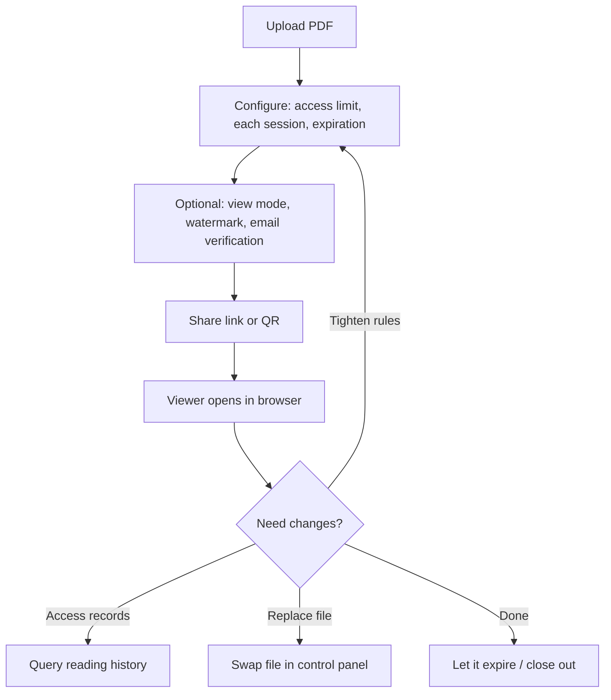

Online PDF DRM is best understood as **enforceable sharing rules in a browser**. Instead of sending a copy of the PDF, you share a link and control access at the viewer.

This guide is “complete” in the sense that it covers the controls most teams actually use—not theoretical DRM terminology.

## What you can control online

- **Access limit**: cap total opens
- **Each session**: limit reading time per open
- **Expiration**: end access automatically
- **Viewer mode**: SecureView / FenceView / Unrestricted
- **Deterrence**: watermark + protected viewer
- **Audience**: email verification when needed
- **Accountability**: access records
- **Maintenance**: replace file without resending a new link

## End-to-end workflow

```mermaid
flowchart TB
  A[Upload PDF] --> B["Configure: access limit, each session, expiration"]
  B --> C["Optional: view mode, watermark, email verification"]
  C --> D["Share link or QR"]
  D --> E[Viewer opens in browser]
  E --> F{Need changes?}
  F -->|Access records| G[Query reading history]
  F -->|Replace file| H[Swap file in control panel]
  F -->|Tighten rules| B
  F -->|Done| I[Let it expire / close out]
```

## Upload

## Configure (rules)

### Protected viewer and deterrence

### Optional: email verification

## Share (link + QR)

## Access records

## Replace the file (keep the sharing channel)

## Large access limits caveat

If **Access limit** is above **10,000**, behavior can trend toward an effectively public link and **access records may not be logged**.

---

**Related:** [MaiPDF complete workflow guide (with diagrams)](/en/maipdf-complete-workflow-guide-with-diagrams) · [Secure PDF links](/en/secure-pdf-links) · [Prevent PDF downloads (view-only)](/en/prevent-pdf-downloads-view-only)

[Go to Blog Index](/blog)
