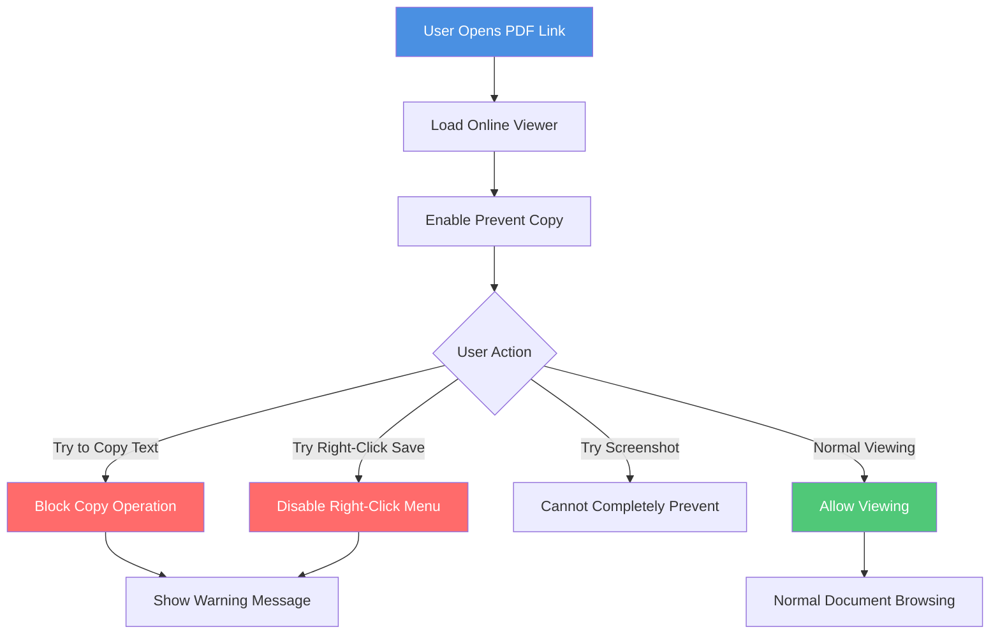
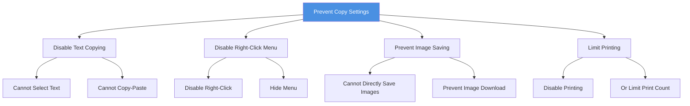

# PDF Online Viewer Prevent Copy: Protect Document Content from Copying

  
When sharing PDF documents, how can you prevent recipients from copying document content? The <strong>prevent copy feature</strong> can effectively block text copying, image saving, and other operations to protect document content security. This guide explains how to set up the prevent copy feature for PDF online viewers.

## Why Prevent Copying?

### Common Use Cases

**1. Copyright Content Protection**
- Original articles and research reports
- Prevent content from being copied and republished
- Protect intellectual property

**2. Business Secret Protection**
- Product plans and business strategies
- Prevent content from being copied to competitors
- Protect business secrets

**3. Educational Content Management**
- Course materials and exam questions
- Prevent students from copying answers
- Protect teaching resources

**4. Design Work Protection**
- Design drafts and creative proposals
- Prevent designs from being copied and used
- Protect creative achievements

## How Prevent Copy Works

### Protection Mechanism

**Protected Content:**
- ✅ Prevent text selection and copying
- ✅ Disable right-click menu
- ✅ Prevent direct image saving
- ✅ Limit printing function

## How to Set Prevent Copy

### Setup Steps

**1. Upload PDF Document**
   - Select the PDF file to protect
   - Wait for upload to complete

**2. Enter Security Settings**
   - Click "Settings" or "Security Settings"
   - Find "Content Protection" option

**3. Enable Prevent Copy**
   - Select "Disable Copy" option
   - Can simultaneously disable right-click menu
   - Confirm settings

**4. Generate Share Link**
   - Generate link after saving settings
   - Share link with recipients

### Setting Options

## Effects of Preventing Copy

### What Users Can Do

- ✅ View document content normally
- ✅ Navigate through pages
- ✅ Zoom in and out
- ✅ Search document content (if allowed)

### What Users Cannot Do

- ❌ Select and copy text
- ❌ Use right-click menu
- ❌ Directly save images
- ❌ Print document (if disabled)

## Limitations of Prevent Copy

### Situations That Cannot Be Completely Prevented

**1. Screenshots**
- Users can still use screenshot tools
- Cannot completely prevent screen capture
- Recommend combining with watermark

**2. Screen Recording**
- Can use screen recording tools
- Cannot prevent video recording
- Need other protection measures

**3. Manual Input**
- Users may manually input content
- Cannot prevent manual copying
- Suitable for protecting large amounts of content

### Recommended Combinations

**1. Watermark Protection**
- Add dynamic watermark
- Can track source even from screenshots
- Provide legal evidence

**2. Access Control**
- Set view count limits
- Limit access time
- Control access scope

**3. Disable Download**
- Disable PDF file download
- Can only view online
- Reduce content leak risk

## Best Practices

### Suitable Scenarios

**Suitable for Prevent Copy:**
- Copyright content and original articles
- Business secrets and internal documents
- Educational content and exam questions
- Design works and creative proposals

**Not Suitable for Prevent Copy:**
- Documents that need user copying and citation
- Publicly shared reference materials
- Documents that need printing
- Documents that need editing

### Setting Recommendations

**1. Clearly Inform Users**
- Explain that document copying is disabled
- Explain protection reasons
- Provide necessary usage guidance

**2. Reasonably Set Permissions**
- Choose protection level based on document importance
- Balance security and usability
- Avoid excessive restrictions affecting usage

**3. Combine with Other Measures**
- Combine with watermark, access control, and other features
- Build multi-layered protection system
- Regularly check access records

## Frequently Asked Questions

### Q1: Can users still view documents after preventing copy?

**A:** Yes. Preventing copy only blocks copying operations. Users can still view document content normally.

### Q2: Can I only disable text copying while allowing printing?

**A:** Yes. In settings, you can separately control copying, printing, and other permissions.

### Q3: Does preventing copy affect document loading speed?

**A:** Minimal impact. The prevent copy feature has almost negligible impact on document loading speed.

### Q4: How to know if someone tried to copy?

**A:** You can check user behavior through access records, but cannot completely detect all copy attempts.

### Q5: Can I temporarily allow copying?

**A:** Yes. In settings, you can modify copy permissions at any time to allow or disable copying.

## Summary

The prevent copy feature for PDF online viewers is an important tool for protecting document content security:

- ✅ **Prevent Text Copying**: Block content from being copied and abused
- ✅ **Protect Intellectual Property**: Protect original content and creativity
- ✅ **Control Content Distribution**: Reduce content leak risk
- ✅ **Combine with Other Features**: Build complete protection system

Remember, preventing copy is not a panacea. It's recommended to combine with watermark, access control, disable download, and other features to build a multi-layered document protection system and comprehensively ensure document security.

