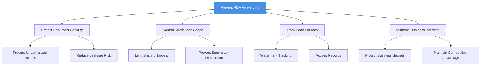
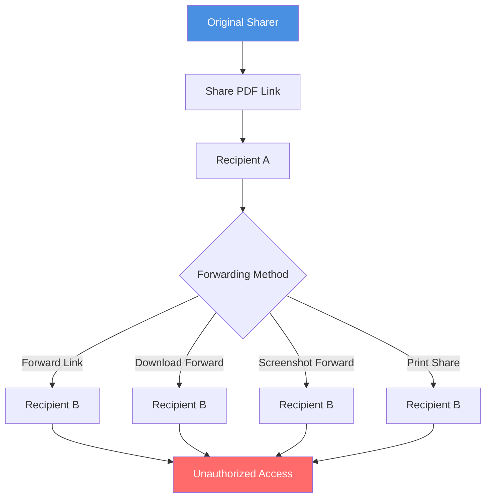
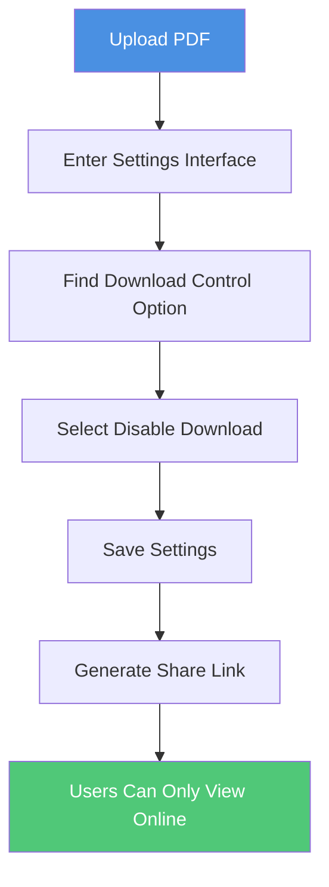
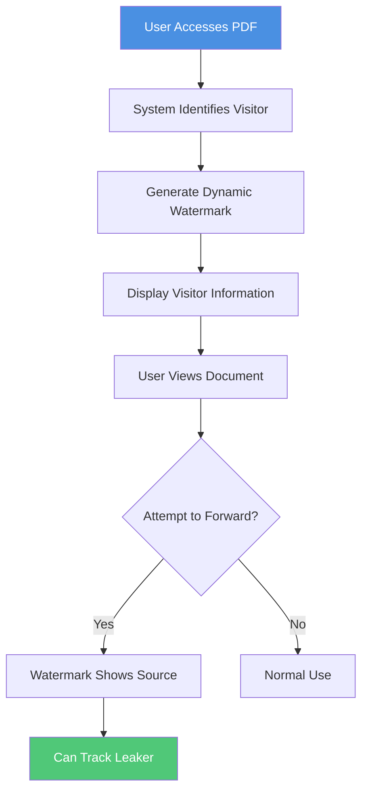
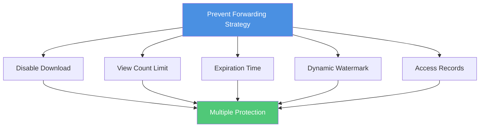
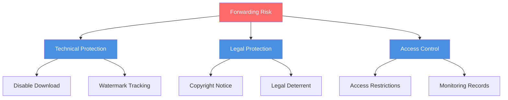

# PDF Prevent Forwarding: Complete Guide to Stop Unauthorized Document Sharing

  
When sharing PDF documents, are you concerned about recipients forwarding them to others? <strong>Preventing forwarding</strong> is a key measure for protecting document security. This guide details how to prevent PDF documents from being re-shared through multiple methods, ensuring your documents only spread within authorized scope.

## Why Prevent PDF Forwarding?

### Security Risks from Forwarding

**1. Unauthorized Distribution**
- Documents forwarded to unauthorized personnel
- Cannot control document distribution scope
- Confidential information may leak to competitors

**2. Copyright and Intellectual Property Risks**
- Original content illegally distributed
- Design works used without authorization
- Business secrets leaked

**3. Privacy Information Leakage**
- Personal data widely distributed
- Sensitive information maliciously shared
- Cannot track leak sources

**4. Business Losses**
- Product plans leaked in advance
- Price information obtained by competitors
- Business strategies analyzed

### Necessity of Preventing Forwarding

## Common Ways of PDF Forwarding

### Forwarding Method Analysis

**1. Direct Link Forwarding**
- Copy share link and send to others
- Share through social media
- Forward through email

**2. Download and Forward File**
- Download PDF file
- Forward as email attachment
- Share through cloud storage

**3. Screenshot Forwarding**
- Capture PDF pages
- Share as images
- Distribute through social media

**4. Print and Share**
- Print PDF document
- Scan into electronic version
- Re-share

### Forwarding Flowchart

## Methods to Prevent PDF Forwarding

### Method 1: Disable Download

**Principle:**
- Document can only be viewed online
- Cannot download to local device
- Prevent file forwarding

**Setup Steps:**

**Advantages:**
- ✅ Completely prevent file download
- ✅ Document always under server control
- ✅ Cannot forward through file

**Limitations:**
- ⚠️ Cannot completely prevent screenshots
- ⚠️ Cannot prevent printing

### Method 2: Set Access Restrictions

**2.1 View Count Limit**

**Setup Method:**
- Limit document view count (e.g., 1-5 times)
- Link expires when limit reached
- Prevent link from being shared multiple times

**Use Cases:**
- Confidential documents
- One-time access
- Temporary sharing

**2.2 Expiration Time Setting**

**Setup Method:**
- Set automatic link expiration time
- Cannot access after expiration
- Limit document validity period

**Use Cases:**
- Temporary sharing
- Limited-time events
- Regularly updated documents

**2.3 Visitor ID Restriction**

**Setup Method:**
- Restrict access to specific Visitor IDs
- Prevent remote access
- Enhance security

### Method 3: Dynamic Watermark Protection

**Principle:**
- Add dynamic watermark to PDF
- Display visitor information
- Track leak sources

**Watermark Content:**
- Visitor email
- Access time
- Visitor ID
- Visitor name

**Advantages:**
- ✅ Deterrent effect
- ✅ Track leak sources
- ✅ Legal evidence

**Flowchart:**

### Method 4: Access Records and Monitoring

**Features:**
- Record each access
- Track visitor information
- Monitor abnormal access

**Recorded Content:**
- Access time
- Visitor ID
- Device information
- Geographic location

**Advantages:**
- ✅ Timely detect abnormalities
- ✅ Track forwarding behavior
- ✅ Provide evidence

### Method 5: Combine Multiple Methods

**Best Practices:**

**Combination Plans:**

| Security Level | Disable Download | View Count | Expiration | Watermark | Access Records |
|---------------|------------------|------------|------------|-----------|----------------|
| Basic | ✅ | - | - | - | ✅ |
| Standard | ✅ | ✅ | ✅ | - | ✅ |
| Advanced | ✅ | ✅ | ✅ | ✅ | ✅ |
| Maximum | ✅ | ✅ | ✅ | ✅ | ✅ |

## Complete Setup Process

### Step 1: Upload PDF File

1. Visit PDF sharing platform
2. Drag & drop or select PDF file
3. Wait for upload to complete

### Step 2: Set Security Options

**Disable Download Setup:**
1. Enter settings interface
2. Find "Download Control" option
3. Select "Disable Download"
4. Save settings

**View Count Limit:**
1. Find "View Count Limit" option
2. Set appropriate view count (recommend 1-5 times)
3. Save settings

**Expiration Time Setup:**
1. Find "Expiration Time" option
2. Set appropriate expiration time
3. Save settings

**Dynamic Watermark Setup:**
1. Find "Watermark" option
2. Enable dynamic watermark
3. Select display content
4. Save settings

### Step 3: Generate Share Link

1. Confirm all settings
2. Generate share link
3. Copy link
4. Send to authorized users

### Step 4: Monitor Access

1. Regularly check access records
2. Monitor abnormal access
3. Timely detect forwarding behavior
4. Take appropriate measures

## Application Scenarios

### Scenario 1: Business Contract Sharing

**Requirements:**
- Prevent contract forwarding
- Protect business secrets
- Track access records

**Setup Plan:**
- ✅ Disable download
- ✅ View count limit: 3-5 times
- ✅ Expiration time: 7-14 days
- ✅ Dynamic watermark
- ✅ Access records

### Scenario 2: Product Proposal Presentation

**Requirements:**
- Prevent proposal leakage
- Control viewing scope
- Track leak sources

**Setup Plan:**
- ✅ Disable download
- ✅ View count limit: 1-3 times
- ✅ Expiration time: 3-7 days
- ✅ Dynamic watermark (required)
- ✅ Access records

### Scenario 3: Training Material Sharing

**Requirements:**
- Prevent material forwarding
- Control usage scope
- Protect copyright

**Setup Plan:**
- ✅ Disable download (optional)
- ✅ View count limit: 10-20 times
- ✅ Expiration time: 30 days
- ✅ Watermark (optional)
- ✅ Access records

## Limitations

### Situations That Cannot Be Completely Prevented

**1. Screenshot Forwarding**
- Cannot completely prevent screenshots
- Can track through watermark
- Legal deterrent effect

**2. Print and Share**
- Cannot prevent printing
- Can disable print function
- Use with watermark

**3. Screen Recording**
- Cannot prevent screen recording
- Can track through watermark
- Legal protection

### Response Strategies

## Best Practices

### 1. Multi-Layer Protection

**Recommended Combinations:**
- Disable download + View count limit
- Expiration time + Dynamic watermark
- Access records + Visitor ID restriction

### 2. Set Based on Importance

**Confidential Documents:**
- Disable download (required)
- View count: 1-3 times
- Expiration time: 3-7 days
- Dynamic watermark (required)

**Important Documents:**
- Disable download
- View count: 3-10 times
- Expiration time: 7-30 days
- Watermark (optional)

**General Documents:**
- Download control (optional)
- View count: 10-50 times
- Expiration time: 30-90 days
- Access records

### 3. Regular Monitoring

**Monitoring Points:**
- Regularly check access records
- Pay attention to abnormal access
- Timely detect forwarding behavior
- Take appropriate measures

## FAQ

### Q1: Can users still forward after disabling download?

**A:** Can forward links, but cannot forward files. Recommend combining with view count limit and expiration time.

### Q2: Will dynamic watermark affect reading experience?

**A:** Modern watermark technology can avoid affecting reading while providing deterrent and tracking effects.

### Q3: How to know if document was forwarded?

**A:** Can check abnormal access through access records, dynamic watermark can track leak sources.

### Q4: Can forwarding be completely prevented?

**A:** Cannot 100% prevent, but can greatly reduce forwarding risk through multiple protection measures.

## Summary

Preventing PDF forwarding requires comprehensive use of multiple methods:

- ✅ **Disable Download** - Prevent file forwarding
- ✅ **Access Restrictions** - Control view count and expiration time
- ✅ **Dynamic Watermark** - Track leak sources
- ✅ **Access Records** - Monitor abnormal behavior
- ✅ **Combined Use** - Multiple protection for better security

**Start Using Now:** Upload your PDF document, set prevent forwarding options, and protect your document security!

