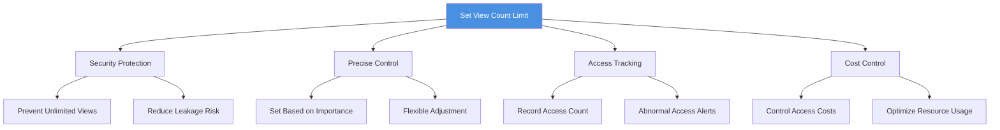
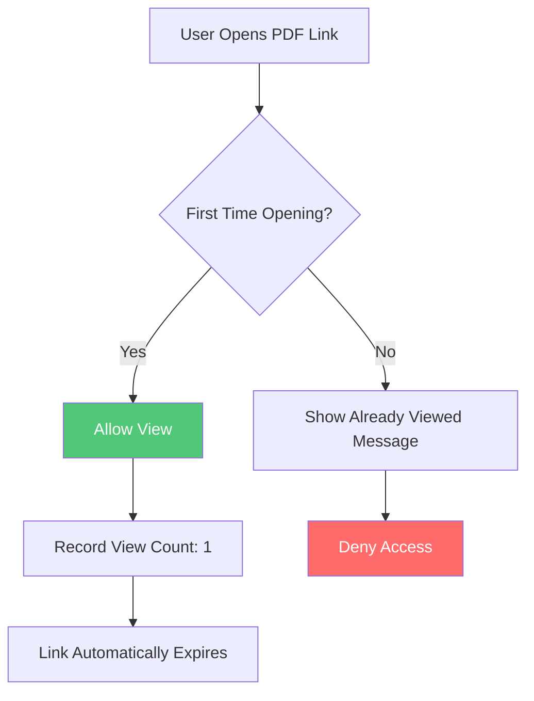
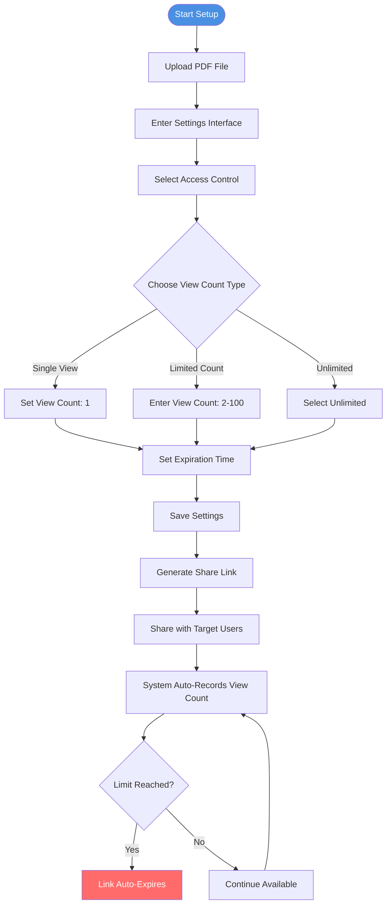
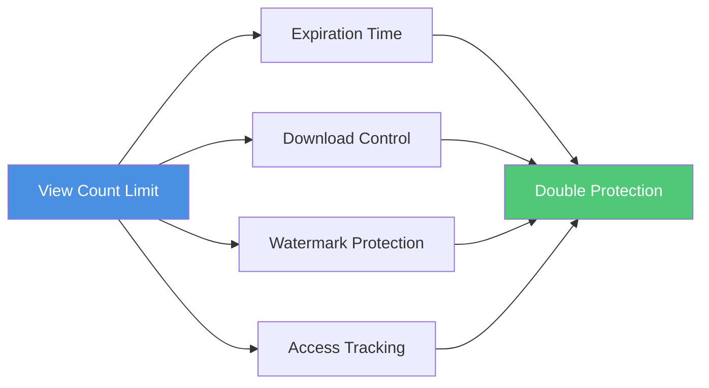
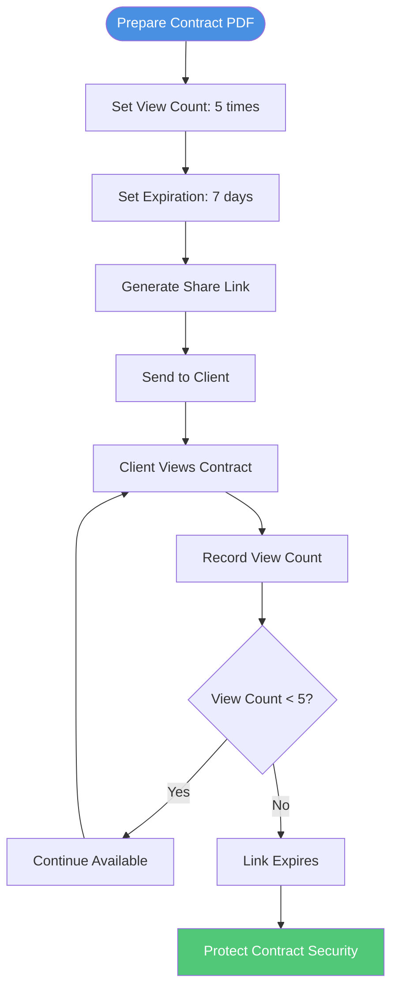

# PDF View Count Limit Settings: Complete Guide to Precise Document Access Control

  
When sharing important PDF documents, are you concerned about unlimited access? <strong>Setting view count limits</strong> is a key feature for protecting document security. This guide details how to set view count restrictions for PDF documents, helping you achieve precise control over document access.

## Why Set PDF View Count Limits?

### Common Security Issues

**1. Unlimited Access Risk**
- After sharing, anyone can view the PDF unlimited times
- Cannot control document access frequency
- Important information may be repeatedly studied

**2. Confidential Data Leakage**
- Business secrets viewed multiple times
- Competitors may repeatedly analyze document content
- Cannot track abnormal access behavior

**3. Privacy Information Exposure**
- Personal data maliciously spread
- Sensitive information accessed multiple times
- Cannot recall shared documents

**4. Business Losses**
- Product plans viewed multiple times
- Price information repeatedly studied
- Business strategies may leak

### Advantages of Setting View Count Limits

## Types of PDF View Count Limits

### 1. Single View (One-Time Access)

**Use Cases:**
- Highly sensitive confidential documents
- One-time quotes
- Temporary access credentials
- Self-destructing documents

**Features:**
- Document can only be opened once
- Link automatically expires after viewing
- Highest level of security protection

**Flowchart:**

### 2. Limited View Count

**Use Cases:**
- Business contracts (3-5 times)
- Product manuals (5-10 times)
- Training materials (10-20 times)
- Event materials (20-50 times)

**Features:**
- Can set 2-100 view limit
- Link expires when limit reached
- Real-time display of remaining views

**Setting Options:**

| View Count | Use Case | Security Level |
|-----------|----------|----------------|
| 2-5 times | Confidential contracts, quotes | ⭐⭐⭐⭐⭐ |
| 5-10 times | Product manuals, proposals | ⭐⭐⭐⭐ |
| 10-20 times | Training materials, reports | ⭐⭐⭐ |
| 20-50 times | Event materials, brochures | ⭐⭐ |
| 50-100 times | Public materials, reference docs | ⭐ |

### 3. Unlimited Views

**Use Cases:**
- Public materials
- Long-term valid documents
- Reference documents
- Promotional materials

**Features:**
- No view count restriction
- Suitable for long-term sharing
- Can be used with expiration time

## How to Set PDF View Count Limits

### Complete Setup Process

### Detailed Steps

**Step 1: Upload PDF File**
1. Visit PDF sharing platform
2. Drag & drop or select PDF file
3. Wait for upload to complete

**Step 2: Enter Settings Interface**
1. Click "Settings" or "Access Control"
2. Find "View Count Limit" option
3. Select limit type

**Step 3: Set View Count**

**Single View Setup:**
- Select "Single View" option
- System automatically sets to 1
- Link expires immediately after viewing

**Limited Count Setup:**
- Select "Limited Count" option
- Enter specific view count (2-100)
- Recommend setting based on document importance

**Unlimited Setup:**
- Select "Unlimited" option
- Can be used with expiration time
- Suitable for long-term shared documents

**Step 4: Save and Share**
1. Confirm settings are correct
2. Save settings
3. Copy share link
4. Send to target users

## Best Practices for View Count Limits

### Set Based on Document Type

**Confidential Documents (1-3 times)**
- Business contracts
- Quotes
- Confidential plans
- Personal privacy data

**Important Documents (3-10 times)**
- Product manuals
- Project proposals
- Training materials
- Financial reports

**General Documents (10-50 times)**
- Event materials
- Brochures
- Reference documents
- Public materials

### Combine with Other Security Measures

**Combined Use:**
- **View Count + Expiration Time**: Double time control
- **View Count + Download Prevention**: Prevent local saving
- **View Count + Watermark**: Track leak sources
- **View Count + Access Records**: Complete security monitoring

## Application Scenarios

### Scenario 1: Business Contract Sharing

**Setup Recommendations:**
- View count: 3-5 times
- Expiration time: 7-14 days
- Combine with download prevention
- Enable access records

### Scenario 2: Product Manual Distribution

**Setup Recommendations:**
- View count: 10-20 times
- Expiration time: 30 days
- Allow download (optional)
- Enable watermark

### Scenario 3: Training Material Sharing

**Setup Recommendations:**
- View count: 20-50 times
- Expiration time: 60 days
- Allow download
- Access statistics

## Monitoring and Management

### Real-Time Access Monitoring

**View Access Records:**
- Total view count
- Remaining view count
- Each view time
- Visitor information

### Abnormal Access Alerts

**Monitoring Indicators:**
- Multiple accesses in short time
- Abnormal IP address access
- View count limit reached
- Frequent access before expiration

### Management Operations

**Available Operations:**
- View detailed access records
- Modify view count limit
- Reset view count (if supported)
- Disable link in advance

## FAQ

### Q1: Will view count limits affect user experience?

**A:** No. Reasonable view count settings protect document security without affecting normal use. Recommend setting appropriate counts based on document importance.

### Q2: Can I modify view count after setting?

**A:** Yes. Most platforms support modifying view count limits after sharing, but already viewed counts won't reset.

### Q3: What happens when view count limit is reached?

**A:** Link automatically expires, users cannot access document. You can generate new link or modify limit to continue sharing.

### Q4: How to choose appropriate view count?

**A:** Recommend considering:
- Document importance
- Sharing target
- Use scenario
- Security requirements

## Summary

Setting PDF view count limits is an important measure for protecting document security:

- ✅ **Precise Control** - Set appropriate view counts based on document importance
- ✅ **Security Protection** - Prevent unlimited viewing and distribution
- ✅ **Flexible Management** - Support single, limited, unlimited modes
- ✅ **Real-Time Monitoring** - Record each access, track abnormal behavior
- ✅ **Combined Use** - Work with expiration time, download control for comprehensive protection

**Start Using Now:** Upload your PDF document, set view count limits, and protect your document security!

