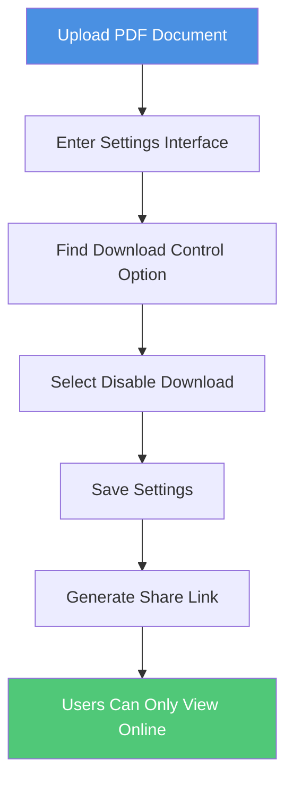

# PDF Share Link Disable Download: How to Set View-Only Access

  
When sharing PDF documents, do you want recipients to view them online only, without downloading? The <strong>disable download feature</strong> can effectively prevent documents from being saved and forwarded. This guide explains how to set up the disable download feature for PDF share links to ensure document security.

## Why Disable Downloads?

### Common Use Cases

**1. Business Document Protection**
- Important documents like contracts and proposals
- Prevent documents from being saved and forwarded to competitors
- Control document distribution scope

**2. Educational Content Management**
- Course materials and answer keys
- Students can view but not save
- Prevent content from being widely distributed

**3. Sensitive Information Protection**
- Financial reports and internal documents
- Limit document saving and distribution
- Protect business secrets

**4. Temporary Document Sharing**
- Draft documents and content under review
- Avoid old versions being saved
- Ensure viewing of the latest version

## How to Disable Downloads

### Setup Steps

**Detailed Steps:**

1. **Upload PDF Document**
   - Select the PDF file you want to share
   - Wait for upload to complete

2. **Enter Settings Interface**
   - Click "Settings" or "Security Settings"
   - Find "Download Control" option

3. **Enable Disable Download**
   - Select "Disable Download" option
   - Confirm settings

4. **Generate Share Link**
   - Save settings and generate link
   - Share the link with recipients

## Effects of Disabling Downloads

### What Users Can Do

- ✅ View complete document online
- ✅ Navigate through all pages
- ✅ Zoom in and out for details
- ✅ View on any device (phone, tablet, computer)

### What Users Cannot Do

- ❌ Download file to local device
- ❌ Save PDF file
- ❌ Forward file to others
- ❌ View document offline

## Advantages of Disabling Downloads

**1. Prevent File Forwarding**
- Documents cannot be saved as files
- Reduce risk of document forwarding
- Maintain control over documents

**2. Protect Document Security**
- Documents always under server control
- Can revoke access at any time
- Record access logs

**3. Simplify Document Management**
- No need to worry about multiple file versions
- Ensure viewing of latest version
- Easy to update and maintain

## Important Notes

### Limitations

**Situations That Cannot Be Completely Prevented:**
- ⚠️ Screenshots: Users can still take screenshots
- ⚠️ Screen Recording: Users can use screen recording tools

**Note:** The disable download feature automatically disables printing, because printing to PDF is equivalent to downloading. Therefore, after setting disable download, users cannot save documents through printing.

**Recommended Combinations:**
- Combine with watermark feature to track sources even from screenshots
- Set view count limits to prevent link abuse
- Set expiration time to limit document validity

## Best Practices

**1. Clearly Inform Recipients**
- Explain that documents can only be viewed online
- Explain the reason for disabling downloads
- Provide necessary viewing guidance

**2. Choose Appropriate Documents**
- Suitable for temporary sharing
- Content that needs regular updates
- Materials that don't need long-term storage

**3. Combine with Other Security Measures**
- Set access password
- Limit view count
- Add dynamic watermark

## Frequently Asked Questions

### Q1: Can users still view documents after disabling downloads?

**A:** Yes. Disabling downloads only prevents saving files. Users can still view the complete document content online.

### Q2: How to know if someone tried to download?

**A:** You can check user access behavior through access records, but cannot completely detect all download attempts.

### Q3: Does disabling downloads affect document loading speed?

**A:** No. The disable download feature does not affect document loading speed.

### Q4: Can I temporarily allow downloads after disabling them?

**A:** No. Once you set disable download, you cannot modify this property. If you need to allow downloads, you need to re-upload the PDF and generate a new share link.

### Q5: Can I still print after disabling downloads?

**A:** No. The disable download feature automatically disables printing. If printing were allowed, users could save the document as a PDF file through "Print to PDF", which is equivalent to downloading. Therefore, disabling downloads and disabling printing are linked and cannot be set separately.

## Summary

The disable download feature for PDF share links is an important tool for protecting document security. By disabling downloads, you can:

- ✅ Prevent documents from being saved and forwarded
- ✅ Maintain control over documents
- ✅ Simplify document management process
- ✅ Protect sensitive information

Remember, disabling downloads is not a panacea. It's recommended to combine with other security measures such as password protection, access restrictions, and watermarks to build a multi-layered document protection system.

