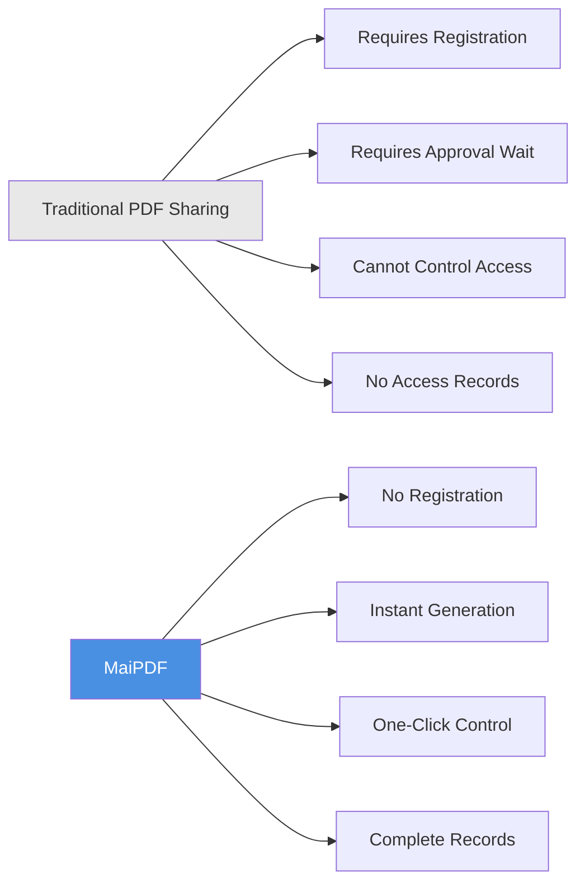
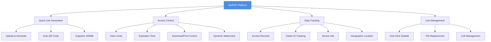
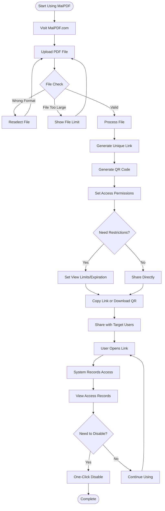
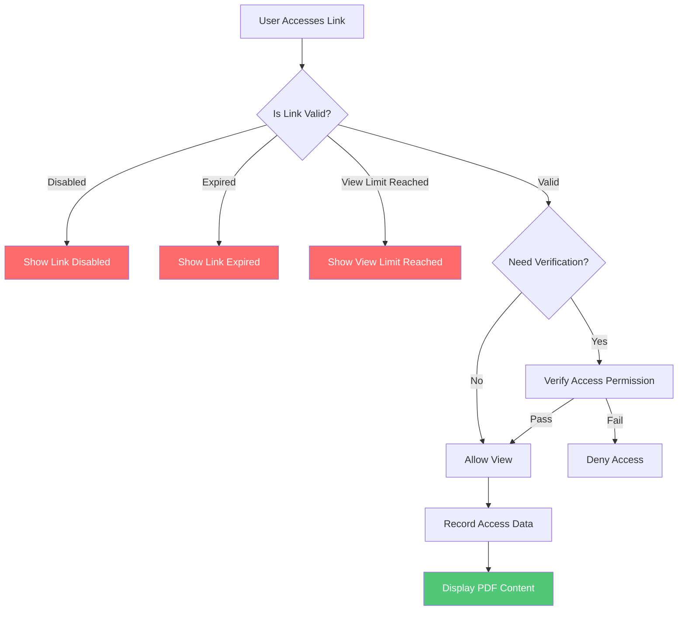
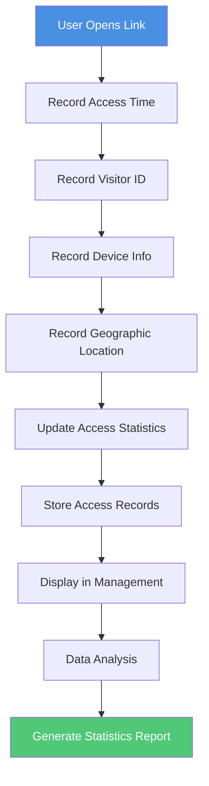
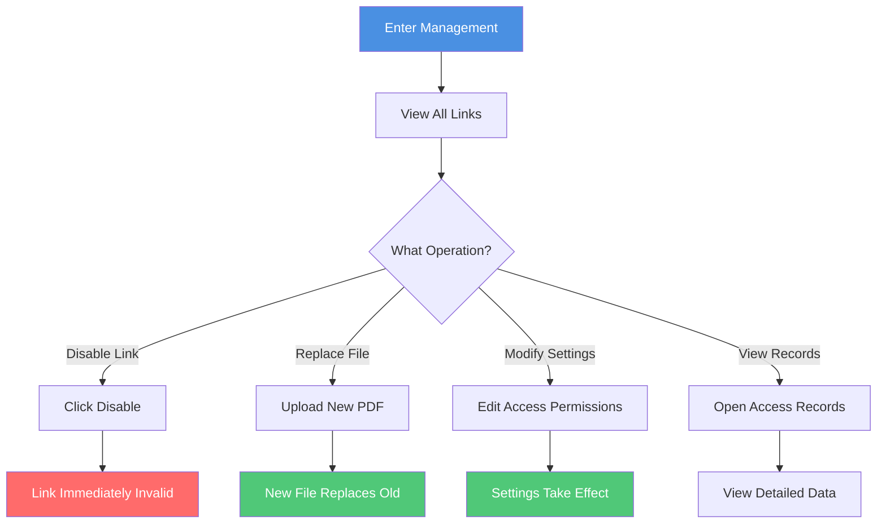
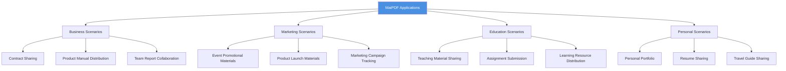
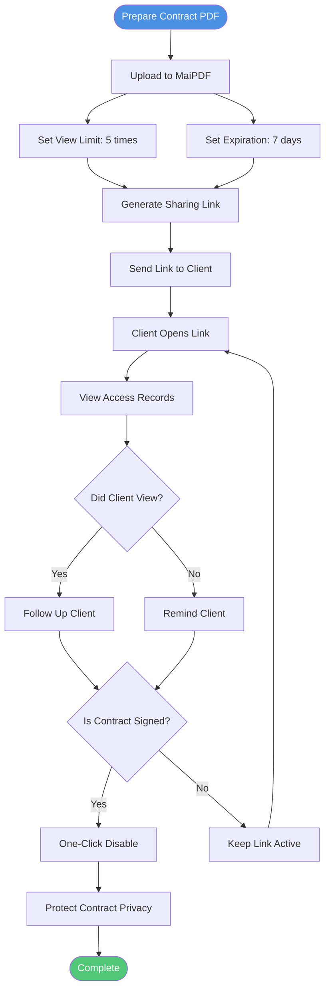
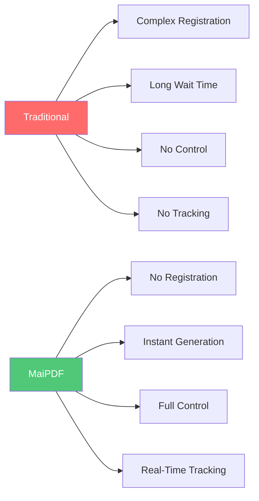
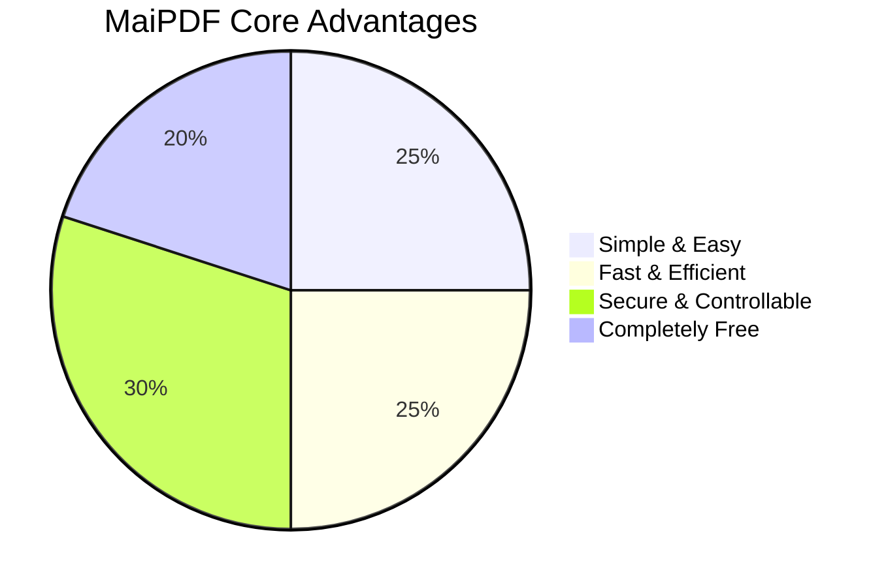

# MaiPDF Complete Introduction: Professional PDF Sharing Platform Made Simple and Secure

  
<strong>MaiPDF</strong> is a professional online PDF sharing platform that allows you to quickly generate sharing links without registration, control access permissions anytime, and track document views in real-time. Whether it's business contracts, product manuals, or team reports, MaiPDF makes document sharing simple, secure, and controllable.

## What is MaiPDF?

### Platform Positioning

MaiPDF is an **online PDF sharing and management platform** focused on providing simple, secure, and controllable document sharing solutions.

**Core Features:**
- ✅ **No Registration Required** - Use immediately, zero barriers
- ✅ **Instant Generation** - Generate links within 10 seconds after upload
- ✅ **Completely Free** - All basic features are free
- ✅ **Professional Security** - Access control, watermark protection, data tracking

### MaiPDF vs Traditional Methods

## Core Features Overview

### Feature Architecture

## Complete Usage Workflow

### Complete Flow from Upload to Share

### Three Steps to Get Started

**Step 1: Upload PDF**
- Visit MaiPDF.com
- Drag & drop or select PDF file
- Supports up to 100MB

**Step 2: Generate Link**
- Auto-generate sharing link
- Auto-generate QR code
- Set access permissions

**Step 3: Share & Use**
- Copy link to share
- Or download QR code to share
- View access records in real-time

## Core Features Explained

### Feature 1: Quick Link Generation

**Features:**
- ⚡ Instant generation (usually within 10 seconds)
- 🔗 Auto-generate unique link
- 📱 Auto-generate QR code
- 💾 Supports up to 100MB files

**Flowchart:**

### Feature 2: Access Control

**Control Options:**

| Control | Description | Use Case |
|---------|-------------|----------|
| View Limits | Limit number of times PDF can be opened | Contracts, confidential documents |
| Expiration Time | Set automatic link expiration | Temporary sharing, event materials |
| Download Control | Allow or prohibit PDF download | Copyright protection, prevent distribution |
| Print Control | Allow or prohibit PDF printing | Prevent copying, protect content |
| Dynamic Watermark | Watermark showing viewer information | Track leaks, identity verification |

**Access Control Flowchart:**

### Feature 3: Data Tracking

**Tracking Content:**
- 📊 Total open count
- ⏰ Time of each open
- 🌐 visitor ID
- 📱 Device information
- 📍 Geographic location
- 🔗 Access source

**Data Tracking Flowchart:**

### Feature 4: Link Management

**Management Features:**
- 🚫 One-click disable link
- 🔄 Replace PDF file
- 📝 Modify access settings
- 📊 View management interface

**Link Management Flowchart:**

## Application Scenarios

### Scenario Categories

### Typical Application Scenario Flow

**Scenario: Business Contract Sharing**

## Feature Comparison

### MaiPDF vs Traditional Methods

| Comparison | Traditional PDF Sharing | MaiPDF |
|------------|------------------------|--------|
| **Registration** | ❌ Requires account | ✅ No registration |
| **Link Generation** | ❌ Requires approval wait | ✅ Instant (within 10 seconds) |
| **Access Control** | ❌ Cannot control | ✅ Full control (count, time, download) |
| **Access Tracking** | ❌ No records | ✅ Complete records (time, Visitor ID, device) |
| **Link Management** | ❌ Can only delete | ✅ One-click disable, file replacement |
| **Watermark Protection** | ❌ Not supported | ✅ Dynamic watermark (online mode) |
| **Cost** | 💰 May charge | ✅ Completely free |
| **File Size** | 📦 Usually small | ✅ Up to 100MB |

### Feature Advantage Comparison

## Advantages Summary

### Core Advantages

**1. Simple & Easy**
- No registration, use immediately
- Three steps: Upload → Generate → Share
- Clean interface, intuitive operation

**2. Fast & Efficient**
- Instant link generation (usually within 10 seconds)
- Auto-generate QR code
- Supports large files (up to 100MB)

**3. Secure & Controllable**
- Complete access control
- Real-time access tracking
- One-click disable link
- Dynamic watermark protection (online mode)

**4. Completely Free**
- All basic features free
- No hidden fees
- No usage limits

### Advantages Chart

## Quick Start

### Three Steps to Get Started

**Start Now:**
1. Visit [MaiPDF.com](https://maipdf.com)
2. Drag & drop PDF file to upload area
3. Copy generated link or download QR code
4. Share with target users

## Summary

MaiPDF is a **professional, simple, secure, and free** PDF sharing platform that makes document sharing easy through these core features:

- ⚡ **Quick Generation** - Instant link generation, no waiting
- 🔒 **Secure Control** - Complete access control and permission management
- 📊 **Data Tracking** - Real-time access records and analytics
- 🎯 **Simple to Use** - No registration, three steps to share
- 💰 **Completely Free** - All basic features free to use

Whether you're a business professional, marketer, educator, or individual user, MaiPDF provides professional PDF sharing solutions.

**Start Using Now:** [Visit MaiPDF.com](https://maipdf.com)

