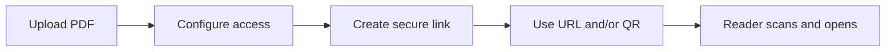

A QR code is a **concrete way** to hand someone your PDF: they scan, open the link, and read—no typing a long URL. On [MaiPDF](https://maipdf.com/pdf/maipdf2026.html) you get **link + QR** after **Upload → Configure → Share**, with the same controls as any other share (expiry, access limit, session length, viewing mode, optional verification and alerts).

## Upload the PDF

Upload (or sign in first, depending on your workflow). The QR is generated from the secure link you create—**not** from a mystery third-party URL shortener.

## Configure, then create the link and QR

On **Configure**, set **expiration**, **access limit**, and **each-session reading time**. Choose **SecureView**, **FenceView**, or **Unrestricted** to match how open or locked the reader experience should be. Add **email verification** or **Telegram read alerts** when you care who opened it.

After you create the secure link, the page shows the **copyable URL** and **QR** you can drop into slides, posters, packaging, or a projector slide.

### Quick flow

**Large access limits:** If **Access limit** is above **10,000**, the link behaves like a very public channel and MaiPDF turns off access logging, Telegram alerts, and dynamic watermark—fine for odd edge cases, not typical for controlled PDF-to-QR use.

## Where PDF + QR works well

| Channel | Why |
|---------|-----|
| **Events** | Posters, badges, handouts—one scan to the deck or agenda |
| **Retail & packaging** | Manuals and spec sheets without app installs |
| **Real estate & retail cards** | One sheet, always current if you replace the file behind the same link |
| **Classroom / training** | Projector slide + printed QR for the same document |

## Before you print or ship

- Scan test on **at least one iPhone and one Android**; check legibility at the **real viewing distance**.
- Keep **contrast and quiet zone** around the code so cameras lock on fast.
- Leave the **short URL** visible near the QR when you can, as a fallback if a phone struggles.
- Match **viewing mode and limits** to how sensitive the PDF is.

**Takeaway:** PDF-to-QR is about **frictionless mobile entry**; the QR is only as trustworthy as the **link policy** behind it—keep expiry and limits honest for the file you are distributing.

---

**Related:** [PDF QR code generation with MaiPDF](/en/pdf-qr-code-generation-maipdf) · [Transform PDFs into shareable links in 3 steps](/en/transform-pdfs-shareable-links-3-steps) · [Instant PDF link generation](/en/instant-pdf-link-generation)
