# How to Prevent PDF Downloads: Complete Guide

  
<strong>The Problem:</strong> You share a PDF and someone downloads it, then forwards it to 50 other people.

  
<strong>The Solution:</strong> Use MaiPDF (free) to create view-only links. People can READ the PDF, but can't DOWNLOAD it.

## 🤔 Why Prevent Downloads?

**Real scenarios where download prevention matters:**

  

    <h3>🎓 Teachers</h3>
    
<strong>Problem:</strong> Students download exam PDF and share it

    
<strong>Solution:</strong> View-only exam that can't be saved

  

  

    <h3>💼 Sales Teams</h3>
    
<strong>Problem:</strong> Prospects download proposal and forward to competitors

    
<strong>Solution:</strong> View-only proposal with tracking

  

  

    <h3>⚖️ Legal Firms</h3>
    
<strong>Problem:</strong> Sensitive documents downloaded and leaked

    
<strong>Solution:</strong> View-only with watermarks showing viewer identity

  

  

    <h3>🏥 Healthcare</h3>
    
<strong>Problem:</strong> Patient records downloaded to unsecure devices

    
<strong>Solution:</strong> View-only medical records (HIPAA compliant)

  

## 🛡️ How MaiPDF Prevents Downloads

**MaiPDF uses multiple techniques together:**

```mermaid
flowchart LR
    A[Your PDF] --> B[Upload to MaiPDF]
    B --> C[PDF Stored on Server]
    C --> D[You Get Special Link]
    D --> E[Share Link]
    E --> F[User Clicks Link]
    F --> G[View in Browser]
    G --> H{Try to Download?}
    H -->|Download Button| I[❌ Disabled]
    H -->|Right Click| J[❌ Blocked]
    H -->|Ctrl+S| K[❌ Blocked]
    H -->|Just Read| L[✅ Can View]
    
    style A fill:#e3f2fd,stroke:#1976d2,stroke-width:2px
    style C fill:#fff3e0,stroke:#f57c00,stroke-width:2px
    style L fill:#e8f5e9,stroke:#388e3c,stroke-width:2px
    style I fill:#ffebee,stroke:#d32f2f,stroke-width:2px
    style J fill:#ffebee,stroke:#d32f2f,stroke-width:2px
    style K fill:#ffebee,stroke:#d32f2f,stroke-width:2px
```

### What MaiPDF Does

```mermaid
flowchart LR
    A[PDF File] --> B[Your Server]
    B --> C[Convert to Images]
    C --> D[Send Image Chunks]
    D --> E[User's Browser]
    E --> F[Display as Readable Pages]
    
    G[❌ No PDF File on Device] -.-> E
    H[❌ Can't Download Original] -.-> E
    I[✅ Can Still Screenshot] -.-> E
    
    style A fill:#e3f2fd,stroke:#1976d2,stroke-width:2px
    style B fill:#fff3e0,stroke:#f57c00,stroke-width:2px
    style F fill:#e8f5e9,stroke:#388e3c,stroke-width:2px
    style G fill:#ffebee,stroke:#d32f2f,stroke-width:2px
    style H fill:#ffebee,stroke:#d32f2f,stroke-width:2px
```

  

    <h4>✅ What You Get (FREE)</h4>
    <ul>
      <li>Disables download buttons and right-click</li>
      <li>Blocks keyboard shortcuts (Ctrl+S, Ctrl+P)</li>
      <li>Track who viewed and when</li>
      <li>Revoke access anytime</li>
      <li>Works on all devices (no software install)</li>
      <li>Add watermarks to discourage screenshots</li>
    </ul>
  

  

    <h4>⚠️ What It Can't Do</h4>
    <ul>
      <li>Can't prevent screenshots (nothing can)</li>
      <li>Can't prevent phone camera photos</li>
      <li>Can't stop screen recording software</li>
      <li>Needs internet to view</li>
    </ul>
  

**But it stops 95% of casual sharing and forwarding - which is what most people need.**

## 📝 How to Set It Up (2 Minutes)

  

    
1

    

      <h4>Upload PDF</h4>
      
Upload your file to the platform

    

  

  

    
2

    

      <h4>Enable Settings</h4>
      
Turn on "Prevent Downloads" and "Disable Print"

      
    

  

  

    
3

    

      <h4>Share Link</h4>
      
Copy the secure link

      
    

  

  

    
4

    

      <h4>Track Access</h4>
      
Monitor who viewed your document

      
    

  

## ⚠️ What Can't Be Prevented

  

    <h3>⚖️ Be Realistic About What Protection Can Do</h3>
    
No technology can prevent everything. Here's what you need to know:

  

  

    

      <h4>❌ What NO System Can Stop</h4>
      

        

          📱
          

            <strong>Phone Photos</strong>
            
Someone taking a picture of their screen

          

        

        

          🖥️
          

            <strong>Screen Recording</strong>
            
Advanced users can record their screen

          

        

        

          📸
          

            <strong>Screenshots</strong>
            
If they can view it, they can screenshot it

          

        

        

          ✍️
          

            <strong>Manual Copying</strong>
            
Someone retyping or memorizing content

          

        

      

    

    

      <h4>✅ What Protection ACTUALLY Does</h4>
      

        

          ✓
          

            <strong>Stops Casual Sharing</strong>
            
Prevents easy copy-paste and forward

          

        

        

          ✓
          

            <strong>Creates Friction</strong>
            
Makes unauthorized sharing much harder

          

        

        

          ✓
          

            <strong>Deterrent Effect</strong>
            
Shows you're serious about security

          

        

        

          ✓
          

            <strong>Audit Trail</strong>
            
Track who accessed your content

          

        

      

    

  

  

    
<strong>Bottom Line:</strong> Think of download prevention like a lock on your door. It won't stop a determined burglar with tools, but it stops casual thieves and makes your home a harder target.

  

## 💡 Best Practices

  

    <h4>📝 Before Implementing</h4>
    <ul>
      <li>Identify what content actually needs protection</li>
      <li>Consider your audience's technical skill level</li>
      <li>Calculate the value of your content</li>
      <li>Set a realistic security budget</li>
    </ul>
  

  

    <h4>⚙️ During Setup</h4>
    <ul>
      <li>Test with non-sensitive documents first</li>
      <li>Try accessing from different devices</li>
      <li>Get feedback from a small group</li>
      <li>Document your security settings</li>
    </ul>
  

  

    <h4>📊 After Launch</h4>
    <ul>
      <li>Monitor access patterns regularly</li>
      <li>Review who's viewing documents</li>
      <li>Check for suspicious activity</li>
      <li>Adjust settings based on usage</li>
    </ul>
  

## ✨ Why Use MaiPDF?

  

    💰
    

      <strong>Completely Free</strong>
      
No credit card, no hidden costs

    

  

  

    ⚡
    

      <strong>Super Simple</strong>
      
Recipients just click link in browser

    

  

  

    😊
    

      <strong>Fast Setup</strong>
      
Upload PDF, get link - done in 2 minutes

    

  

  

    🔒
    

      <strong>Good Protection</strong>
      
Stops 95% of casual downloading and sharing

    

  

---

**For viewers:** Just click the link - no software, no account, no setup.  
**For you:** Upload, configure, share - takes 2 minutes. Free forever.

