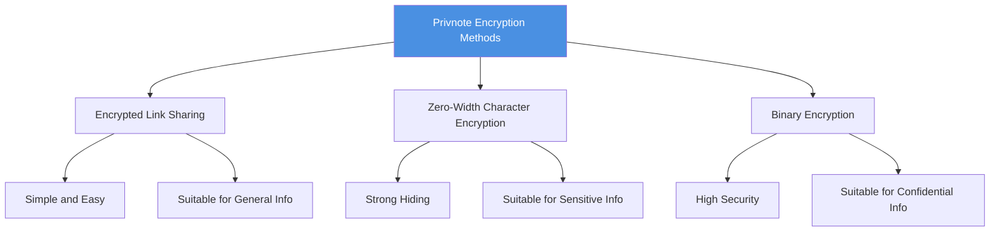
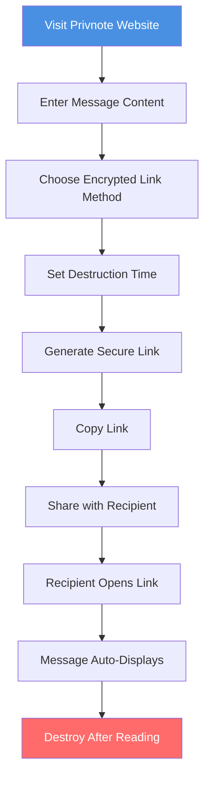

# Privnote Encrypted Note Sharing Complete Guide: Practical Methods for Secure Sharing of Sensitive Information

  
Need to securely share sensitive information but worried about information leakage? <strong>Privnote encrypted notes</strong> provide multiple encryption methods to securely share sensitive information. This guide details Privnote's various encryption features and usage methods to help you share information securely.

## Privnote Encryption Methods Overview

### Three Main Encryption Methods

Privnote provides three different encryption methods, each with its own characteristics and use cases:

## Method 1: Encrypted Link Sharing

### How It Works

**Encrypted link sharing** is Privnote's most commonly used encryption method:

1. **Message Encryption**: Input message content is encrypted
2. **Generate Link**: System generates secure link containing encrypted content
3. **Link Sharing**: Access encrypted message content through link
4. **Auto-Destruct**: Message automatically deleted after reading

### Usage Steps

**Detailed Steps:**

1. **Visit Website**
   - Open privnote.chat
   - Select "Encrypted Link" option

2. **Enter Content**
   - Enter information to share in text box
   - Supports multiple lines of text
   - Can enter content of any length

3. **Generate Link**
   - Click "Create Note" button
   - System automatically generates encrypted link
   - Link contains encrypted message content

4. **Share Link**
   - Copy generated link
   - Send to recipient through secure channel
   - Recommend not sharing link publicly

### Advantages and Limitations

**Advantages:**
- ✅ Simple operation, easy to use
- ✅ No software installation required
- ✅ Supports multiple device access
- ✅ Auto-destruct feature

**Limitations:**
- ⚠️ Links may be forwarded
- ⚠️ Requires internet connection
- ⚠️ Cannot completely prevent screenshots

## Method 2: Zero-Width Character Encryption

### How It Works

**Zero-width character encryption** is an encryption method with stronger hiding capabilities:

1. **Zero-Width Characters**: Uses invisible zero-width characters to hide messages
2. **Text Hiding**: Messages are completely invisible to the naked eye
3. **Special Decoding**: Requires special tools to read
4. **Enhanced Security**: Provides additional security protection layer

### Use Cases

**Suitable for Zero-Width Character Encryption:**
- Information requiring high hiding
- Prevent messages from being screenshot and saved
- Share sensitive information in public places
- Content requiring additional security protection

### Setup Method

1. **Choose Encryption Method**
   - Select "Zero-Width Character Encryption" in Privnote
   - Understand encryption principles and limitations

2. **Enter Message Content**
   - Enter information to encrypt
   - System automatically processes with zero-width characters

3. **Generate Encrypted Text**
   - System generates text containing zero-width characters
   - Text appears empty or ordinary
   - Actually contains hidden message content

4. **Share Encrypted Text**
   - Copy encrypted text
   - Can embed in ordinary text
   - Recipient uses tool to decode

### Important Notes

- ⚠️ Recipients need to know how to decode
- ⚠️ Some platforms may filter zero-width characters
- ⚠️ Requires decoding tools
- ⚠️ Not suitable for all use cases

## Method 3: Binary Encryption

### How It Works

**Binary encryption** converts messages to binary format:

1. **Text Conversion**: Convert message content to binary (0s and 1s)
2. **Encryption Processing**: Encrypt binary data
3. **Generate Ciphertext**: Generate encrypted binary text
4. **Decode and Restore**: Recipient decodes to restore original message

### Usage Steps

**Detailed Steps:**

1. **Choose Binary Encryption**
   - Select "Binary Encryption" in Privnote
   - Understand binary encryption characteristics

2. **Enter Message Content**
   - Enter information to encrypt
   - System automatically converts to binary

3. **Generate Binary Ciphertext**
   - System generates binary format ciphertext
   - Ciphertext consists of 0s and 1s
   - Can be shared securely

4. **Decode Message**
   - Recipient uses decoding tool
   - Restore binary to original message
   - View message content

### Use Cases

**Suitable for Binary Encryption:**
- Confidential information requiring high security
- Technically advanced users
- Content requiring additional encryption protection
- Scenarios with extremely high security requirements

## Security Features Comparison

### Comparison of Three Encryption Methods

| Feature | Encrypted Link | Zero-Width | Binary |
|---------|--------------|------------|--------|
| Ease of Use | ⭐⭐⭐⭐⭐ | ⭐⭐⭐ | ⭐⭐ |
| Security | ⭐⭐⭐⭐ | ⭐⭐⭐⭐ | ⭐⭐⭐⭐⭐ |
| Hiding | ⭐⭐⭐ | ⭐⭐⭐⭐⭐ | ⭐⭐⭐ |
| Applicability | ⭐⭐⭐⭐⭐ | ⭐⭐⭐ | ⭐⭐ |

### Selection Recommendations

**General Information Sharing:**
- Recommended: Encrypted link sharing
- Reason: Simple and easy, suitable for most scenarios

**Sensitive Information Sharing:**
- Recommended: Zero-width character encryption
- Reason: Strong hiding, not easily detected

**Confidential Information Sharing:**
- Recommended: Binary encryption
- Reason: Highest security, suitable for high security requirements

## Best Practices

### Usage Recommendations

**1. Choose Encryption Method Based on Information Importance**
- General information: Use encrypted links
- Sensitive information: Use zero-width or binary
- Confidential information: Use binary encryption

**2. Securely Share Links or Ciphertext**
- Send through encrypted channels
- Avoid sharing in public places
- Don't post links on social media
- Recommend setting access password

**3. Combine with Other Security Measures**
- Set message destruction time
- Limit access count
- Use access tracking features
- Regularly check access records

### Important Notes

**1. Messages Cannot Be Recovered After Destruction**
- Ensure recipients have read important information
- Recommend backing up important information
- Don't rely on self-destruct messages as the only record

**2. Cannot Completely Prevent Screenshots**
- Recipients may still take screenshots
- Recommend combining with other security measures
- Don't share overly sensitive information

**3. Link and Ciphertext Security**
- Links themselves may be forwarded
- Recommend setting access password
- Limit link validity period

## Frequently Asked Questions

### Q1: Which encryption method is the most secure?

**A:** Binary encryption has the highest security but is relatively complex to use. For most users, encrypted link sharing is secure enough.

### Q2: Will zero-width character encrypted messages be filtered?

**A:** Some platforms may filter zero-width characters. It's recommended to test compatibility before use.

### Q3: How to decode binary encrypted messages?

**A:** Requires corresponding decoding tools. Privnote usually provides online decoding functionality.

### Q4: Can I use multiple encryption methods simultaneously?

**A:** Usually only one encryption method can be selected at a time, but can be combined with other security features.

### Q5: Will encrypted messages be saved to the server?

**A:** Messages are deleted from the server after destruction and are not stored long-term.

## Summary

Privnote provides multiple encryption methods to meet different security needs:

- ✅ **Encrypted Link Sharing**: Simple and easy, suitable for general information
- ✅ **Zero-Width Character Encryption**: Strong hiding, suitable for sensitive information
- ✅ **Binary Encryption**: High security, suitable for confidential information

Choose the appropriate encryption method based on information importance and use cases, combine with other security measures to build a complete information security protection system.

