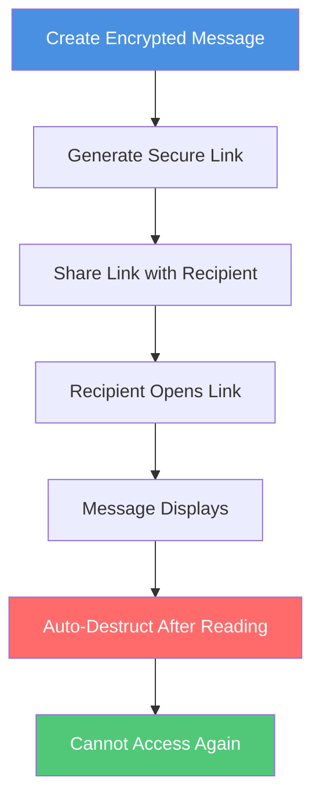
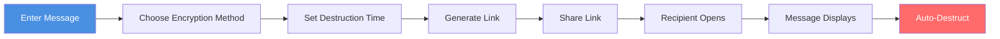

# Privnote Secure Self-Destruct Messages Guide: How to Send Encrypted Messages That Disappear After Reading

  
Need to send sensitive information but worried about messages being saved or forwarded? <strong>Privnote</strong> is a secure self-destruct messaging service that allows you to send encrypted messages that disappear after reading. This guide details how to use Privnote to send secure self-destruct messages and protect your privacy and information security.

## What is Privnote?

### Core Features

**Privnote** is an online secure messaging service with the following key features:

- ✅ **Auto-Destruct**: Messages are automatically deleted after being read
- ✅ **Encryption Protection**: Uses encryption technology to protect message content
- ✅ **Secure Links**: Generates unique secure links to share messages
- ✅ **Access Tracking**: Records message access time and device information

### How It Works

## Why Use Privnote?

### Use Cases

**1. Send Sensitive Information**
- Passwords and verification codes
- Bank account information
- Personal privacy data
- Temporary access credentials

**2. Share Business Secrets**
- Temporary authorization codes
- One-time passwords
- Confidential file links
- Internal information transmission

**3. Protect Personal Privacy**
- Conversations you don't want saved
- Temporarily shared information
- Contact information that needs to be kept confidential
- Sensitive personal data

## How to Use Privnote

### Basic Steps

**1. Visit Privnote Website**
   - Open privnote.chat
   - No registration required, use directly

**2. Enter Message Content**
   - Enter the message you want to send in the text box
   - Supports plain text content
   - Can enter multiple lines of text

**3. Set Destruction Time (Optional)**
   - Choose message destruction time
   - Options: Destroy immediately after reading, after 1 hour, after 24 hours, etc.
   - Default: Destroy immediately after reading

**4. Generate Secure Link**
   - Click "Create Note" or "Generate Link"
   - System generates unique secure link
   - Link contains encrypted message content

**5. Share Link**
   - Copy the generated link
   - Send via email, instant messaging, etc.
   - Recommend sending link through secure channels

**6. Recipient Views**
   - Recipient opens link
   - Message content displays
   - Auto-destructs after reading

### Usage Flow

## Privnote Encryption Methods

### 1. Encrypted Link Sharing

**How It Works:**
- Message content is encrypted
- Generates secure link containing encrypted content
- Message can only be accessed through the link
- Link is unique and time-limited

**Advantages:**
- ✅ Simple and easy to use
- ✅ High security
- ✅ No software installation required

### 2. Zero-Width Character Encryption

**How It Works:**
- Uses zero-width characters to hide messages
- Messages are invisible to the naked eye
- Requires special tools to read
- Adds an extra layer of security

**Use Cases:**
- Messages requiring higher security
- Prevent messages from being screenshot and saved
- Hide sensitive information

### 3. Binary Encryption

**How It Works:**
- Converts messages to binary format (0s and 1s)
- Provides additional encryption protection
- Requires decoding to read
- Enhances message security

## Security Features

### Auto-Destruct Mechanism

**Destruction Timing:**
- Destroy immediately after reading (default)
- Auto-destruct after set time
- Destroy after reaching access count
- Manual trigger destruction

**Destruction Effects:**
- Message content completely deleted
- Link becomes invalid, cannot access again
- No traces left on server
- Ensures information is not saved

### Access Tracking

**Recorded Information:**
- Access time
- Access device information
- Visitor ID
- Access count

**Uses:**
- Confirm if message has been read
- Track message access situation
- Detect abnormal access
- Provide security audit

## Best Practices

### Usage Recommendations

**1. Choose Appropriate Destruction Time**
- Sensitive information: Destroy immediately after reading
- General information: Destroy after 1-24 hours
- Reference information: Destroy after 7 days

**2. Share Links Securely**
- Send links through encrypted channels
- Avoid sharing in public places
- Don't post links on social media
- Recommend sending through private messages

**3. Protect Link Security**
- Don't save links to insecure places
- Avoid using the same link in multiple places
- Delete unnecessary links promptly
- Regularly check access records

### Important Notes

**1. Messages Cannot Be Recovered Once Destroyed**
- Ensure recipients have read important information
- Recommend backing up important information
- Don't rely on self-destruct messages as the only record

**2. Cannot Completely Prevent Screenshots**
- Recipients may still take screenshots
- Recommend combining with other security measures
- Don't share overly sensitive information

**3. Link Security**
- Links themselves may be forwarded
- Recommend setting access password
- Limit link validity period

## Frequently Asked Questions

### Q1: Is Privnote free?

**A:** Yes, Privnote provides free basic services. Some advanced features may require payment.

### Q2: Can messages be recovered after destruction?

**A:** No. Once messages are destroyed, they cannot be recovered. This is to ensure information security.

### Q3: Can I set an access password for messages?

**A:** Some versions support setting access passwords to add extra security protection.

### Q4: How to know if a message has been read?

**A:** You can check message access time and device information through access logs.

### Q5: What languages does Privnote support?

**A:** Privnote supports multiple languages, including Chinese, English, Spanish, French, Japanese, and German.

### Q6: Will messages be saved to the server?

**A:** Messages are deleted from the server after destruction and are not stored long-term.

## Summary

Privnote is a practical secure self-destruct messaging service suitable for scenarios requiring sending sensitive information:

- ✅ **Auto-Destruct**: Messages automatically deleted after reading
- ✅ **Encryption Protection**: Multiple encryption methods protect message security
- ✅ **Simple and Easy**: No registration required, use directly
- ✅ **Access Tracking**: Records message access situation

Remember, self-destruct messages are not a panacea. It's recommended to combine with other security measures such as using strong passwords and encrypted communication to build a complete information security system.

