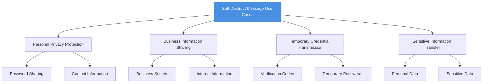
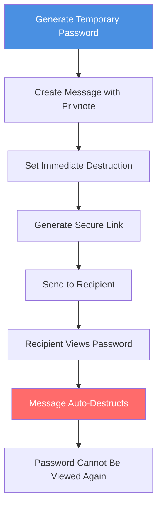
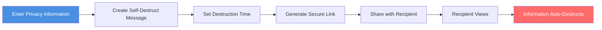

# Privnote Self-Destruct Messages Use Cases: When to Use Messages That Disappear After Reading

  
What scenarios are suitable for self-destruct messaging services? <strong>Privnote self-destruct messages</strong> can automatically delete after being read, protecting information from being saved and forwarded. This guide introduces use cases for self-destruct messages to help you understand when to use self-destruct messaging services.

## Core Value of Self-Destruct Messages

### Why Need Self-Destruct Messages?

The main value of self-destruct messaging services lies in:

- ✅ **Auto-Delete**: Messages automatically destroyed after reading, leaving no traces
- ✅ **Prevent Saving**: Cannot save message content, reducing leak risk
- ✅ **Privacy Protection**: Protect sensitive information from long-term storage
- ✅ **Temporary Sharing**: Suitable for sharing temporary, one-time information

### Use Case Categories

## Use Case 1: Password and Verification Code Sharing

### Scenarios

**1. Temporary Password Sharing**
- Set temporary passwords for new users
- Passwords need to be changed immediately after use
- Don't want passwords to be saved

**2. Verification Code Transmission**
- Send login verification codes
- One-time use verification information
- Immediately invalid after use

**3. Account Information Sharing**
- Temporarily share account passwords
- Don't want passwords to be saved long-term
- Need to change password after use

### Usage Flow

### Advantages

- ✅ Passwords won't be saved
- ✅ Automatically deleted after use
- ✅ Reduce password leak risk
- ✅ Suitable for temporary password sharing

## Use Case 2: Business Secrets and Internal Information

### Scenarios

**1. Business Proposal Sharing**
- Send business plan links
- Don't want proposals to be saved
- Limit access count

**2. Internal Information Transmission**
- Share internal meeting minutes
- Temporary authorization information
- Confidential file links

**3. Customer Information Sharing**
- Temporarily share customer contact information
- Don't want information to be saved long-term
- Immediately deleted after use

### Usage Recommendations

**Setting Recommendations:**
- Set shorter destruction time (1-24 hours)
- Limit access count (1-3 times)
- Use access tracking features
- Combine with password protection

### Important Notes

- ⚠️ Important information should be backed up
- ⚠️ Cannot completely prevent screenshots
- ⚠️ Recommend combining with other security measures
- ⚠️ Regularly check access records

## Use Case 3: Personal Privacy Information Protection

### Scenarios

**1. Personal Contact Information**
- Temporarily share phone numbers
- Don't want to be saved to contacts
- Automatically deleted after use

**2. Personal Address Information**
- Share temporary addresses
- Don't want addresses to be saved long-term
- Immediately deleted after use

**3. Personal Data Sharing**
- Temporarily share ID numbers
- Bank account information
- Other sensitive personal information

### Privacy Protection Flow

### Protection Measures

- ✅ Information automatically deleted after reading
- ✅ Cannot access again
- ✅ Reduce information leak risk
- ✅ Protect personal privacy

## Use Case 4: Temporary Authorization and Access Credentials

### Scenarios

**1. Temporary Access Codes**
- Share temporary system access codes
- One-time use credentials
- Immediately invalid after use

**2. API Key Sharing**
- Temporarily share API keys
- Don't want keys to be saved
- Need to replace after use

**3. Temporary Authorization Links**
- Share temporary authorization links
- Limit access count
- Automatically invalid after use

### Usage Flow

1. **Create Temporary Credentials**
   - Generate temporary access codes or keys
   - Set validity period

2. **Share Using Self-Destruct Message**
   - Create self-destruct message
   - Set immediate destruction
   - Generate secure link

3. **Recipient Uses**
   - Recipient views credentials
   - Uses credentials to access system
   - Message automatically destructs

4. **Credentials Expire**
   - Credentials invalid after use
   - Message cannot be viewed again
   - Ensure security

## Use Case 5: Sensitive Document Link Sharing

### Scenarios

**1. Confidential Document Links**
- Share access links to confidential documents
- Don't want links to be saved
- Limit access count

**2. Temporary File Sharing**
- Share download links for temporary files
- Files deleted after use
- Links automatically expire

**3. Restricted Content Access**
- Share access links to restricted content
- Limit access time
- Immediately invalid after use

### Security Settings

**Recommended Settings:**
- Destruction time: Destroy immediately after reading
- Access count: 1-3 times
- Access password: Set access password
- Access tracking: Enable access logs

## Scenarios Not Suitable for Self-Destruct Messages

### Unsuitable Scenarios

**1. Information That Needs Long-Term Storage**
- Important contracts and agreements
- Legal documents
- Records that need to be archived

**2. Content That Needs Multiple Views**
- Reference materials
- Learning materials
- Information that needs repeated viewing

**3. Documents That Need Editing**
- Content that needs modification
- Collaborative editing documents
- Drafts that need to be saved

### Alternatives

For scenarios not suitable for self-destruct messages, consider:

- Use encrypted storage services
- Use access control features
- Use watermark protection features
- Use other secure sharing methods

## Best Practices

### Usage Recommendations

**1. Clarify Usage Purpose**
- Determine if information needs self-destruction
- Assess information importance
- Choose appropriate destruction time

**2. Securely Share Links**
- Send links through secure channels
- Avoid sharing in public places
- Don't post links on social media

**3. Combine with Other Security Measures**
- Set access password
- Limit access count
- Use access tracking features
- Regularly check access records

### Important Notes

**1. Messages Cannot Be Recovered**
- Ensure recipients have read important information
- Important information should be backed up
- Don't rely on self-destruct messages as the only record

**2. Cannot Completely Prevent Screenshots**
- Recipients may still take screenshots
- Recommend combining with other security measures
- Don't share overly sensitive information

**3. Link Security**
- Links themselves may be forwarded
- Recommend setting access password
- Limit link validity period

## Frequently Asked Questions

### Q1: Are self-destruct messages suitable for all scenarios?

**A:** No. Self-destruct messages are suitable for temporary, one-time information sharing, not suitable for content that needs long-term storage or multiple views.

### Q2: How to choose destruction time?

**A:** Choose based on information importance and use cases. Sensitive information recommend immediate destruction, general information can be set to destroy after 1-24 hours.

### Q3: Can I set an access password for messages?

**A:** Some versions support setting access passwords to add extra security protection.

### Q4: How to know if a message has been read?

**A:** You can check message access time and device information through access logs.

### Q5: Will self-destruct messages be saved to the server?

**A:** Messages are deleted from the server after destruction and are not stored long-term.

## Summary

Privnote self-destruct messages are suitable for various scenarios, mainly including:

- ✅ **Password and Verification Code Sharing**: Temporary credentials, deleted after use
- ✅ **Business Secret Sharing**: Internal information, limited access
- ✅ **Personal Privacy Protection**: Sensitive information, auto-destruct
- ✅ **Temporary Authorization Credentials**: One-time credentials, invalid after use
- ✅ **Sensitive Document Links**: Restricted content, automatically expire

Based on information characteristics and usage needs, reasonably choose self-destruct messaging services, combine with other security measures to build a complete information security protection system.

