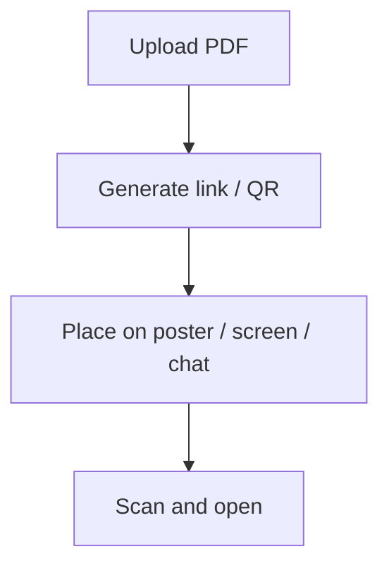

# 📲 QR Code PDF Sharing Made Easy

  
Picture this: You’re in front of an audience, ready to share your PDF. No email lists, no signups, no awkward file transfers.

  
Just a QR code. Scan it, view it, done.

  
Welcome to the future of PDF sharing—fast, seamless, and email-free.

## Why share PDFs

- Send files fast (quotes, handouts, slides)
- Avoid big attachments and re-sends
- Let people open with one tap

## Why QR codes

- No copy/paste
- Perfect for offline/onsite use (posters, booths, classrooms)
- Lowest friction for recipients

## How MaiPDF solves it

MaiPDF turns “share → scan → open” into one short path:

## 🧠 Why Skip Email?

Email is great, but it’s not always practical:

- **Slow:** Not ideal for live events.
- **Privacy Concerns:** Exposes recipient email addresses.
- **Unreliable:** Messages can get lost or filtered.
- **Connectivity Issues:** Requires everyone to be online.

In contrast, QR codes are:

- **Instant:** Share in seconds.
- **Universal:** Works on any device with a camera.
- **Effortless:** Easy to scan from screens or printed materials.

Perfect for conferences, classrooms, trade shows, and more.

## 🔄 How QR-Based PDF Sharing Works

Here’s how you can share PDFs using QR codes:

1. **Upload Your PDF**
   - Use a secure cloud service to host your file.

2. **Generate a Link**
   - Create a view-only link for your PDF.

3. **Create a QR Code**
   - Use a QR code generator to link to your file.

4. **Share the QR Code**
   - Display it on a screen or print it out for easy scanning.

Your audience scans the code and accesses the PDF instantly—no downloads, no logins.

## 🧪 Real-Life Scenarios

### 🎤 Conferences and Workshops
Share slides or handouts with attendees in real-time.

### 🏫 Classrooms
Provide students with instant access to study materials.

### 🛍️ Trade Shows
Distribute brochures or product catalogs without physical copies.

## 🛠 Tools Like MaiPDF Make It Simple

Platforms like MaiPDF streamline the process:

- **Upload PDFs:** Host your files securely.
- **Set Access Rules:** Control how many times the file can be opened.
- **Generate QR Codes:** Link directly to your PDF.
- **Track Views:** Monitor access with timestamps and Visitor IDs.

You can even disable links or update access settings later.

## 🔒 Privacy and Control

QR code sharing offers:

- **Anonymity:** No personal data collection.
- **Time-Limited Access:** Disable the link when it’s no longer needed.
- **Tracking:** Monitor who accessed your file and when.

## ✅ Key Takeaways

- QR codes simplify PDF sharing for live events.
- No emails, no downloads, no hassle.
- Perfect for presentations, classrooms, and more.

Embrace the future of document sharing. Try QR code-based PDF sharing today!