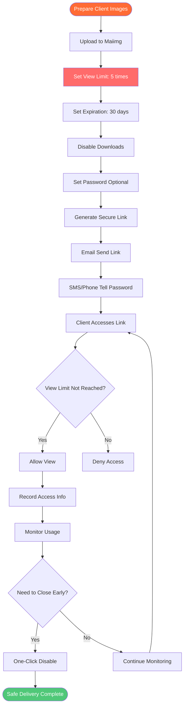

# Safe Client Image Delivery Tool: Secure Private Image Sharing with Maiimg

  
<strong>What tool is safe for sending private images to clients?</strong> Maiimg is a professional client image delivery tool that provides view limits, expiration dates, password protection, download control, and other security features to ensure your client's private images are shared securely. Used by photographers, designers, and business professionals. Completely free, no registration required.

## Why You Need a Safe Client Image Delivery Tool

**Problems with Traditional Methods:**
- ⚠️ **WeChat/QQ Sending** - Images can be forwarded, no control
- ⚠️ **Email Attachments** - File size limits, may be downloaded and saved
- ⚠️ **Cloud Storage Sharing** - Links may leak, cannot track access
- ⚠️ **Cloud Storage** - Requires registration, privacy risks
- ⚠️ **No Control** - Cannot limit views, cannot set expiration

**Maiimg Solutions:**
- ✅ **View Limits** - Set to view only 3-5 times, prevent unlimited sharing
- ✅ **Auto Expiration** - Auto-expire after 7-30 days, protect privacy
- ✅ **Disable Downloads** - Clients can only view, not download, protect copyright
- ✅ **Password Protection** - Additional security layer, only those who know password can view
- ✅ **Access Tracking** - Know who viewed and when
- ✅ **One-Click Disable** - Can close link immediately anytime

## Complete Process for Sending Private Images to Clients

### Safe Delivery Flow

### Step 1: Upload Client Images

**Steps:**
1. Visit [Maiimg.com](https://maiimg.com)
2. Select client images (up to 25)
3. Upload all images at once
4. Wait for upload to complete

**Security Features:**
- ✅ HTTPS encrypted upload
- ✅ Secure server storage
- ✅ Default private, not public
- ✅ Completely controlled by you

### Step 2: Configure Security Settings

**Key Security Settings:**

**View Limits:**
- 🔢 Set maximum views (e.g., 5 times)
- Link auto-expires after limit reached
- Prevent clients from unlimited sharing
- Recommended: 3-5 views for client previews, 1-3 for important files

**Expiration:**
- ⏰ Set expiration date (e.g., 30 days later)
- Link auto-expires after date
- Images no longer accessible
- Recommended: 14-30 days for client delivery, 1-7 days for confidential files

**Download Control:**
- ⬇️ **Must disable downloads**
- Clients can only view online
- Cannot save to local
- Protect your copyright and privacy

**Password Protection (Optional but Recommended):**
- 🔑 Set access password
- Send link and password separately
- Additional security layer
- Recommended: Must set password for important files

### Step 3: Share Securely with Clients

**Sharing Methods:**

**Method 1: Email + Phone (Most Secure)**
1. Send link via email
2. Tell password via phone/SMS
3. Link and password separate, more secure

**Method 2: Email + WeChat**
1. Email send link
2. WeChat separately send password
3. Don't send in same email

**Method 3: Face-to-Face Delivery**
1. Generate QR code
2. Print or show to client
3. Tell password in person

**Important Reminders:**
- ⚠️ **Never** send link and password in same email
- ⚠️ **Never** send both in WeChat/QQ at same time
- ✅ Use different channels to send separately is more secure

## Real Use Cases

### Case 1: Photographer Sending Photos to Clients

**Situation:** Wedding photographer needs to deliver wedding photos to couple

**Settings:**
- Upload wedding photos (20-25 images)
- View limit: 20 times (couple can view multiple times)
- Expiration: 90 days (give enough time)
- Download: **Disabled** (protect copyright)
- Password: Set simple password

**Sharing:**
- Email send link
- WeChat tell password
- Remind clients to view before expiration

**Benefits:**
- ✅ Protect photo copyright
- ✅ Control sharing scope
- ✅ Track client viewing
- ✅ Professional delivery method

### Case 2: Designer Sending Design Drafts to Clients

**Situation:** Designer needs to preview design proposals with clients

**Settings:**
- Upload design draft images (5-10 images)
- View limit: **3 times** (prevent clients from viewing repeatedly without paying)
- Expiration: **7 days** (time-sensitive content)
- Download: **Disabled** (protect design copyright)
- Password: **Must set** (important files)

**Sharing:**
- Email send link
- Phone tell password
- Remind clients to view promptly

**Benefits:**
- ✅ Protect design copyright
- ✅ Prevent clients from screenshotting without paying
- ✅ Control view count
- ✅ Track client engagement

## Security Features Explained

### 1. View Limits - Prevent Unlimited Sharing

**How It Works:**
- You set maximum views (e.g., 5 times)
- Each time client opens link, count +1
- After reaching 5 times, link auto-expires
- Even with link cannot view anymore

**Why Important:**
- Prevent clients from sharing link with friends
- Prevent clients from viewing repeatedly without paying
- Control image distribution scope
- Protect your rights

**Recommended Settings:**
- Client preview: 3-5 times
- Important files: 1-3 times
- Regular delivery: 10-20 times

### 2. Expiration - Auto Cleanup

**How It Works:**
- You set expiration date (e.g., 30 days later)
- After expiration, link auto-expires
- Images no longer accessible
- Auto cleanup, protect privacy

**Why Important:**
- Time-sensitive content auto-expires
- No need to manually delete
- Protect long-term privacy
- Meet data protection requirements

**Recommended Settings:**
- Client delivery: 14-30 days
- Confidential files: 1-7 days
- Regular sharing: 30-90 days

### 3. Disable Downloads - Protect Copyright

**How It Works:**
- Disable download button
- Prevent right-click save
- Block screenshot tools (partially)
- Can only view online

**Why Important:**
- Protect photo/design copyright
- Prevent clients from saving without paying
- Control image usage
- Maintain your rights

**Important Reminder:**
- ⚠️ **Must disable downloads** when sending private images to clients
- ⚠️ Otherwise clients can save and share
- ✅ Disabling downloads is the most basic security measure

## Conclusion: Safe Client Image Delivery Tool

**Maiimg is the best safe tool for sending private images to clients:**

✅ **View Limits** - Prevent unlimited sharing (set 3-10 times)  
✅ **Auto Expiration** - Protect privacy (auto-expire after 7-30 days)  
✅ **Disable Downloads** - Protect copyright (clients can only view, not download)  
✅ **Password Protection** - Additional security (send link and password separately)  
✅ **Access Tracking** - Know who viewed (IP, time, device)  
✅ **One-Click Disable** - Close anytime (disable immediately if abnormal)  
✅ **No Registration** - Use directly (completely free)  

**Ready to safely send private images to clients?**

Visit [Maiimg.com](https://maiimg.com) to use immediately. Upload images, set security parameters, share securely with clients. No registration required, completely free, professional and secure.

  <h2 class="solution-title">🚀 Ready to Start?</h2>
  
Experience the power of <strong>Maiimg</strong> - Upload, share, and track your images with complete control!

  <a href="https://maiimg.com" class="solution-button">Try Maiimg Now</a>

---

**Related Articles:**
- [One-Click Share Multiple Images: Gallery Sharing](/blog/en/one-click-share-multiple-images-gallery-sharing)
- [Social Media Image Gallery Sharing: Complete Guide](/blog/en/social-media-image-gallery-sharing-guide)
- [Secure Private Image Sharing: Client Image Delivery](/blog/en/secure-private-image-sharing-client-delivery)
