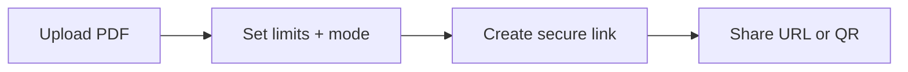

A **secure PDF link** here means: one URL (and optional QR) where **you decide** how long it works, **how many times** it can open, **how long each read session** lasts, and **how strictly** the file is shown—not a public folder anyone can rifle through. That is what [MaiPDF’s main tool](https://maipdf.com/pdf/maipdf2026.html) is built for: **Upload → Configure → Share**.

## 1) Upload the PDF

Upload your file to start the workflow. Everything else hangs off the link you generate next—not on emailing a raw attachment.

## 2) Configure access (this is the “secure” part)

On **Configure**, set at least:

- **Access limit** — how many opens you allow  
- **Each session** — how long one continuous read can run  
- **Expiration** — when the link stops working  

Optional when the audience matters:

- **Telegram read alerts** — know when someone opens the document  
- **Email verification** — readers confirm email before viewing  

Then pick a **viewing mode** (**SecureView**, **FenceView**, or **Unrestricted**) to match how much you want to tighten what people can do in the viewer. Add **dynamic watermark** when your setup offers it and the content needs it.

### Short flow

**Large access limits:** If **Access limit** is above **10,000**, MaiPDF treats the link as broadly open and **disables** access logging, Telegram alerts, and dynamic watermark. Use a realistic cap for anything you still consider “secure.”

## 3) Share the link and QR

You get a **copyable link** and a **QR** for the same rules—use either channel: email, chat, intranet, slide deck, or print.

## Why links can beat attachments

| With a controlled link | With a big attachment |
|------------------------|------------------------|
| Revoke or tighten by changing settings or rotating the link | Copies spread in inboxes |
| One place to update if you **replace the file** behind the link | Everyone has a stale file version |

“Secure” is not a buzzword—it is **the combination of limits, expiry, mode, and optional verification** you actually turned on.

---

**Related:** [Control PDF downloads and permissions](/en/control-pdf-downloads-permissions) · [Transform PDFs into shareable links in 3 steps](/en/transform-pdfs-shareable-links-3-steps) · [PDF attachment vs link in email](/en/pdf-attachment-vs-link-email-best-practices)
