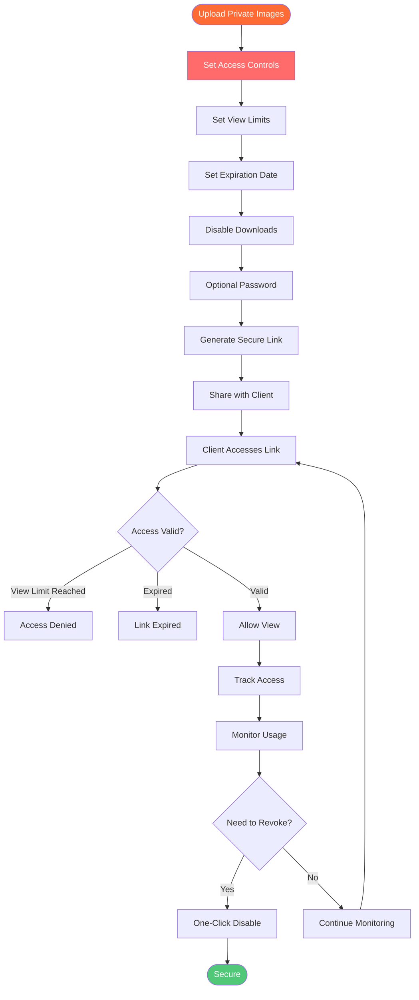

# Secure Private Image Sharing: Safe Client Image Delivery with Maiimg

  
Need to <strong>share private images securely with clients</strong>? Maiimg provides secure image sharing with advanced access control, view limits, expiration dates, password protection, and real-time tracking. Perfect for confidential client deliveries, private portfolios, wedding photos, and sensitive image sharing. Keep your images private and secure.

## Why Secure Private Image Sharing Matters

**Security Concerns:**
- ⚠️ Images can be downloaded and shared
- ⚠️ No control over who views images
- ⚠️ Images stay online indefinitely
- ⚠️ No tracking of access
- ⚠️ Privacy risks

**Maiimg Solutions:**
- ✅ **Access Control** - Control who sees images
- ✅ **View Limits** - Limit number of views
- ✅ **Expiration Dates** - Auto-expire links
- ✅ **Download Control** - Disable downloads
- ✅ **Tracking** - See who accessed images
- ✅ **Password Protection** - Optional password

## How Secure Private Image Sharing Works

### Security Process Flow

### Step 1: Upload Private Images

**Upload Process:**
1. Visit [Maiimg.com](https://maiimg.com)
2. Upload up to 25 images
3. Images stored securely
4. Configure security settings

**Security Features:**
- Secure HTTPS upload
- Encrypted storage
- Private by default
- Full control

### Step 2: Configure Security Settings

**Security Options:**
- 🔢 **View Limits** - Set maximum opens (e.g., 5 views)
- ⏰ **Expiration** - Set expiration date
- ⬇️ **Download Control** - Disable downloads
- 🔑 **Password** - Optional password protection
- 📧 **Email Verification** - Require email

**Recommended Settings for Private Images:**
- View limit: 3-10 views
- Expiration: 7-30 days
- Downloads: Disabled
- Password: Enabled (optional)

### Step 3: Share Securely

**Sharing Methods:**
- 📧 Email link separately
- 💬 Secure messaging
- 🔑 Share password separately
- 📱 QR code (for in-person)

**Best Practices:**
- Share link and password separately
- Use secure communication
- Set short expiration
- Monitor access

## Security Features Explained

### View Limits

**How It Works:**
- Set maximum number of views (e.g., 5)
- Link stops working after limit
- Prevents unlimited sharing
- Controls distribution

**Use Cases:**
- Client previews: 3-5 views
- Confidential documents: 1-3 views
- Private portfolios: 5-10 views

### Expiration Dates

**How It Works:**
- Set expiration date and time
- Link auto-disables after date
- Images no longer accessible
- Automatic cleanup

**Use Cases:**
- Time-sensitive content: 7 days
- Client deliveries: 30 days
- Confidential materials: 1-3 days

### Download Control

**How It Works:**
- Disable download button
- Prevent right-click save
- Block file saving
- View-only mode

**Use Cases:**
- Confidential images
- Client previews
- Private portfolios
- Sensitive content

### Password Protection

**How It Works:**
- Set password for gallery
- Share password separately
- Additional security layer
- Access control

**Use Cases:**
- Highly confidential content
- Client-specific access
- Private portfolios
- Sensitive materials

### Tracking & Monitoring

**What You Can Track:**
- 📊 Who viewed images
- ⏰ When images were viewed
- 📱 Device information
- 🌍 IP addresses
- 📈 Access patterns

**Benefits:**
- Monitor access
- Detect unauthorized access
- Track client engagement
- Ensure security

## Use Cases for Secure Private Sharing

### 1. Client Image Delivery

**Scenario:** Deliver photos to clients securely

**Setup:**
- Upload client photos
- Set view limit: 10 views
- Set expiration: 30 days
- Disable downloads
- Share link and password

**Benefits:**
- Secure delivery
- Controlled access
- Privacy protection
- Professional service

### 2. Wedding Photo Delivery

**Scenario:** Deliver wedding photos to couple

**Setup:**
- Upload wedding photos
- Set view limit: 20 views
- Set expiration: 90 days
- Optional password
- Share with couple

**Benefits:**
- Private sharing
- Controlled access
- Track engagement
- Professional delivery

### 3. Confidential Portfolio

**Scenario:** Share portfolio with select clients

**Setup:**
- Upload portfolio images
- Set view limit: 5 views
- Set expiration: 14 days
- Password protection
- Disable downloads

**Benefits:**
- Confidential sharing
- Access control
- Privacy protection
- Professional presentation

### 4. Sensitive Business Images

**Scenario:** Share confidential business images

**Setup:**
- Upload business images
- Set view limit: 3 views
- Set expiration: 7 days
- Password required
- Disable downloads
- Track all access

**Benefits:**
- Maximum security
- Full control
- Access tracking
- Compliance

## Security Best Practices

### 1. Set Appropriate Limits

**For Highly Confidential:**
- View limit: 1-3 views
- Expiration: 1-3 days
- Password: Required
- Downloads: Disabled

**For Client Deliveries:**
- View limit: 5-10 views
- Expiration: 14-30 days
- Password: Optional
- Downloads: Disabled

### 2. Share Credentials Separately

**Best Practice:**
- Share link via email
- Share password via SMS/phone
- Never share together
- Use secure channels

### 3. Monitor Access Regularly

**Regular Checks:**
- Review access logs daily
- Check for unauthorized access
- Monitor view counts
- Update settings if needed

### 4. Use Short Expiration

**Best Practice:**
- Set short expiration dates
- Extend if needed
- Auto-cleanup
- Privacy protection

## Comparison: Secure vs Public Sharing

### Secure Private Sharing (Maiimg)

**Advantages:**
- ✅ View limits
- ✅ Expiration dates
- ✅ Download control
- ✅ Password protection
- ✅ Access tracking
- ✅ One-click disable

### Public Sharing (Traditional)

**Disadvantages:**
- ❌ No view limits
- ❌ No expiration
- ❌ Downloads enabled
- ❌ No password
- ❌ No tracking
- ❌ No control

## Common Questions

### How Secure Is It?

**Very Secure:**
- HTTPS encryption
- Secure storage
- Access controls
- Tracking enabled
- One-click disable

### Can Clients Download Images?

**You Control:**
- Disable downloads
- View-only mode
- Prevent saving
- Full control

### How Long Do Images Stay Online?

**You Control:**
- Set expiration dates
- Auto-disable after date
- One-click delete
- Full control

### Can I See Who Viewed Images?

**Yes!** Full tracking:
- View count
- Access times
- Device info
- IP addresses

### Is Password Protection Available?

**Yes!** Optional password:
- Set password
- Share separately
- Additional security
- Access control

## Conclusion: Secure Private Image Sharing

Maiimg provides the best **secure private image sharing** with:
- ✅ View limits (control access)
- ✅ Expiration dates (auto-cleanup)
- ✅ Download control (view-only)
- ✅ Password protection (optional)
- ✅ Real-time tracking (monitor access)
- ✅ One-click disable (instant control)
- ✅ No registration required
- ✅ Completely free

**Perfect for:**
- ✅ Client image delivery
- ✅ Wedding photo delivery
- ✅ Confidential portfolios
- ✅ Sensitive business images
- ✅ Private sharing

**Ready to share images securely?**

Visit [Maiimg.com](https://maiimg.com) to upload images and configure secure sharing settings. Keep your images private and secure. No registration required, completely free.

---

**Related Articles:**
- [One-Click Share Multiple Images: Gallery Sharing](/blog/en/one-click-share-multiple-images-gallery-sharing)
- [Social Media Image Gallery Sharing: Complete Guide](/blog/en/social-media-image-gallery-sharing-guide)
- [Free Image Hosting: Complete Guide](/blog/en/free-image-hosting-maiimg-complete-guide)
