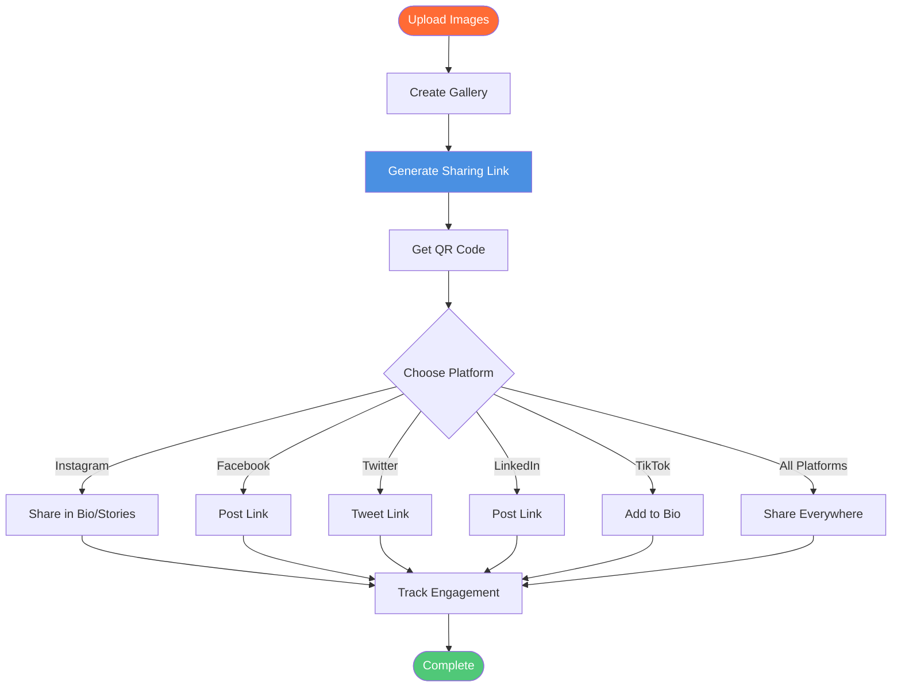

# Social Media Image Gallery Sharing: Share Image Galleries on Social Media

  
Need to <strong>share image galleries on social media</strong>? Maiimg lets you create professional image galleries, generate sharing links, create QR codes, and share on Instagram, Facebook, Twitter, LinkedIn, TikTok, and more. Upload up to 25 images, get one sharing link, and share across all platforms. Perfect for social media marketing, event promotion, and content sharing.

## What is Social Media Image Gallery Sharing?

**Social media image gallery sharing** allows you to create professional image galleries and share them across social media platforms with a single link. Instead of posting individual images, you create a gallery and share one link that works on all platforms.

**Benefits:**
- ✅ **One Link for All** - Share on multiple platforms
- ✅ **Professional Gallery** - Beautiful presentation
- ✅ **Mobile-Friendly** - Works on all devices
- ✅ **Easy Sharing** - Copy and paste link
- ✅ **Track Engagement** - See views and engagement

## How Social Media Gallery Sharing Works

### Complete Sharing Process

### Step 1: Create Your Gallery

**Upload Process:**
1. Visit [Maiimg.com](https://maiimg.com)
2. Upload up to 25 images
3. Gallery created automatically
4. Get sharing link

**Gallery Features:**
- Professional layout
- Mobile-responsive
- Fast loading
- Beautiful presentation

### Step 2: Get Sharing Link

**What You Get:**
- ✅ **Sharing Link** - Works on all platforms
- ✅ **QR Code** - For offline sharing
- ✅ **Gallery View** - Professional display
- ✅ **Mobile-Optimized** - Perfect for social media

### Step 3: Share on Social Media

**Platforms Supported:**
- 📷 Instagram
- 👥 Facebook
- 🐦 Twitter/X
- 💼 LinkedIn
- 🎵 TikTok
- 📌 Pinterest
- And more!

## Platform-Specific Sharing

### Instagram Sharing

**Methods:**
1. **Bio Link** - Add gallery link to bio
2. **Stories** - Share link in stories
3. **Posts** - Mention link in captions
4. **QR Code** - Display QR code at events

**Best Practices:**
- Use short, descriptive text
- Include call-to-action
- Track engagement
- Update regularly

### Facebook Sharing

**Methods:**
1. **Posts** - Share link in posts
2. **Groups** - Share in groups
3. **Events** - Add to event pages
4. **Pages** - Share on business pages

**Best Practices:**
- Add engaging description
- Include images
- Use hashtags
- Engage with comments

### Twitter/X Sharing

**Methods:**
1. **Tweets** - Share link in tweets
2. **Threads** - Create tweet threads
3. **Bio** - Add to profile bio
4. **Pinned Tweets** - Pin gallery tweet

**Best Practices:**
- Keep tweets concise
- Use relevant hashtags
- Include images
- Engage with followers

### LinkedIn Sharing

**Methods:**
1. **Posts** - Share in posts
2. **Articles** - Include in articles
3. **Company Pages** - Share on pages
4. **Messages** - Share in messages

**Best Practices:**
- Professional tone
- Add context
- Engage with network
- Track engagement

### TikTok Sharing

**Methods:**
1. **Bio Link** - Add to profile bio
2. **Video Descriptions** - Include in descriptions
3. **Comments** - Share in comments
4. **QR Code** - Display in videos

**Best Practices:**
- Short, catchy descriptions
- Use trending hashtags
- Engage with comments
- Track views

## Use Cases

### 1. Event Promotion

**Scenario:** Promote events on social media

**Process:**
1. Upload event photos
2. Create gallery
3. Share on all platforms
4. Track engagement

**Benefits:**
- Consistent messaging
- Professional presentation
- Easy sharing
- Track effectiveness

### 2. Product Showcase

**Scenario:** Showcase products on social media

**Process:**
1. Upload product images
2. Create gallery
3. Share on platforms
4. Track views

**Benefits:**
- Multiple products, one link
- Professional display
- Easy sharing
- Analytics

### 3. Content Marketing

**Scenario:** Share content on social media

**Process:**
1. Upload content images
2. Create gallery
3. Share across platforms
4. Track engagement

**Benefits:**
- Multi-platform sharing
- Professional presentation
- Track performance
- Easy management

### 4. Influencer Collaboration

**Scenario:** Share collaboration content

**Process:**
1. Upload collaboration images
2. Create gallery
3. Share with influencers
4. Track distribution

**Benefits:**
- Easy sharing
- Professional presentation
- Track reach
- Manage collaborations

## Advanced Features

### Access Control

**Control Options:**
- 🔢 View limits
- ⏰ Expiration dates
- ⬇️ Download control
- ⏱️ Time restrictions

**Benefits:**
- Privacy protection
- Controlled sharing
- Security
- Compliance

### QR Code Integration

**QR Code Features:**
- Auto-generated
- Mobile-friendly
- Easy to print
- Perfect for events

**Social Media Use:**
- Instagram stories
- Facebook events
- Twitter events
- LinkedIn events

### Tracking & Analytics

**What You Can Track:**
- 📊 Total views
- ⏰ View times
- 📱 Device information
- 📈 Access trends
- 🌍 Geographic data

**Benefits:**
- Understand audience
- Track engagement
- Measure effectiveness
- Optimize strategy

## Best Practices

### 1. Optimize for Each Platform

**Tips:**
- Use platform-specific formats
- Optimize descriptions
- Include relevant hashtags
- Engage with audience

### 2. Create Engaging Descriptions

**Best Practice:**
- Write compelling copy
- Include call-to-action
- Use relevant hashtags
- Add context

### 3. Use QR Codes

**Best Practice:**
- Generate QR codes
- Display at events
- Include in posts
- Easy mobile access

### 4. Track and Analyze

**Regular Checks:**
- Review analytics
- Track engagement
- Monitor trends
- Optimize strategy

## Common Questions

### Can I Share on Multiple Platforms?

**Yes!** One link works everywhere:
- Instagram
- Facebook
- Twitter
- LinkedIn
- TikTok
- And more!

### Is It Mobile-Friendly?

**Yes!** Fully optimized:
- Mobile-responsive
- Fast loading
- Touch-friendly
- Perfect for mobile

### Can I Track Engagement?

**Yes!** Full analytics:
- View count
- Access times
- Device info
- Geographic data

### Are QR Codes Included?

**Yes!** Auto-generated:
- QR code for each gallery
- Mobile-friendly
- Easy to share
- Perfect for events

## Conclusion: Social Media Image Gallery Sharing

Maiimg makes it easy to **share image galleries on social media**:
- ✅ Upload up to 25 images
- ✅ Single link for all platforms
- ✅ QR code included
- ✅ Mobile-optimized
- ✅ Access control
- ✅ Real-time tracking
- ✅ No registration required
- ✅ Completely free

**Ready to share galleries on social media?**

Visit [Maiimg.com](https://maiimg.com) to create galleries and share on all social media platforms. No registration required, completely free.

  <h2 class="solution-title">🚀 Ready to Start?</h2>
  
Experience the power of <strong>Maiimg</strong> - Upload, share, and track your images with complete control!

  <a href="https://maiimg.com" class="solution-button">Try Maiimg Now</a>

---

**Related Articles:**
- [One-Click Share Multiple Images: Gallery Sharing](/blog/en/one-click-share-multiple-images-gallery-sharing)
- [Secure Private Image Sharing: Client Image Delivery](/blog/en/secure-private-image-sharing-client-delivery)
- [Free Image Hosting: Complete Guide](/blog/en/free-image-hosting-maiimg-complete-guide)
