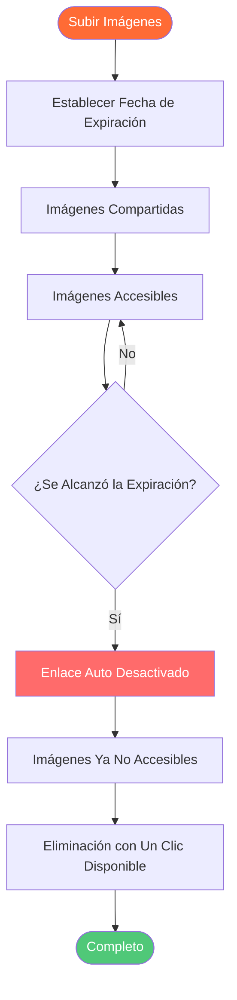

# Auto Eliminar Imágenes: Guía de Expiración y Auto Eliminación de Imágenes

  
¿Necesita <strong>auto eliminar imágenes</strong> después de cierto tiempo? Maiimg le permite establecer fechas de expiración de imágenes, desactivar automáticamente enlaces después de períodos de tiempo y controlar cuándo se eliminan las imágenes. Esta guía completa muestra cómo usar funciones de auto eliminación y expiración para alojamiento temporal de imágenes.

## ¿Qué es Auto Eliminar Imágenes?

**Auto eliminar imágenes** es una característica que elimina o desactiva automáticamente enlaces de imágenes después de un período de tiempo especificado. Esto es útil para compartir temporal de imágenes, protección de privacidad y gestión de almacenamiento de imágenes.

**Beneficios de Auto Eliminar:**
- ✅ **Protección de Privacidad** - Las imágenes se eliminan automáticamente
- ✅ **Gestión de Almacenamiento** - No se necesita limpieza manual
- ✅ **Compartir Temporal** - Perfecto para contenido limitado en el tiempo
- ✅ **Seguridad** - Desactivación automática de enlaces
- ✅ **Cumplimiento** - Cumplir con requisitos de retención de datos

## Cómo Funciona Auto Eliminar

### Proceso de Expiración

## Conclusión: Auto Eliminar Imágenes

Maiimg proporciona las mejores características de **auto eliminar imágenes** con:
- ✅ Opciones de expiración flexibles
- ✅ Expiración basada en fecha
- ✅ Expiración de período de tiempo
- ✅ Expiración de límite de visualización
- ✅ Eliminación manual
- ✅ Controles combinados
- ✅ Seguimiento en tiempo real
- ✅ Completamente gratis
- ✅ No se requiere registro

**¿Listo para usar auto eliminar?**

Visite [Maiimg.com](https://maiimg.com) para subir imágenes y establecer fechas de expiración. Eliminación automática, protección de privacidad y control completo. No se requiere registro, completamente gratis.

---

**Artículos Relacionados:**
- [Compartir Múltiples Imágenes con Un Clic: Compartir Galería](/blog/es/one-click-share-multiple-images-gallery-sharing)
- [Compartir Galería de Imágenes en Redes Sociales: Guía Completa](/blog/es/social-media-image-gallery-sharing-guide)
- [Alojamiento de Imágenes Gratuito: Guía Completa](/blog/es/free-image-hosting-maiimg-complete-guide)
