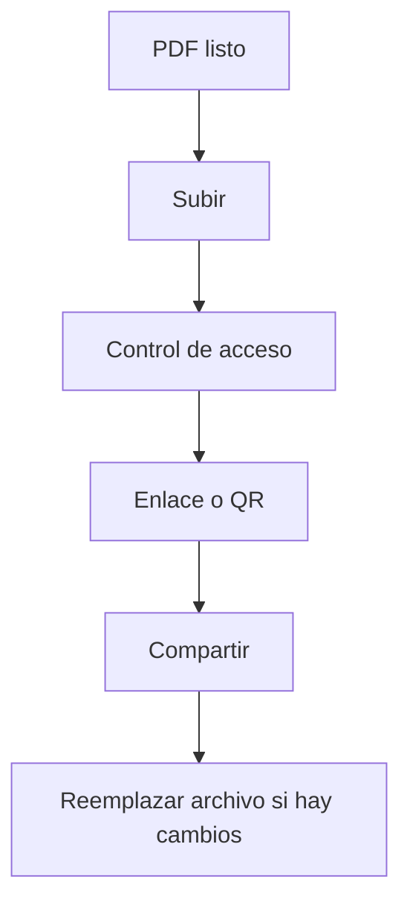

En entornos corporativos, enviar PDFs como adjuntos suele terminar en **versiones duplicadas** y poca trazabilidad. Una alternativa más ordenada es compartir **un enlace**.

MaiPDF está pensado para **compartir PDFs en línea** mediante enlace (para compartir imágenes, usa **Maiimg**).

## Flujo recomendado (práctico)

1. **Subir el PDF**
2. **Configurar control de acceso** (si aplica)
3. **Generar enlace / QR**
4. **Compartir**
5. **Actualizar con “Reemplazar archivo”** (el enlace no cambia)

> Nota: no asumimos “fecha de expiración” como función.

## Subir

## Configurar (opcional)

## Compartir por enlace/QR

## Mantener el enlace y actualizar la versión

Si necesitas publicar una nueva versión, usa **Reemplazar archivo** para mantener el mismo enlace.

Referencia: `https://sendpdfonline.com/article/replace-pdf-without-changing-link-zh`

