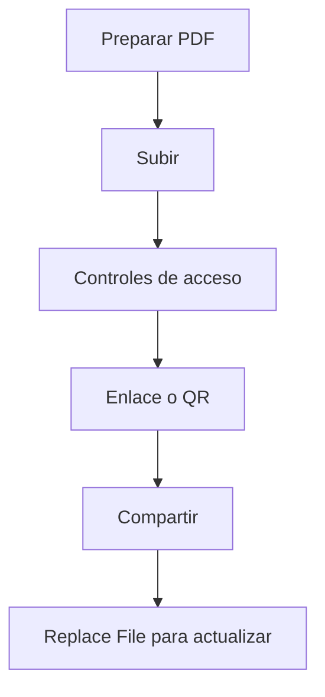

Enviar PDFs como adjuntos crea copias por todas partes. Una opción más limpia es **compartir un enlace**.

## Flujo recomendado

1. **Subir el PDF**
2. **Configurar controles de acceso** (opcional)
3. **Generar enlace / QR**
4. **Compartir**
5. **Actualizar con “Replace File”** (el enlace se mantiene)

> Nota: no asumimos que exista un ajuste de “fecha de caducidad/expiration date”.

## Capturas

## Actualizar sin cambiar el enlace

Cuando el documento cambia, **Replace File** ayuda a publicar una nueva versión sin reenviar un enlace nuevo.

Referencia: `https://sendpdfonline.com/article/replace-pdf-without-changing-link-zh`

