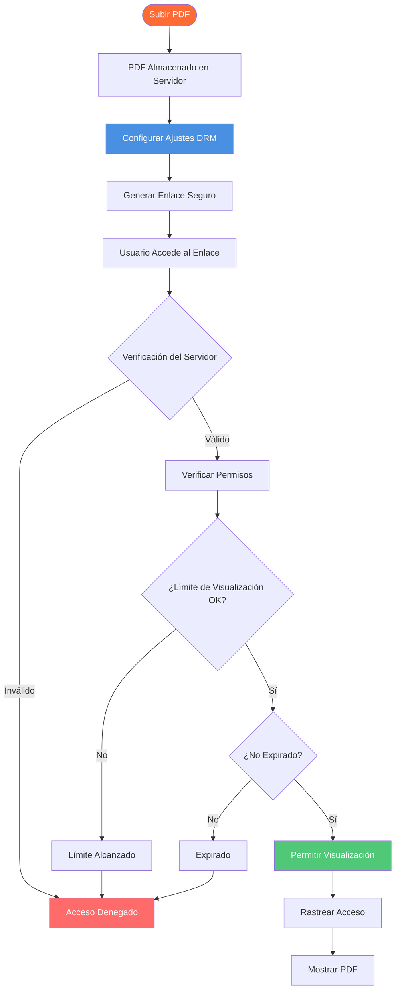

# PDF DRM en Línea: Guía Completa de Gestión de Derechos Digitales PDF en Línea

  
¿Necesita proteger sus documentos PDF en línea? El <strong>DRM PDF en línea</strong> (Gestión de Derechos Digitales) le permite controlar el acceso, prevenir descargas, limitar visualizaciones y rastrear el uso de sus PDFs. Esta guía completa explica cómo funciona el DRM en línea, sus características y cómo implementar la protección DRM PDF en línea para sus documentos.

## ¿Qué es el DRM PDF en Línea?

**El DRM PDF en Línea** (Gestión de Derechos Digitales) es una tecnología que protege documentos PDF controlando cómo pueden ser accedidos, visualizados y distribuidos en línea. A diferencia de la protección PDF tradicional que se basa en contraseñas o cifrado, el DRM en línea proporciona control basado en servidor y gestión en tiempo real.

**Características Clave:**
- ✅ **Control Basado en Servidor** - Permisos gestionados en el servidor
- ✅ **Gestión en Tiempo Real** - Cambiar configuraciones instantáneamente
- ✅ **Seguimiento de Acceso** - Monitorear quién visualiza documentos
- ✅ **No Se Requiere Software** - Funciona en cualquier navegador
- ✅ **Acceso Revocable** - Desactivar enlaces en cualquier momento

## Cómo Funciona el DRM PDF en Línea

### Arquitectura DRM en Línea

### Paso 1: Subir y Configurar

**Proceso:**
1. Subir PDF a la plataforma en línea
2. Configurar ajustes DRM
3. Establecer controles de acceso
4. Generar enlace seguro

**Ajustes DRM Disponibles:**
- Límites de visualización
- Fechas de expiración
- Prevención de descargas
- Prevención de impresión
- Control de acceso

### Paso 2: Verificación del Servidor

**Cómo Funciona:**
- El usuario accede al enlace
- El servidor verifica permisos
- Verifica límites de visualización
- Valida expiración
- Aplica restricciones

**Beneficios:**
- Control en tiempo real
- No se puede evitar
- Gestión centralizada
- Rastro de auditoría

### Paso 3: Control de Acceso

**Mecanismos de Control:**
- Modo solo visualización
- Bloqueo de descargas
- Prevención de impresión
- Prevención de copia
- Detección de captura de pantalla

## Características del DRM PDF en Línea

### 1. Control de Acceso

**Verificación por Correo Electrónico:**
- Requerir correo electrónico antes del acceso
- Restringir a correos electrónicos específicos
- Restricciones de dominio
- Autenticación basada en correo electrónico

**Protección con Contraseña:**
- Establecer contraseña de acceso
- Compartir contraseña por separado
- Capa de seguridad adicional
- Control de acceso

### 2. Límites de Visualización

**Cómo Funciona:**
- Establecer número máximo de visualizaciones (ej. 10)
- El servidor rastrea cada visualización
- El enlace deja de funcionar después del límite
- Previene acceso ilimitado

**Casos de Uso:**
- Documentos confidenciales: 1-3 visualizaciones
- Vistas previas de clientes: 5-10 visualizaciones
- Materiales de capacitación: 20-50 visualizaciones

### 3. Control de Expiración

**Expiración Basada en Tiempo:**
- Establecer fecha de expiración
- Desactivar automáticamente después de la fecha
- Acceso limitado en el tiempo
- Limpieza automática

**Beneficios:**
- Compartir temporal
- Protección de privacidad
- Soporte de cumplimiento
- Gestión automática

### 4. Prevención de Descargas

**Control de Descarga:**
- Desactivar botón de descarga
- Bloquear guardado con clic derecho
- Prevenir guardado de archivos
- Modo solo visualización

**Por Qué Es Importante:**
- Proteger derechos de autor
- Prevenir distribución
- Controlar acceso
- Mantener seguridad

## Conclusión: DRM PDF en Línea

El DRM PDF en línea proporciona protección poderosa de documentos con:
- ✅ Control de acceso en tiempo real
- ✅ Límites de visualización y expiración
- ✅ Prevención de descargas e impresión
- ✅ Filigranas dinámicas
- ✅ Seguimiento completo
- ✅ Revocación instantánea
- ✅ No se requiere software
- ✅ Gestión fácil

**¿Listo para proteger sus PDFs con DRM en línea?**

MaiPDF ofrece DRM PDF en línea gratuito con todas estas características. Suba su PDF, configure los ajustes DRM, genere enlaces seguros y proteja sus documentos. No se requiere registro.

---

**Artículos Relacionados:**
- [DRM PDF Sin Conexión: Solución Empresarial](/blog/es/offline-pdf-drm-enterprise-solution)
- [Control de Acceso PDF: Guía Completa](/blog/es/pdf-access-control-complete-guide)
