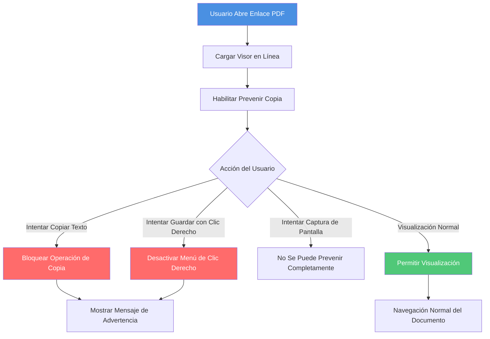

# Visor PDF en Línea Prevenir Copia: Proteger Contenido del Documento de la Copia

  
Al compartir documentos PDF, ¿cómo puede prevenir que los destinatarios copien el contenido del documento? La <strong>función de prevenir copia</strong> puede bloquear efectivamente la copia de texto, el guardado de imágenes y otras operaciones para proteger la seguridad del contenido del documento. Esta guía explica cómo configurar la función de prevenir copia para visores PDF en línea.

## Por Qué Prevenir la Copia?

### Casos de Uso Comunes

**1. Protección de Contenido con Derechos de Autor**
- Artículos originales e informes de investigación
- Prevenir que el contenido sea copiado y republicado
- Proteger la propiedad intelectual

**2. Protección de Secretos Comerciales**
- Planes de productos y estrategias comerciales
- Prevenir que el contenido sea copiado a competidores
- Proteger secretos comerciales

**3. Gestión de Contenido Educativo**
- Materiales del curso y preguntas de examen
- Prevenir que los estudiantes copien respuestas
- Proteger recursos de enseñanza

**4. Protección de Trabajo de Diseño**
- Borradores de diseño y propuestas creativas
- Prevenir que los diseños sean copiados y utilizados
- Proteger logros creativos

## Cómo Funciona Prevenir Copia

### Mecanismo de Protección

**Contenido Protegido:**
- ✅ Prevenir selección y copia de texto
- ✅ Desactivar menú de clic derecho
- ✅ Prevenir guardado directo de imágenes
- ✅ Limitar función de impresión

## Conclusión

La función de prevenir copia para visores PDF en línea es una herramienta importante para proteger la seguridad del contenido del documento. Se recomienda combinarla con filigranas, control de acceso, desactivar descargas y otras funciones para construir un sistema de protección de documentos multicapa y garantizar de manera integral la seguridad del documento.

---

**Artículos Relacionados:**
- [DRM PDF en Línea: Guía Completa](/blog/es/pdf-online-drm-complete-guide)
- [Seguridad PDF: Mejores Prácticas](/blog/es/pdf-security-best-practices-complete-guide-document-protection)
