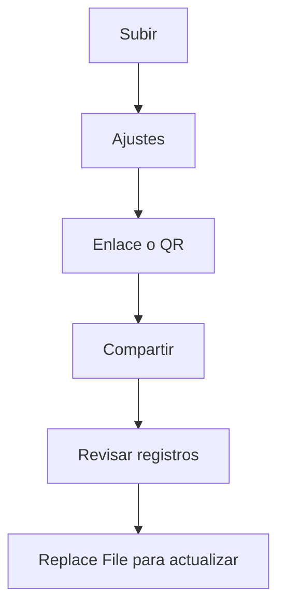

La seguridad de un PDF compartido suele fallar por dos cosas: **copias descontroladas** y **falta de trazabilidad**.

Aquí va una guía breve (sin prometer funciones que no existan).

## Flujo recomendado

1. **Subir**
2. **Configurar controles de acceso** (solo si hace falta)
3. **Generar enlace / QR**
4. **Compartir**
5. **Revisar registros**
6. **Actualizar con Replace File** (mismo enlace)

> Nota: MaiPDF online no se describe como “poner fecha de expiración”. Evita ese tipo de afirmaciones.

## Capturas útiles

## Actualizar sin romper el enlace

Referencia: `https://sendpdfonline.com/article/replace-pdf-without-changing-link-zh`

