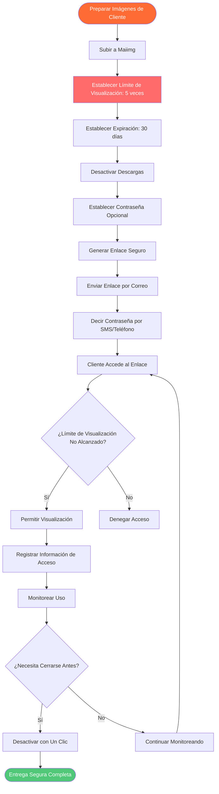

# Herramienta Segura de Entrega de Imágenes a Clientes: Compartir Imágenes Privadas de Forma Segura con Maiimg

  
<strong>¿Qué herramienta es segura para enviar imágenes privadas a clientes?</strong> Maiimg es una herramienta profesional de entrega de imágenes a clientes que proporciona límites de visualización, fechas de expiración, protección con contraseña, control de descarga y otras características de seguridad para asegurar que sus imágenes privadas de clientes se compartan de forma segura. Utilizado por fotógrafos, diseñadores y profesionales de negocios. Completamente gratis, no se requiere registro.

## Por Qué Necesita una Herramienta Segura de Entrega de Imágenes a Clientes

**Problemas con Métodos Tradicionales:**
- ⚠️ **Envío por WeChat/QQ** - Las imágenes pueden ser reenviadas, sin control
- ⚠️ **Adjuntos de Correo** - Límites de tamaño de archivo, pueden ser descargados y guardados
- ⚠️ **Compartir en Almacenamiento en la Nube** - Los enlaces pueden filtrarse, no se puede rastrear el acceso
- ⚠️ **Almacenamiento en la Nube** - Requiere registro, riesgos de privacidad
- ⚠️ **Sin Control** - No se pueden limitar las visualizaciones, no se puede establecer expiración

**Soluciones Maiimg:**
- ✅ **Límites de Visualización** - Establecer para ver solo 3-5 veces, prevenir compartir ilimitado
- ✅ **Expiración Automática** - Expirar automáticamente después de 7-30 días, proteger privacidad
- ✅ **Desactivar Descargas** - Los clientes solo pueden ver, no descargar, proteger derechos de autor
- ✅ **Protección con Contraseña** - Capa de seguridad adicional, solo quienes conocen la contraseña pueden ver
- ✅ **Seguimiento de Acceso** - Saber quién vio y cuándo
- ✅ **Desactivar con Un Clic** - Cerrar enlace inmediatamente en cualquier momento

## Proceso Completo para Enviar Imágenes Privadas a Clientes

### Flujo de Entrega Segura

## Conclusión: Herramienta Segura de Entrega de Imágenes a Clientes

**Maiimg es la mejor herramienta segura para enviar imágenes privadas a clientes:**

✅ **Límites de Visualización** - Prevenir compartir ilimitado (establecer 3-10 veces)  
✅ **Expiración Automática** - Proteger privacidad (expirar automáticamente después de 7-30 días)  
✅ **Desactivar Descargas** - Proteger derechos de autor (clientes solo pueden ver, no descargar)  
✅ **Protección con Contraseña** - Seguridad adicional (enviar enlace y contraseña por separado)  
✅ **Seguimiento de Acceso** - Saber quién vio (IP, tiempo, dispositivo)  
✅ **Desactivar con Un Clic** - Cerrar en cualquier momento (desactivar inmediatamente si es anormal)  
✅ **Sin Registro** - Usar directamente (completamente gratis)  

**¿Listo para enviar imágenes privadas de forma segura a clientes?**

Visite [Maiimg.com](https://maiimg.com) para usar inmediatamente. Suba imágenes, establezca parámetros de seguridad, comparta de forma segura con clientes. No se requiere registro, completamente gratis, profesional y seguro.

---

**Artículos Relacionados:**
- [Compartir Múltiples Imágenes con Un Clic: Compartir Galería](/blog/es/one-click-share-multiple-images-gallery-sharing)
- [Compartir Galería de Imágenes en Redes Sociales: Guía Completa](/blog/es/social-media-image-gallery-sharing-guide)
