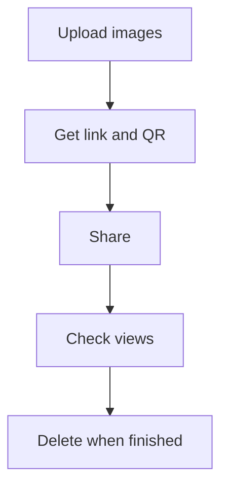

Par défaut, un lien partagé peut circuler longtemps. Si votre besoin est “que ça n’existe plus après un certain temps”, le plus sûr est d’avoir un **processus clair** (et pas une promesse magique).

Maiimg est un outil de **partage d’images** (pas de PDF). Voici une façon simple de gérer la “fin de vie” d’un partage.

## Flux recommandé

1. **Téléverser les images**
2. **Obtenir un lien / QR**
3. **Partager**
4. **Vérifier les vues** (si besoin)
5. **Quand c’est fini : supprimer le partage** (arrêter le lien)

## Captures

## Remarque

- Ce guide ne suppose pas une “date d’expiration automatique” intégrée.
- Si vous avez une contrainte stricte (ex. conformité), prévoyez une politique interne (qui supprime/retire le partage au bon moment).

