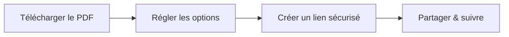

# Réglages de partage PDF

  
Cette page explique <strong>les réglages que vous voyez à l’écran</strong> et à quoi ils servent.

## Les 5 réglages à connaître

1. **Limite d’accès**  
   Limite le nombre total d’ouvertures.

2. **Durée par session**  
   Limite le temps de lecture par session.

3. **Type de protection**  
   - DynamoWatermark  
   - SecureView (lecture seule)  
   - FenceView (dissuasion des captures)  
   - Unrestricted  

4. **Vérification e‑mail**  
   Exige une vérification avant l’accès.

5. **Notification de lecture (optionnel)**  
   Recevez un e‑mail à l’ouverture.

## Flux rapide

