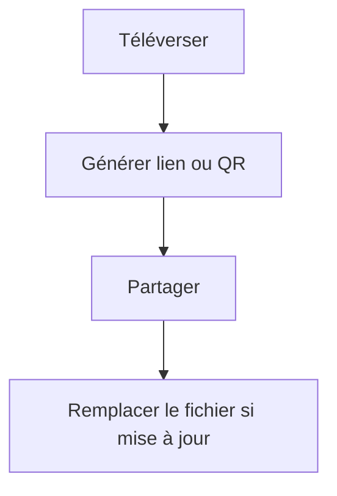

Partager un PDF ne devrait pas créer dix versions différentes dans des boîtes mail. Une approche plus simple est de **partager un lien**.

## Flux en 3 étapes

1. **Téléverser**
2. **Générer un lien / QR**
3. **Partager**

> Note : on ne suppose pas de réglage “expiration date”.

## Mise à jour sans nouveau lien

Quand le PDF change, utilisez **Remplacer le fichier** pour garder le même lien.

Référence : `https://sendpdfonline.com/article/replace-pdf-without-changing-link-zh`

