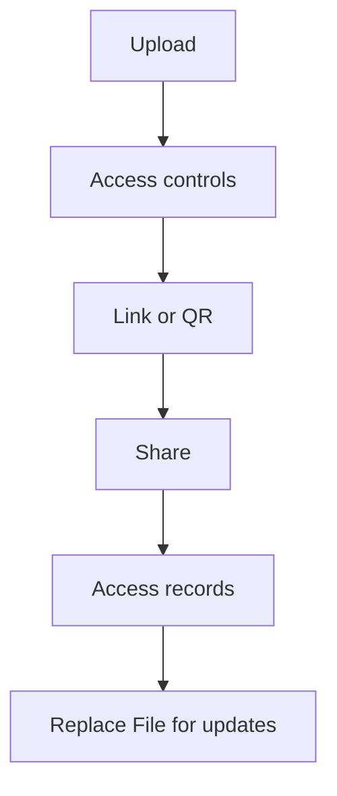

En entreprise, le problème n’est pas seulement “chiffrer un fichier” : c’est surtout **savoir qui a vu quoi**, et éviter que des copies circulent sans contrôle.

Sans sur-promesse, voici un flux pragmatique pour un partage plus propre.

## Flux recommandé

1. **Téléverser**
2. **Régler les contrôles d’accès** (si nécessaire)
3. **Générer un lien / QR**
4. **Partager**
5. **Consulter les enregistrements**
6. **Mettre à jour via Replace File** (lien identique)

> Note : on n’affirme pas l’existence d’un réglage “date d’expiration”.

## Captures

## Mise à jour sans casser le lien

Référence : `https://sendpdfonline.com/article/replace-pdf-without-changing-link-zh`

