# Maiimg Guide Complet : Plateforme Professionnelle de Partage d'Images Simple et Sécurisée

  
<strong>Maiimg</strong> est une plateforme professionnelle de partage d'images en ligne qui vous permet de générer rapidement des liens de partage sans inscription, de contrôler les permissions d'accès à tout moment et de suivre l'ouverture des images en temps réel. Qu'il s'agisse de photos d'événements, d'images produits ou d'œuvres de design, Maiimg rend le partage d'images simple, sécurisé et contrôlable.

## Qu'est-ce que Maiimg ?

### Positionnement de la Plateforme

Maiimg est une **plateforme de partage et de gestion d'images en ligne** axée sur la fourniture de solutions de partage d'images simples, sécurisées et contrôlables.

**Caractéristiques Principales :**
- ✅ **Aucune Inscription Requise** - Utilisation immédiate, zéro barrière
- ✅ **Génération Instantanée** - Génération de liens immédiatement après téléchargement
- ✅ **Entièrement Gratuit** - Toutes les fonctionnalités de base sont gratuites
- ✅ **Sécurité Professionnelle** - Contrôle d'accès, suivi des données, gestion par lots

### Maiimg vs Méthodes Traditionnelles

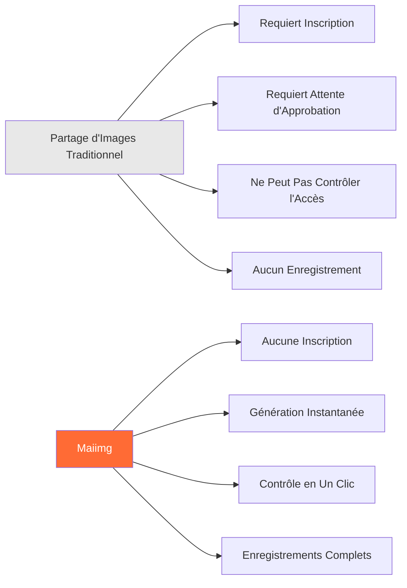

## Aperçu des Fonctionnalités Principales

### Architecture des Fonctionnalités

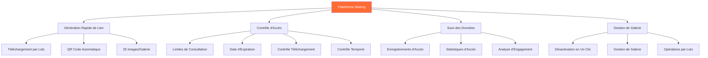

## Flux de Travail Complet

### Flux Complet du Téléchargement au Partage

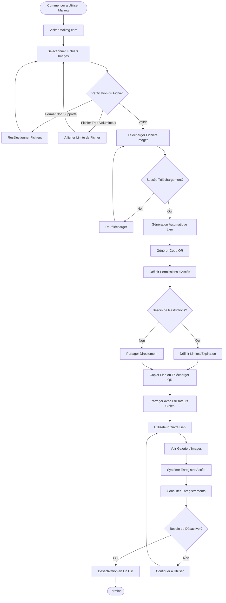

### Trois Étapes pour Commencer

**Étape 1 : Télécharger Images**
- Visiter Maiimg.com
- Glisser-déposer ou sélectionner fichiers images
- Supporte téléchargement par lots (jusqu'à 25 images/galerie)

**Étape 2 : Générer Lien**
- Génération automatique de lien de partage
- Génération automatique de code QR
- Définir permissions d'accès

**Étape 3 : Partager et Utiliser**
- Copier lien pour partager
- Ou télécharger code QR pour partager
- Consulter enregistrements d'accès en temps réel

## Fonctionnalités Principales Expliquées

### Fonctionnalité 1 : Génération Rapide de Lien

**Caractéristiques :**
- ⚡ Génération instantanée (génération immédiate après téléchargement)
- 🔗 Génération automatique de lien unique
- 📱 Génération automatique de code QR
- 📦 Supporte téléchargement par lots (jusqu'à 25 images/galerie)

**Organigramme :**

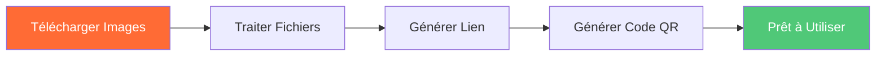

### Fonctionnalité 2 : Contrôle d'Accès

**Options de Contrôle :**

| Contrôle | Description | Cas d'Usage |
|----------|------------|-------------|
| Limites de Consultation | Limiter le nombre de fois que la galerie peut être ouverte | Photos d'événements, partage limité |
| Date d'Expiration | Définir expiration automatique du lien | Partage temporaire, matériel d'événement |
| Contrôle Téléchargement | Autoriser ou interdire le téléchargement d'images | Protection des droits d'auteur, prévenir la distribution |
| Contrôle Temporel | Définir périodes d'accès | Événements à durée limitée, publication programmée |

**Organigramme de Contrôle d'Accès :**

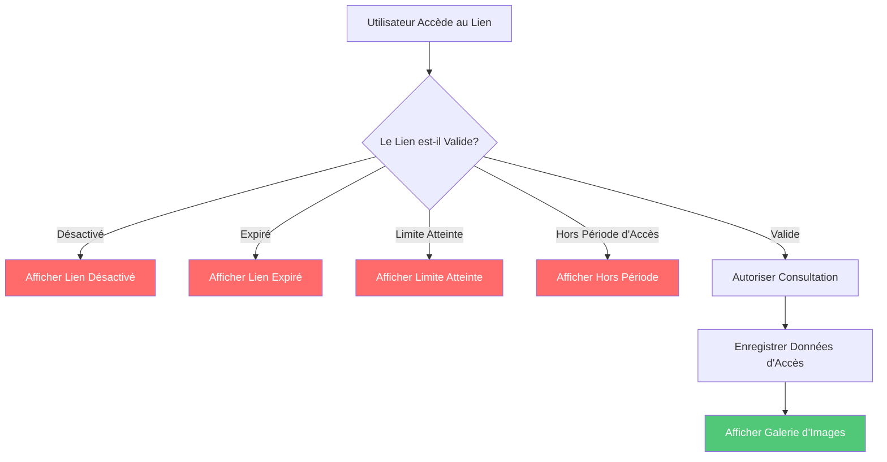

### Fonctionnalité 3 : Suivi des Données

**Contenu Suivi :**
- 📊 Nombre total d'ouvertures
- ⏰ Heure de chaque ouverture
- 📱 Informations sur l'appareil
- 📈 Analyse des tendances d'accès
- 🎯 Données d'engagement des images

**Organigramme de Suivi des Données :**

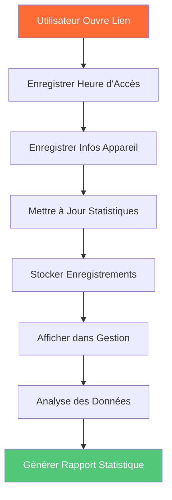

### Fonctionnalité 4 : Gestion de Galerie

**Fonctionnalités de Gestion :**
- 🚫 Désactivation en un clic du lien
- 📝 Modification des paramètres d'accès
- 📊 Consultation de l'interface de gestion
- 🗑️ Suppression de galerie

**Organigramme de Gestion de Galerie :**

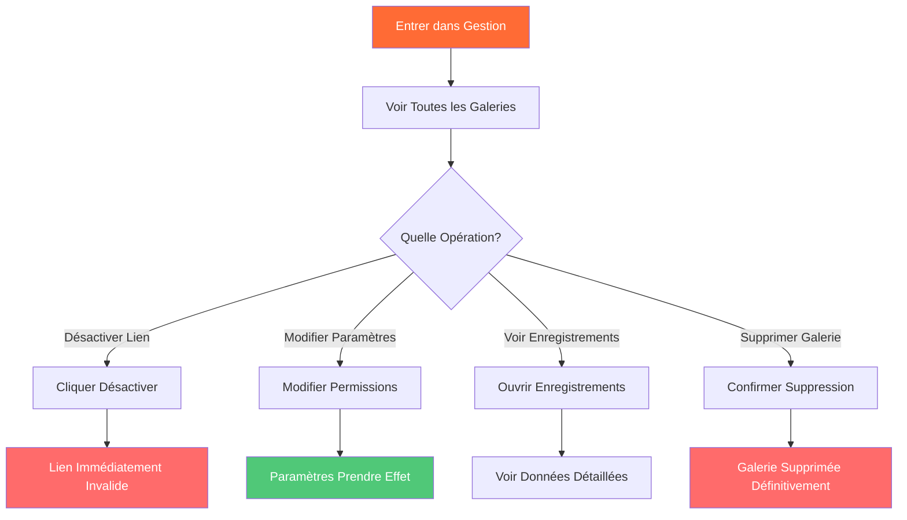

## Scénarios d'Application

### Catégories de Scénarios

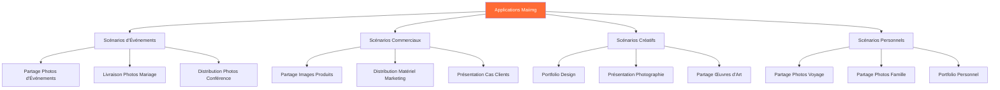

### Flux de Scénario d'Application Typique

**Scénario : Partage de Photos d'Événement**

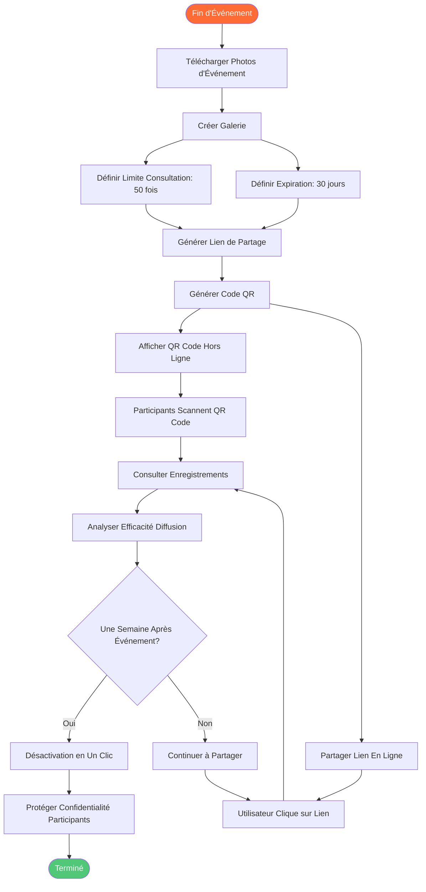

## Comparaison des Fonctionnalités

### Maiimg vs Méthodes Traditionnelles

| Comparaison | Partage d'Images Traditionnel | Maiimg |
|-------------|-------------------------------|--------|
| **Inscription** | ❌ Requiert compte | ✅ Aucune inscription |
| **Génération Lien** | ❌ Requiert attente approbation | ✅ Génération instantanée |
| **Contrôle Accès** | ❌ Ne peut pas contrôler | ✅ Contrôle complet (nombre, temps, téléchargement) |
| **Suivi Accès** | ❌ Aucun enregistrement | ✅ Enregistrements complets (temps, appareil, statistiques) |
| **Gestion Liens** | ❌ Peut seulement supprimer | ✅ Désactivation en un clic, modification paramètres |
| **Téléchargement par Lots** | ❌ Téléchargement unique | ✅ Téléchargement par lots (25 images/galerie) |
| **Coût** | 💰 Peut facturer | ✅ Entièrement gratuit |
| **Complexité Opération** | 📋 Étapes complexes | ✅ Simple et intuitif |

### Comparaison des Avantages

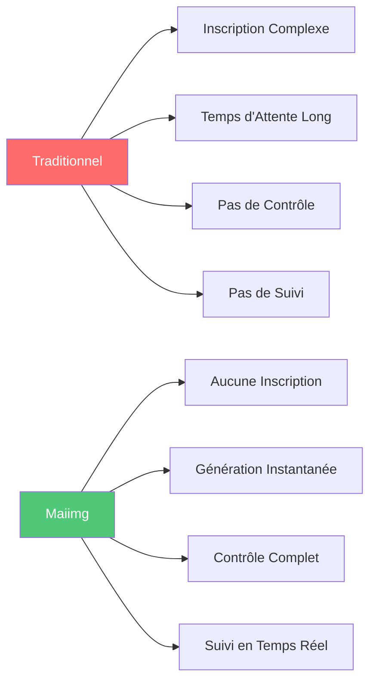

## Résumé des Avantages

### Avantages Principaux

**1. Simple et Facile**
- Aucune inscription, utilisation immédiate
- Trois étapes : Télécharger → Générer → Partager
- Interface propre, opération intuitive

**2. Rapide et Efficace**
- Génération instantanée de lien
- Génération automatique de code QR
- Supporte téléchargement par lots (jusqu'à 25 images/galerie)

**3. Sécurisé et Contrôlable**
- Contrôle d'accès complet
- Suivi d'accès en temps réel
- Désactivation de lien en un clic
- Paramètres de permissions flexibles

**4. Entièrement Gratuit**
- Toutes les fonctionnalités de base gratuites
- Aucun frais caché
- Aucune limite d'utilisation

### Graphique des Avantages

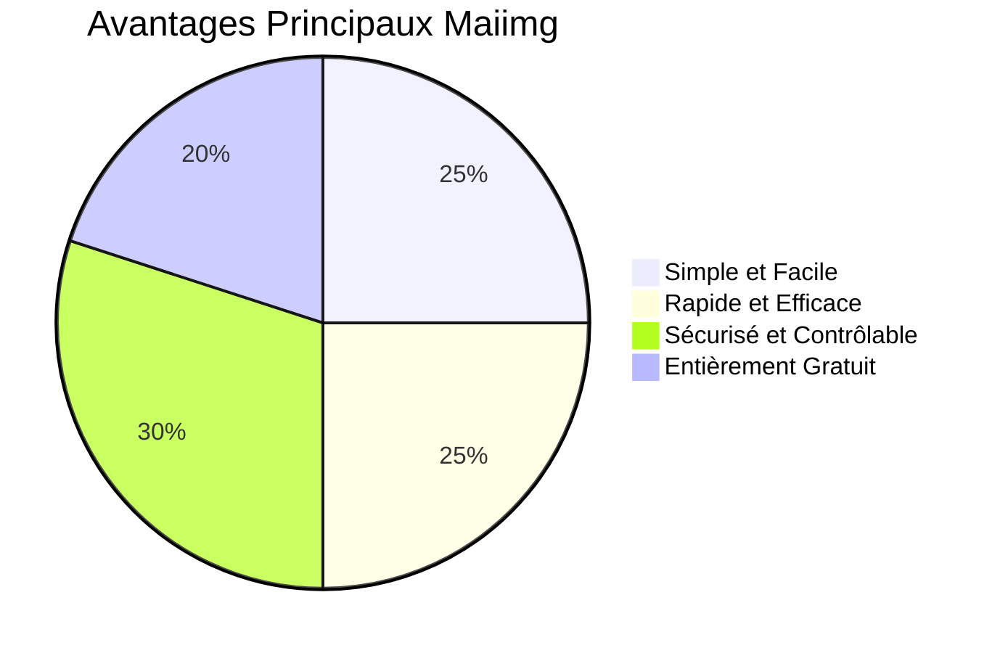

## Démarrage Rapide

### Trois Étapes pour Commencer

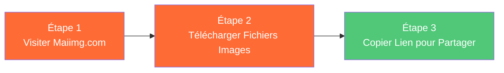

**Commencer Maintenant :**
1. Visiter [Maiimg.com](https://maiimg.com)
2. Glisser-déposer fichiers images dans zone de téléchargement
3. Copier lien généré ou télécharger code QR
4. Partager avec utilisateurs cibles

## Résumé

Maiimg est une plateforme de partage d'images **professionnelle, simple, sécurisée et gratuite** qui facilite le partage d'images grâce à ces fonctionnalités principales :

- ⚡ **Génération Rapide** - Génération instantanée de lien, pas d'attente
- 🔒 **Contrôle Sécurisé** - Contrôle d'accès complet et gestion des permissions
- 📊 **Suivi des Données** - Enregistrements d'accès et analyses en temps réel
- 🎯 **Simple à Utiliser** - Aucune inscription, trois étapes pour partager
- 💰 **Entièrement Gratuit** - Toutes les fonctionnalités de base gratuites

Que vous soyez organisateur d'événements, photographe, designer ou utilisateur individuel, Maiimg offre des solutions professionnelles de partage d'images.

**Commencer à Utiliser Maintenant :** [Visiter Maiimg.com](https://maiimg.com)

