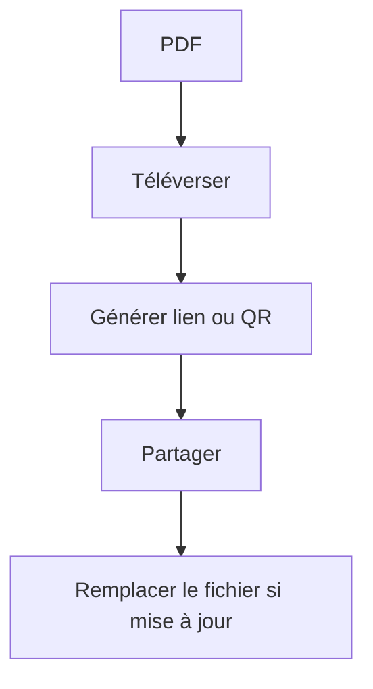

Si ton objectif est simple — **un lien PDF à partager** — garde le processus court.

## Flux minimal

1. **Téléverser le PDF**
2. **Configurer l’accès** (uniquement si nécessaire)
3. **Générer le lien / QR**
4. **Partager**

> Note : on évite toute promesse “expiration date”.

Pour mettre à jour sans changer le lien : `https://sendpdfonline.com/article/replace-pdf-without-changing-link-zh`

