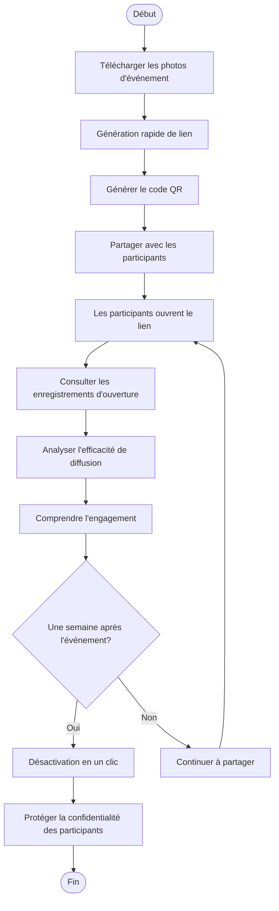
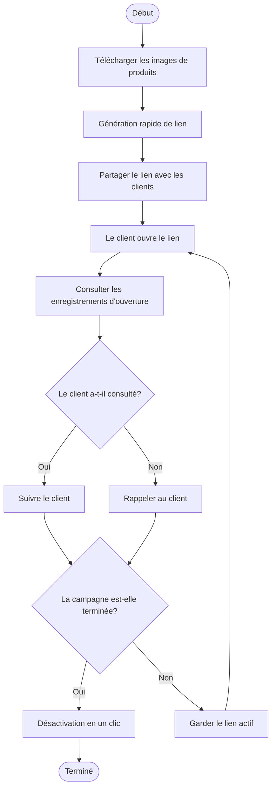
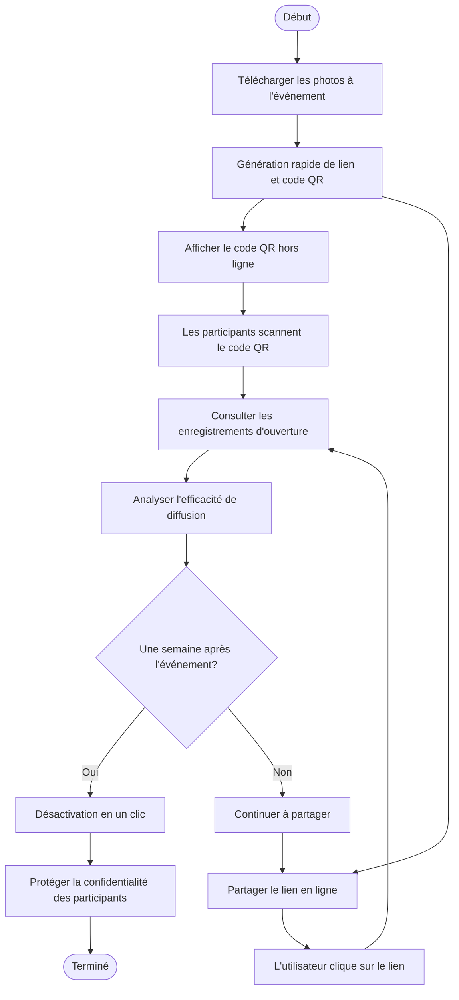

# Maiimg Génération de lien rapide, désactivation en un clic, consultation des enregistrements : Trois fonctionnalités essentielles du partage d'images

  
Que faut-il pour partager des images ? <strong>Génération de lien rapide</strong>, <strong>désactivation en un clic</strong>, <strong>consultation des enregistrements d'ouverture</strong>. Maiimg combine parfaitement ces trois fonctionnalités essentielles pour rendre le partage d'images simple, sécurisé et contrôlable.

## Fonctionnalité essentielle 1 : Génération rapide de lien de partage

### Génération instantanée, terminée en quelques secondes

**Pas d'attente, partage immédiat :**
- Après le téléchargement des images, le lien est généré immédiatement
- Sans inscription, sans attente d'approbation
- Supporte le téléchargement en lot (jusqu'à 25 images)
- Génération automatique de code QR

**Étapes d'utilisation :**
1. Visitez Maiimg.com
2. Glissez-déposez ou sélectionnez les images
3. **Le lien est généré automatiquement**, disponible immédiatement
4. Copiez le lien ou téléchargez le code QR pour partager

## Fonctionnalité essentielle 2 : Désactivation en un clic

### Contrôle à tout moment, effet immédiat

**Opération en un clic, le lien devient immédiatement invalide :**
- Cliquez sur le bouton "Désactiver", le lien devient immédiatement indisponible
- Pas besoin de supprimer les images, il suffit de désactiver le lien
- Les liens partagés deviennent immédiatement invalides

## Fonctionnalité essentielle 3 : Consultation des enregistrements d'ouverture

### Suivi en temps réel, données transparentes

**Enregistrements d'accès complets :**
- Consultez le nombre total d'ouvertures
- Consultez l'heure de chaque ouverture
- Consultez l'adresse IP de l'ouvreur (si supporté)
- Consultez les informations sur l'appareil (si supporté)

## Trois fonctionnalités parfaitement combinées

### Flux de travail complet

**Scénario : Partage de photos d'événement**

**Processus :**

1. **Génération rapide de lien**
   - L'événement se termine, télécharger immédiatement les photos
   - Le lien est généré en quelques secondes
   - Partager avec les participants

2. **Consultation des enregistrements d'ouverture**
   - Consulter en temps réel qui a ouvert le lien
   - Comprendre l'efficacité de diffusion des photos
   - Analyser l'engagement des participants

3. **Désactivation en un clic**
   - Une semaine après la fin de l'événement
   - Désactiver le lien en un clic
   - Protéger la confidentialité des participants

### Tableau de comparaison des fonctionnalités

| Fonctionnalité | Partage d'images traditionnel | Maiimg |
|----------------|-------------------------------|--------|
| Vitesse de génération de lien | Nécessite une inscription, attente d'approbation | Génération en quelques secondes, sans inscription |
| Contrôle du lien | Impossible de désactiver, seulement supprimer | Désactivation en un clic, contrôle à tout moment |
| Enregistrements d'ouverture | Aucun enregistrement ou incomplet | Enregistrements complets, consultation en temps réel |
| Coût d'utilisation | Peut nécessiter un paiement | Entièrement gratuit |
| Complexité opérationnelle | Étapes compliquées | Simple et intuitif |

## Cas d'utilisation réels

### Cas 1 : Partage d'images de produits e-commerce

**Besoin :** Partager rapidement les images de produits avec les clients, comprendre la situation de consultation, fermer l'accès après la campagne

**Solution :**
1. Télécharger les images de produits, **génération rapide de lien**
2. Partager le lien avec les clients
3. **Consulter les enregistrements d'ouverture**, comprendre la situation de consultation du client
4. Après la fin de la campagne, **désactiver le lien en un clic**

### Cas 2 : Partage instantané de photos d'événement

**Besoin :** Partager immédiatement les photos d'événement, suivre l'efficacité de diffusion, protéger la confidentialité après l'événement

**Solution :**
1. Télécharger les photos à l'événement, **génération rapide de lien et code QR**
2. Les participants scannent le code QR pour consulter
3. **Consulter les enregistrements d'ouverture**, comprendre l'efficacité de diffusion des photos
4. Une semaine après l'événement, **désactiver le lien en un clic**

