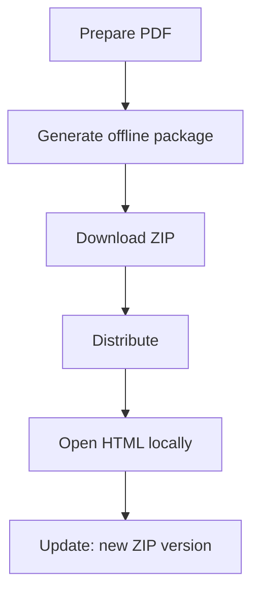

Pour des environnements sans connexion stable, un partage “par lien” n’est pas toujours possible. Une alternative est de générer un **paquet offline** (souvent un ZIP contenant un HTML à ouvrir).

## Flux simple

1. **Créer le paquet offline**
2. **Télécharger le ZIP**
3. **Distribuer le ZIP**
4. **Ouvrir le HTML dans le ZIP**
5. **Si le contenu change : publier une nouvelle version du ZIP**

## Captures

