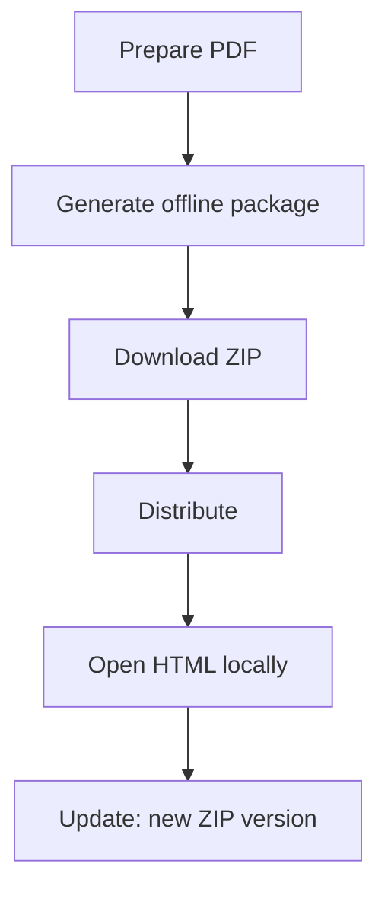

Pour des environnements sans connexion stable, un partage “par lien” n’est pas toujours possible. Une alternative est de générer un **paquet offline** (souvent un ZIP contenant un HTML à ouvrir).

## Flux simple

1. **Créer le paquet offline**
2. **Télécharger le ZIP**
3. **Distribuer le ZIP**
4. **Ouvrir le HTML dans le ZIP**
5. **Si le contenu change : publier une nouvelle version du ZIP**

```mermaid
flowchart TD
  A[Prepare PDF] --> B[Generate offline package]
  B --> C[Download ZIP]
  C --> D[Distribute]
  D --> E[Open HTML locally]
  E --> F[Update: new ZIP version]
```

## Captures

