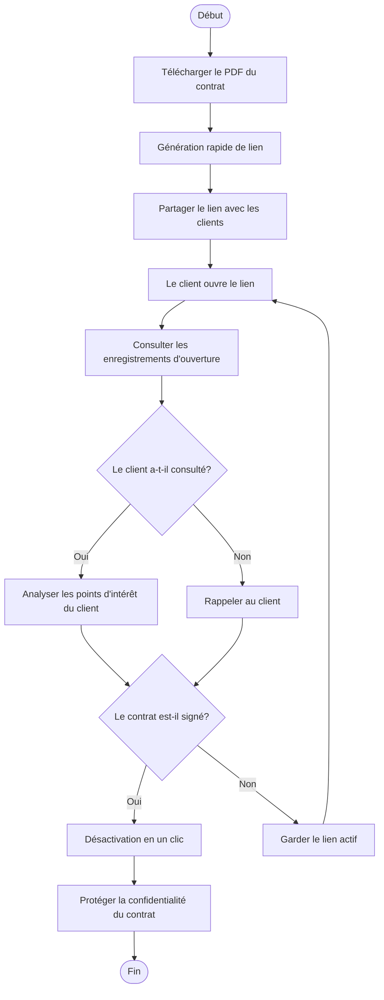
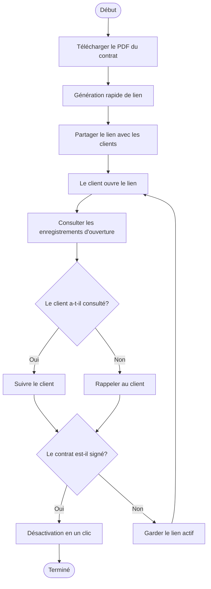
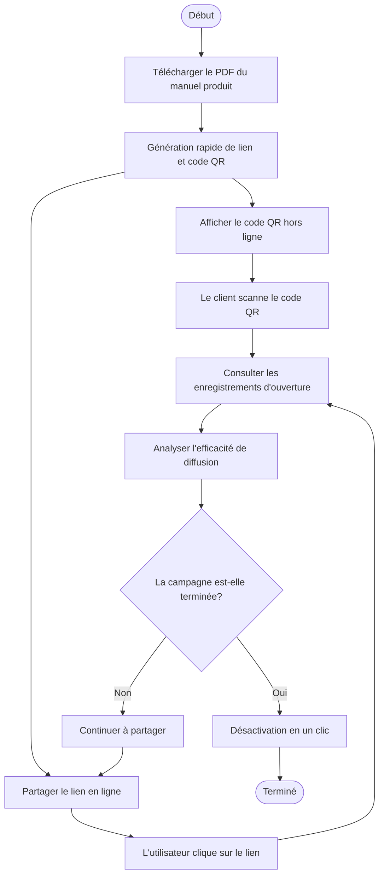

# MaiPDF Génération de lien rapide, désactivation en un clic, consultation des enregistrements : Trois fonctionnalités essentielles du partage PDF

  
Que faut-il pour partager un PDF ? <strong>Génération de lien rapide</strong>, <strong>désactivation en un clic</strong>, <strong>consultation des enregistrements d'ouverture</strong>. MaiPDF combine parfaitement ces trois fonctionnalités essentielles pour rendre le partage PDF simple, sécurisé et contrôlable.

## Fonctionnalité essentielle 1 : Génération rapide de lien de partage

### Génération instantanée, terminée en quelques secondes

**Pas d'attente, partage immédiat :**
- Après le téléchargement du PDF, le lien est généré immédiatement
- Sans inscription, sans attente d'approbation
- Supporte les fichiers jusqu'à 100MB
- Génération automatique de code QR

**Étapes d'utilisation :**
1. Visitez MaiPDF.com
2. Glissez-déposez ou sélectionnez le fichier PDF
3. **Le lien est généré automatiquement**, disponible immédiatement
4. Copiez le lien ou téléchargez le code QR pour partager

## Fonctionnalité essentielle 2 : Désactivation en un clic

### Contrôle à tout moment, effet immédiat

**Opération en un clic, le lien devient immédiatement invalide :**
- Cliquez sur le bouton "Désactiver", le lien devient immédiatement indisponible
- Pas besoin de supprimer le PDF, il suffit de désactiver le lien
- Les liens partagés deviennent immédiatement invalides
- Peut être réactivé à tout moment (si supporté)

## Fonctionnalité essentielle 3 : Consultation des enregistrements d'ouverture

### Suivi en temps réel, données transparentes

**Enregistrements d'accès complets :**
- Consultez le nombre total d'ouvertures
- Consultez l'heure de chaque ouverture
- Consultez l'adresse IP de l'ouvreur
- Consultez les informations sur l'appareil
- Consultez la localisation géographique

## Trois fonctionnalités parfaitement combinées

### Flux de travail complet

**Scénario : Partage de contrat commercial**

**Processus :**

1. **Génération rapide de lien**
   - Télécharger le PDF du contrat
   - Le lien est généré en quelques secondes
   - Partager avec les clients

2. **Consultation des enregistrements d'ouverture**
   - Consulter en temps réel si le client a ouvert le lien
   - Comprendre la situation de consultation du contrat
   - Analyser les points d'intérêt du client

3. **Désactivation en un clic**
   - Après la signature du contrat
   - Désactiver le lien en un clic
   - Protéger la confidentialité du contrat

### Tableau de comparaison des fonctionnalités

| Fonctionnalité | Partage PDF traditionnel | MaiPDF |
|----------------|-------------------------|--------|
| Vitesse de génération de lien | Nécessite une inscription, attente d'approbation | Génération en quelques secondes, sans inscription |
| Contrôle du lien | Impossible de désactiver, seulement supprimer | Désactivation en un clic, contrôle à tout moment |
| Enregistrements d'ouverture | Aucun enregistrement ou incomplet | Enregistrements complets, consultation en temps réel |
| Coût d'utilisation | Peut nécessiter un paiement | Entièrement gratuit |
| Complexité opérationnelle | Étapes compliquées | Simple et intuitif |
| Limite de taille de fichier | Généralement petite | Jusqu'à 100MB |

## Cas d'utilisation réels

### Cas 1 : Partage de contrat commercial

**Besoin :** Partager rapidement le contrat avec les clients, comprendre la situation de consultation, fermer l'accès après la signature

**Solution :**
1. Télécharger le PDF du contrat, **génération rapide de lien**
2. Partager le lien avec les clients
3. **Consulter les enregistrements d'ouverture**, comprendre la situation de consultation du client
4. Après la signature, **désactiver le lien en un clic**

### Cas 2 : Partage instantané de manuel produit

**Besoin :** Partager rapidement le manuel produit avec les clients potentiels, suivre l'efficacité de consultation, protéger la confidentialité après la campagne

**Solution :**
1. Télécharger le PDF du manuel produit, **génération rapide de lien et code QR**
2. Les clients scannent le code QR pour consulter
3. **Consulter les enregistrements d'ouverture**, comprendre l'efficacité de diffusion du manuel
4. Une semaine après la campagne, **désactiver le lien en un clic**

