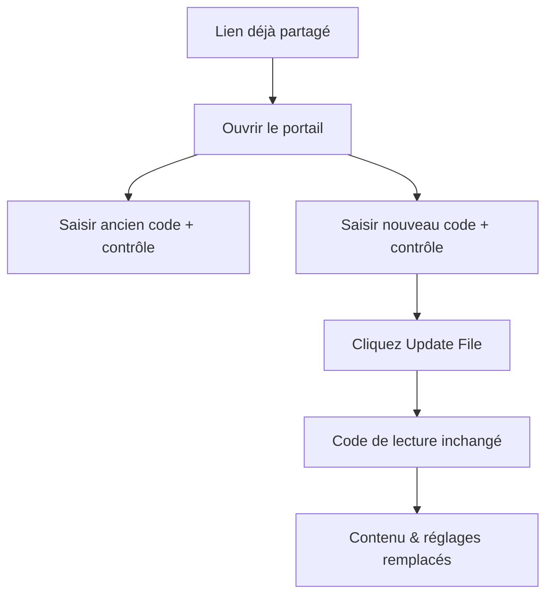

# Remplacer un PDF sans changer le lien

  
<strong>Le code de lecture ne change pas.</strong> Le contenu et les réglages deviennent ceux du nouveau lien.

## Pourquoi remplacer un lien

- Corriger une erreur après l’envoi
- Mettre à jour une version ou un prix
- Ajuster les réglages (vues, durée, vérification, téléchargement, filigrane, alertes)
- Retirer un contenu en remplaçant par un PDF vide

## Comment MaiPDF aide

MaiPDF remplace tout d’un seul coup :

- **Lien inchangé**
- **Contenu mis à jour**
- **Réglages synchronisés** (pas besoin de tout reconfigurer)

## Étapes rapides

1. Ouvrir le portail : https://maipdf.com/pdf/hahachange.php
2. Saisir ancien code de lecture + code de contrôle
3. Saisir nouveau code de lecture + code de contrôle
4. Cliquer **Update File**

## Cas d’usage

- Mise à jour de contrat
- Mise à jour de grille tarifaire
- Supports de formation
- Retrait d’urgence (PDF vide puis remplacement)
