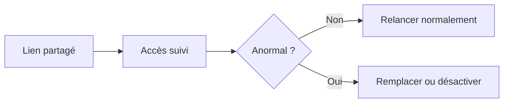

# Suivi & analytics d’accès aux PDF (démarrage rapide)

  
Si vous partagez des PDF importants, le suivi aide à relancer au bon moment et à détecter tôt les accès inhabituels.

## Les 3 signaux à vérifier en premier

- **Moment de la première ouverture**
- **Réouvertures**
- **Signaux de base appareil / IP (approximatif)**

## Si quelque chose semble anormal

- **Remplacer le fichier** : garder le même code de lecture, changer contenu et réglages
- **Désactiver le lien** : couper l’accès immédiatement si besoin

## Un cas d’usage simple

Partager une proposition, attendre la première ouverture, puis relancer pendant que le document est encore “top-of-mind”.

