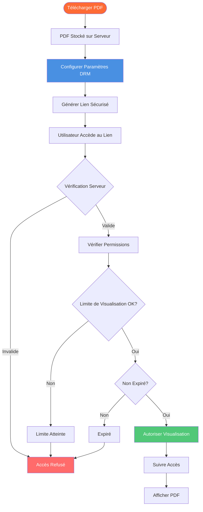

# PDF DRM en Ligne : Guide Complet de la Gestion des Droits Numériques PDF en Ligne

  
Besoin de protéger vos documents PDF en ligne ? Le <strong>DRM PDF en ligne</strong> (Gestion des Droits Numériques) vous permet de contrôler l'accès, d'empêcher les téléchargements, de limiter les visualisations et de suivre l'utilisation de vos PDF. Ce guide complet explique comment fonctionne le DRM en ligne, ses fonctionnalités et comment mettre en œuvre la protection DRM PDF en ligne pour vos documents.

## Qu'est-ce que le DRM PDF en Ligne ?

**Le DRM PDF en Ligne** (Gestion des Droits Numériques) est une technologie qui protège les documents PDF en contrôlant la façon dont ils peuvent être consultés, visualisés et distribués en ligne. Contrairement à la protection PDF traditionnelle qui repose sur des mots de passe ou le cryptage, le DRM en ligne offre un contrôle basé sur le serveur et une gestion en temps réel.

**Caractéristiques Clés :**
- ✅ **Contrôle Basé sur Serveur** - Permissions gérées sur le serveur
- ✅ **Gestion en Temps Réel** - Modifier les paramètres instantanément
- ✅ **Suivi d'Accès** - Surveiller qui consulte les documents
- ✅ **Aucun Logiciel Requis** - Fonctionne dans n'importe quel navigateur
- ✅ **Accès Révocable** - Désactiver les liens à tout moment

## Comment Fonctionne le DRM PDF en Ligne

### Architecture DRM en Ligne

### Étape 1 : Télécharger et Configurer

**Processus :**
1. Télécharger PDF sur la plateforme en ligne
2. Configurer les paramètres DRM
3. Définir les contrôles d'accès
4. Générer un lien sécurisé

**Paramètres DRM Disponibles :**
- Limites de visualisation
- Dates d'expiration
- Prévention des téléchargements
- Prévention de l'impression
- Contrôle d'accès

### Étape 2 : Vérification Serveur

**Comment Ça Fonctionne :**
- L'utilisateur accède au lien
- Le serveur vérifie les permissions
- Vérifie les limites de visualisation
- Valide l'expiration
- Applique les restrictions

**Avantages :**
- Contrôle en temps réel
- Ne peut pas être contourné
- Gestion centralisée
- Piste d'audit

### Étape 3 : Contrôle d'Accès

**Mécanismes de Contrôle :**
- Mode visualisation uniquement
- Blocage des téléchargements
- Prévention de l'impression
- Prévention de la copie
- Détection de capture d'écran

## Fonctionnalités DRM PDF en Ligne

### 1. Contrôle d'Accès

**Vérification E-mail :**
- Exiger un e-mail avant l'accès
- Restreindre à des e-mails spécifiques
- Restrictions de domaine
- Authentification basée sur l'e-mail

**Protection par Mot de Passe :**
- Définir un mot de passe d'accès
- Partager le mot de passe séparément
- Couche de sécurité supplémentaire
- Contrôle d'accès

### 2. Limites de Visualisation

**Comment Ça Fonctionne :**
- Définir le nombre maximum de visualisations (par ex. 10)
- Le serveur suit chaque visualisation
- Le lien cesse de fonctionner après la limite
- Empêche l'accès illimité

**Cas d'Usage :**
- Documents confidentiels : 1-3 visualisations
- Aperçus clients : 5-10 visualisations
- Matériel de formation : 20-50 visualisations

### 3. Contrôle d'Expiration

**Expiration Basée sur le Temps :**
- Définir une date d'expiration
- Désactiver automatiquement après la date
- Accès limité dans le temps
- Nettoyage automatique

**Avantages :**
- Partage temporaire
- Protection de la vie privée
- Support de conformité
- Gestion automatique

### 4. Prévention des Téléchargements

**Contrôle de Téléchargement :**
- Désactiver le bouton de téléchargement
- Bloquer l'enregistrement par clic droit
- Empêcher l'enregistrement de fichiers
- Mode visualisation uniquement

**Pourquoi C'est Important :**
- Protéger le droit d'auteur
- Empêcher la distribution
- Contrôler l'accès
- Maintenir la sécurité

## Conclusion : DRM PDF en Ligne

Le DRM PDF en ligne offre une protection puissante des documents avec :
- ✅ Contrôle d'accès en temps réel
- ✅ Limites de visualisation et expiration
- ✅ Prévention des téléchargements et de l'impression
- ✅ Filigranes dynamiques
- ✅ Suivi complet
- ✅ Révocation instantanée
- ✅ Aucun logiciel requis
- ✅ Gestion facile

**Prêt à protéger vos PDF avec le DRM en ligne ?**

MaiPDF offre un DRM PDF en ligne gratuit avec toutes ces fonctionnalités. Téléchargez votre PDF, configurez les paramètres DRM, générez des liens sécurisés et protégez vos documents. Aucune inscription requise.

---

**Articles Connexes:**
- [DRM PDF Hors Ligne : Solution Entreprise](/blog/fr/offline-pdf-drm-solution-entreprise)
- [Contrôle d'Accès PDF : Guide Complet](/blog/fr/partage-pdf-en-ligne-securise-guide-complet)
