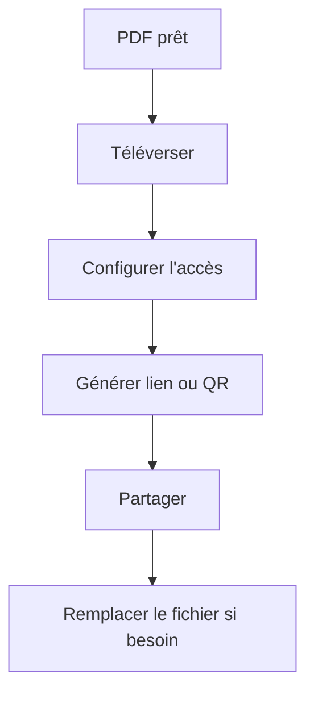

Envoyer un PDF en pièce jointe crée vite des copies partout. Une approche plus propre consiste à **partager un lien** et à ajuster les règles d’accès si nécessaire.

MaiPDF permet de publier un PDF en ligne et de le partager via un lien (ou un QR code).

## Flux recommandé

1. **Téléverser le PDF**
2. **Configurer l’accès** (si besoin)
3. **Générer un lien / QR**
4. **Partager**
5. **Mettre à jour via “Remplacer le fichier”** (lien inchangé)

> Note : on évite de parler de “date d’expiration”, car ce n’est pas un réglage à supposer.

## Téléverser

## Configurer l’accès (optionnel)

## Lien / QR pour partager

## Mettre à jour sans changer le lien

Quand un document change, utilisez **Remplacer le fichier** pour publier une nouvelle version sans redistribuer un nouveau lien.

Référence : `https://sendpdfonline.com/article/replace-pdf-without-changing-link-zh`

