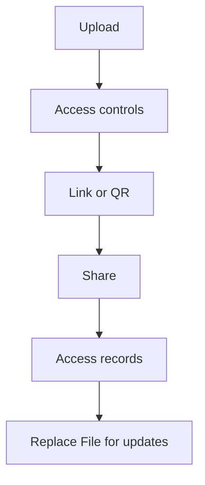

La plupart des fuites viennent de **copies incontrôlées** (pièces jointes, re-partage) et de l’absence de **traçabilité**.

Voici une approche courte et pratico-pratique.

## Flux recommandé

1. **Téléverser**
2. **Régler l’accès** (optionnel)
3. **Générer un lien / QR**
4. **Partager**
5. **Consulter les enregistrements**
6. **Replace File pour les mises à jour** (lien identique)

> Note : on ne suppose pas de réglage “date d’expiration”.

## Captures

Référence (Replace File) : `https://sendpdfonline.com/article/replace-pdf-without-changing-link-zh`

