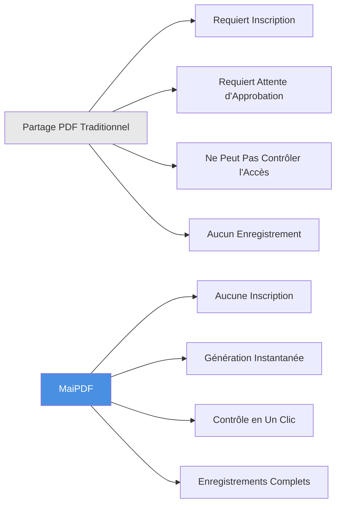
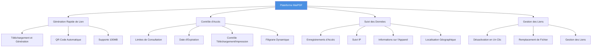
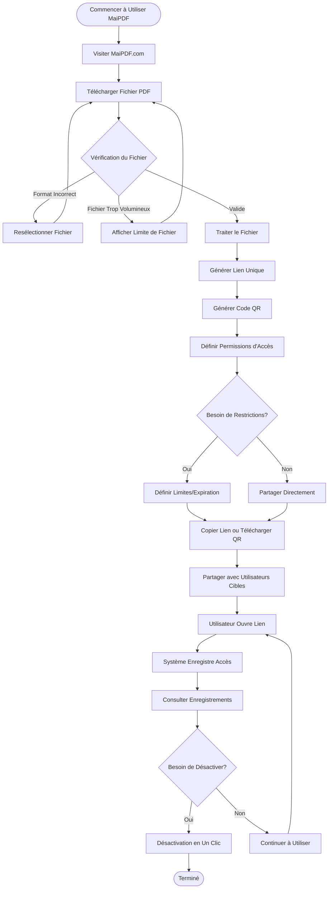
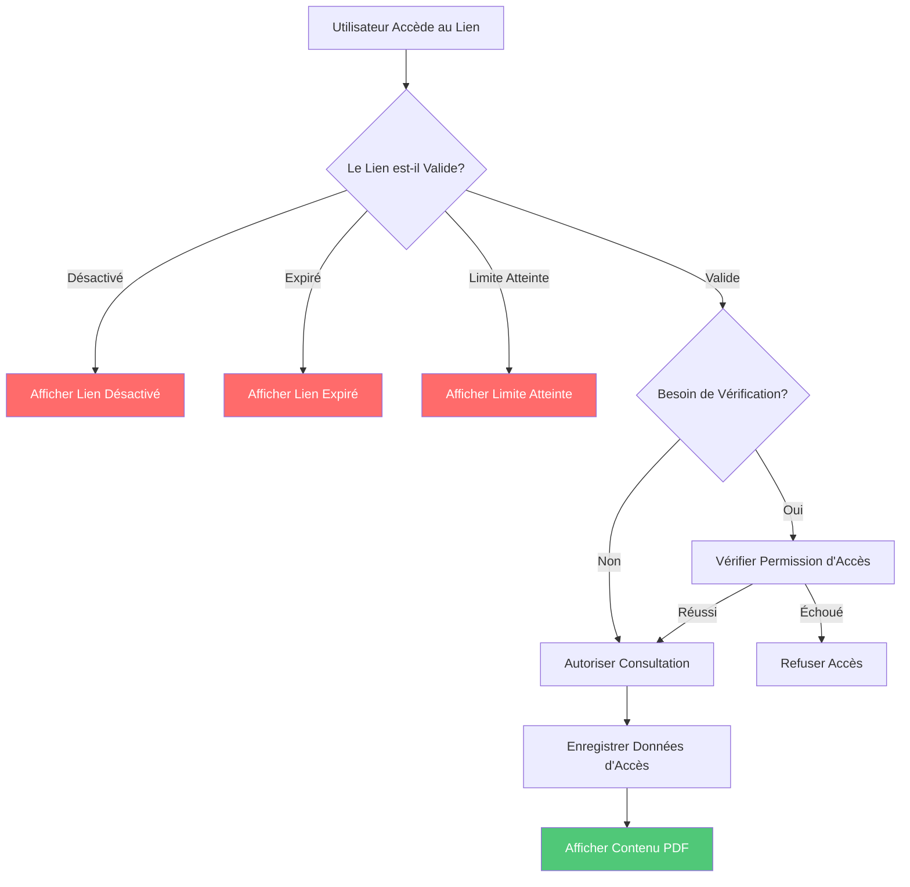
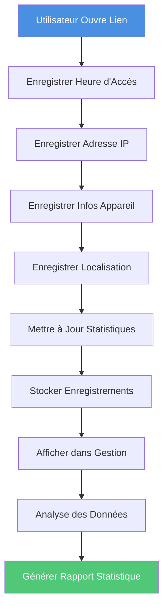
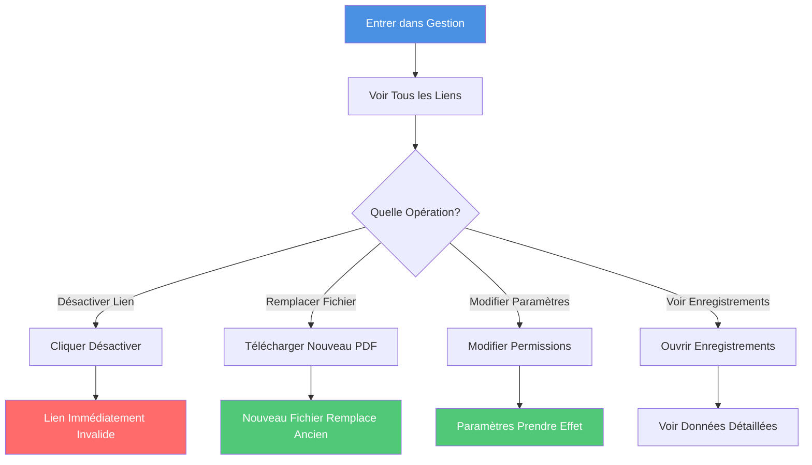
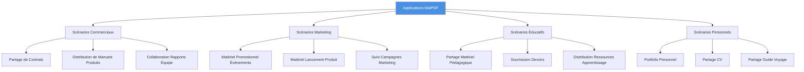
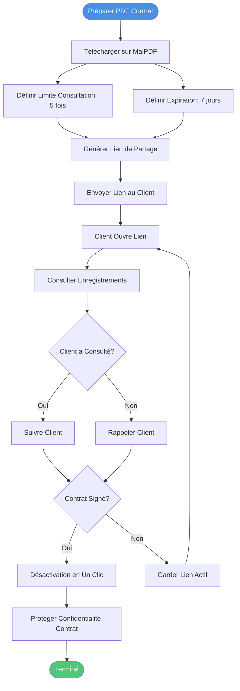
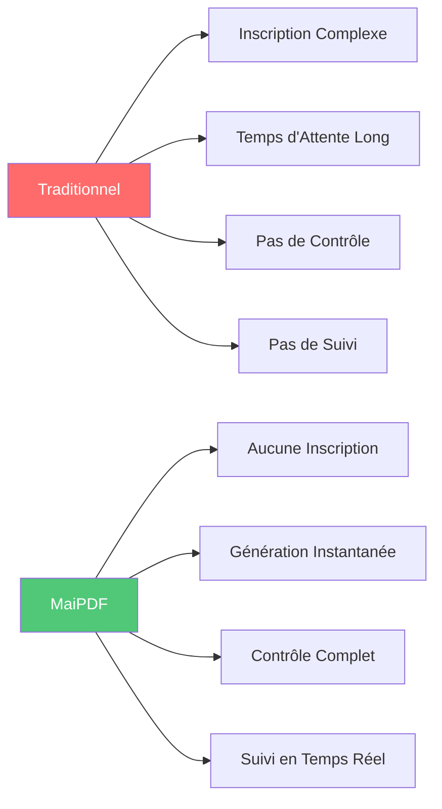
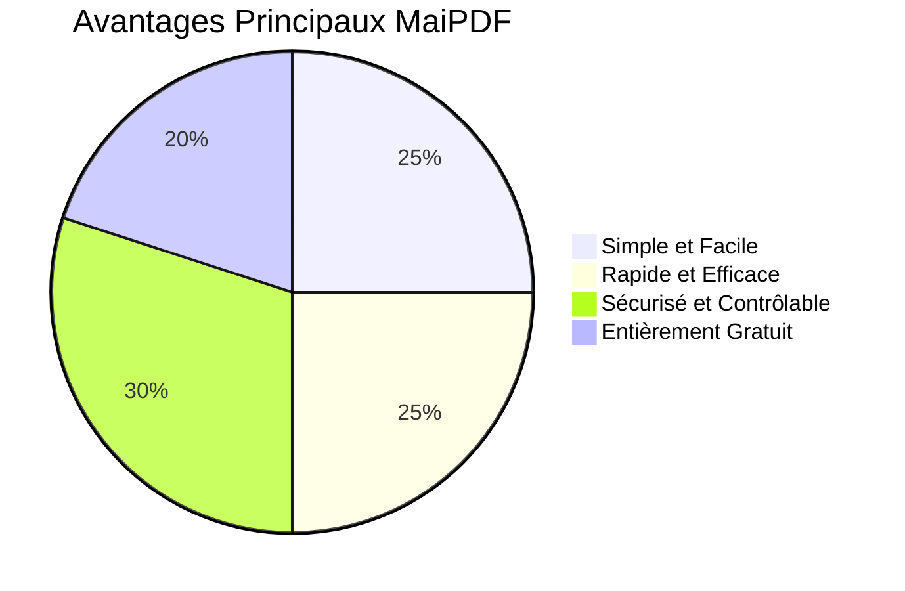

# MaiPDF Guide Complet : Plateforme Professionnelle de Partage PDF Simple et Sécurisée

  
<strong>MaiPDF</strong> est une plateforme professionnelle de partage PDF en ligne qui vous permet de générer rapidement des liens de partage sans inscription, de contrôler les permissions d'accès à tout moment et de suivre l'ouverture des documents en temps réel. Qu'il s'agisse de contrats commerciaux, de manuels produits ou de rapports d'équipe, MaiPDF rend le partage de documents simple, sécurisé et contrôlable.

## Qu'est-ce que MaiPDF ?

### Positionnement de la Plateforme

MaiPDF est une **plateforme de partage et de gestion PDF en ligne** axée sur la fourniture de solutions de partage de documents simples, sécurisées et contrôlables.

**Caractéristiques Principales :**
- ✅ **Aucune Inscription Requise** - Utilisation immédiate, zéro barrière
- ✅ **Génération Instantanée** - Génération de liens en moins de 10 secondes après téléchargement
- ✅ **Entièrement Gratuit** - Toutes les fonctionnalités de base sont gratuites
- ✅ **Sécurité Professionnelle** - Contrôle d'accès, protection par filigrane, suivi des données

### MaiPDF vs Méthodes Traditionnelles

## Aperçu des Fonctionnalités Principales

### Architecture des Fonctionnalités

## Flux de Travail Complet

### Flux Complet du Téléchargement au Partage

### Trois Étapes pour Commencer

**Étape 1 : Télécharger PDF**
- Visiter MaiPDF.com
- Glisser-déposer ou sélectionner fichier PDF
- Supporte jusqu'à 100MB

**Étape 2 : Générer Lien**
- Génération automatique de lien de partage
- Génération automatique de code QR
- Définir permissions d'accès

**Étape 3 : Partager et Utiliser**
- Copier lien pour partager
- Ou télécharger code QR pour partager
- Consulter enregistrements d'accès en temps réel

## Fonctionnalités Principales Expliquées

### Fonctionnalité 1 : Génération Rapide de Lien

**Caractéristiques :**
- ⚡ Génération instantanée (généralement en moins de 10 secondes)
- 🔗 Génération automatique de lien unique
- 📱 Génération automatique de code QR
- 💾 Supporte jusqu'à 100MB de fichiers

**Organigramme :**

### Fonctionnalité 2 : Contrôle d'Accès

**Options de Contrôle :**

| Contrôle | Description | Cas d'Usage |
|----------|------------|-------------|
| Limites de Consultation | Limiter le nombre de fois que le PDF peut être ouvert | Contrats, documents confidentiels |
| Date d'Expiration | Définir expiration automatique du lien | Partage temporaire, matériel d'événement |
| Contrôle Téléchargement | Autoriser ou interdire le téléchargement PDF | Protection des droits d'auteur, prévenir la distribution |
| Contrôle Impression | Autoriser ou interdire l'impression PDF | Prévenir la copie, protéger le contenu |
| Filigrane Dynamique | Filigrane affichant les informations du visualiseur | Suivre les fuites, vérification d'identité |

**Organigramme de Contrôle d'Accès :**

### Fonctionnalité 3 : Suivi des Données

**Contenu Suivi :**
- 📊 Nombre total d'ouvertures
- ⏰ Heure de chaque ouverture
- 🌐 Adresse IP du visiteur
- 📱 Informations sur l'appareil
- 📍 Localisation géographique
- 🔗 Source d'accès

**Organigramme de Suivi des Données :**

### Fonctionnalité 4 : Gestion des Liens

**Fonctionnalités de Gestion :**
- 🚫 Désactivation en un clic du lien
- 🔄 Remplacement du fichier PDF
- 📝 Modification des paramètres d'accès
- 📊 Consultation de l'interface de gestion

**Organigramme de Gestion des Liens :**

## Scénarios d'Application

### Catégories de Scénarios

### Flux de Scénario d'Application Typique

**Scénario : Partage de Contrat Commercial**

## Comparaison des Fonctionnalités

### MaiPDF vs Méthodes Traditionnelles

| Comparaison | Partage PDF Traditionnel | MaiPDF |
|-------------|-------------------------|--------|
| **Inscription** | ❌ Requiert compte | ✅ Aucune inscription |
| **Génération Lien** | ❌ Requiert attente approbation | ✅ Instantanée (moins de 10 secondes) |
| **Contrôle Accès** | ❌ Ne peut pas contrôler | ✅ Contrôle complet (nombre, temps, téléchargement) |
| **Suivi Accès** | ❌ Aucun enregistrement | ✅ Enregistrements complets (temps, IP, appareil) |
| **Gestion Liens** | ❌ Peut seulement supprimer | ✅ Désactivation en un clic, remplacement fichier |
| **Protection Filigrane** | ❌ Non supporté | ✅ Filigrane dynamique (mode en ligne) |
| **Coût** | 💰 Peut facturer | ✅ Entièrement gratuit |
| **Taille Fichier** | 📦 Généralement petit | ✅ Jusqu'à 100MB |

### Comparaison des Avantages

## Résumé des Avantages

### Avantages Principaux

**1. Simple et Facile**
- Aucune inscription, utilisation immédiate
- Trois étapes : Télécharger → Générer → Partager
- Interface propre, opération intuitive

**2. Rapide et Efficace**
- Génération instantanée de lien (généralement en moins de 10 secondes)
- Génération automatique de code QR
- Supporte fichiers volumineux (jusqu'à 100MB)

**3. Sécurisé et Contrôlable**
- Contrôle d'accès complet
- Suivi d'accès en temps réel
- Désactivation de lien en un clic
- Protection par filigrane dynamique (mode en ligne)

**4. Entièrement Gratuit**
- Toutes les fonctionnalités de base gratuites
- Aucun frais caché
- Aucune limite d'utilisation

### Graphique des Avantages

## Démarrage Rapide

### Trois Étapes pour Commencer

**Commencer Maintenant :**
1. Visiter [MaiPDF.com](https://maipdf.com)
2. Glisser-déposer fichier PDF dans zone de téléchargement
3. Copier lien généré ou télécharger code QR
4. Partager avec utilisateurs cibles

## Résumé

MaiPDF est une plateforme de partage PDF **professionnelle, simple, sécurisée et gratuite** qui facilite le partage de documents grâce à ces fonctionnalités principales :

- ⚡ **Génération Rapide** - Génération instantanée de lien, pas d'attente
- 🔒 **Contrôle Sécurisé** - Contrôle d'accès complet et gestion des permissions
- 📊 **Suivi des Données** - Enregistrements d'accès et analyses en temps réel
- 🎯 **Simple à Utiliser** - Aucune inscription, trois étapes pour partager
- 💰 **Entièrement Gratuit** - Toutes les fonctionnalités de base gratuites

Que vous soyez professionnel, marketeur, éducateur ou utilisateur individuel, MaiPDF offre des solutions professionnelles de partage PDF.

**Commencer à Utiliser Maintenant :** [Visiter MaiPDF.com](https://maipdf.com)

