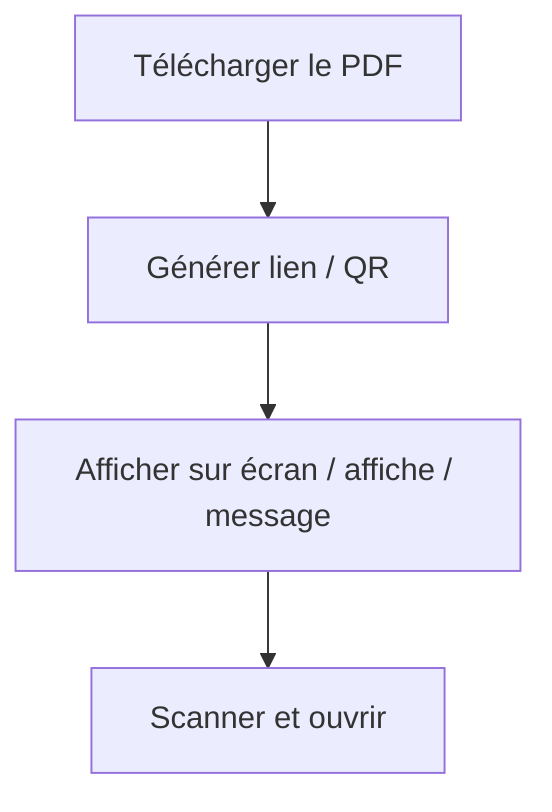

# 📲 Partage de PDF Facile avec Codes QR

  
Imaginez: Vous êtes devant un public et vous souhaitez partager votre PDF instantanément. Pas de listes d'e-mails, pas de formulaires d'inscription, pas de transferts de fichiers complexes.

  
Juste un code QR. Scanner, visualiser, terminé.

  
Bienvenue dans le futur du partage de PDF—rapide, fluide et sans e-mail.

## Pourquoi partager des PDF

- Envoyer vite (devis, supports, slides)
- Éviter les grosses pièces jointes et les renvois
- Permettre d’ouvrir en un seul geste

## Pourquoi les codes QR

- Pas de copier-coller
- Parfait en présentiel (affiches, stands, salles de classe)
- Friction minimale pour le lecteur

## Comment MaiPDF aide

MaiPDF transforme « partager → scanner → ouvrir » en une chaîne courte :

## 🧠 Pourquoi Éviter l'E-mail?

L'e-mail est formidable, mais pas toujours pratique:

- **Lent:** Peu adapté aux événements en direct.
- **Problèmes de Confidentialité:** Expose les adresses e-mail des destinataires.
- **Peu Fiable:** Les messages peuvent être perdus ou filtrés.
- **Problèmes de Connectivité:** Exige que tout le monde soit en ligne.

En revanche, les codes QR sont:

- **Instantanés:** Partagez en quelques secondes.
- **Universels:** Fonctionnent sur n'importe quel appareil équipé d'une caméra.
- **Sans Effort:** Faciles à scanner depuis des écrans ou des supports imprimés.

Parfaits pour les conférences, les salles de classe, les salons professionnels et plus encore.

## 🔄 Comment Fonctionne le Partage de PDF par QR

Voici comment partager des PDF en utilisant des codes QR:

1. **Téléchargez Votre PDF**
   - Utilisez un service cloud sécurisé pour héberger votre fichier.

2. **Générez un Lien**
   - Créez un lien en lecture seule pour votre PDF.

3. **Créez un Code QR**
   - Utilisez un générateur de code QR pour lier à votre fichier.

4. **Partagez le Code QR**
   - Affichez-le sur un écran ou imprimez-le pour faciliter le scan.

Votre public scanne le code et accède instantanément au PDF—sans téléchargement, sans connexion.

## 🧪 Scénarios Réels

### 🎤 Conférences et Ateliers
Partagez des diapositives ou des documents avec les participants en temps réel.

### 🏫 Salles de Classe
Offrez aux étudiants un accès instantané aux supports d'étude.

### 🛍️ Salons Professionnels
Distribuez des brochures ou catalogues de produits sans copies physiques.

## 🛠 Des Outils comme MaiPDF Simplifient le Processus

Les plateformes comme MaiPDF rationalisent le processus:

- **Téléchargez des PDF:** Hébergez vos fichiers en toute sécurité.
- **Définissez des Règles d'Accès:** Contrôlez combien de fois le fichier peut être ouvert.
- **Générez des Codes QR:** Liez directement à votre PDF.
- **Suivez les Consultations:** Surveillez les accès avec horodatages et adresses IP.

Vous pouvez même désactiver des liens ou mettre à jour les paramètres d'accès ultérieurement.

## 🔒 Confidentialité et Contrôle

Le partage par code QR offre:

- **Anonymat:** Pas de collecte de données personnelles.
- **Accès Limité dans le Temps:** Désactivez le lien lorsqu'il n'est plus nécessaire.
- **Suivi:** Surveillez qui a accédé à votre fichier et quand.

## ✅ Points Clés

- Les codes QR simplifient le partage de PDF pour les événements en direct.
- Pas d'e-mails, pas de téléchargements, pas de tracas.
- Parfait pour les présentations, les salles de classe et plus encore.

Adoptez le futur du partage de documents. Essayez le partage de PDF par code QR dès aujourd'hui!