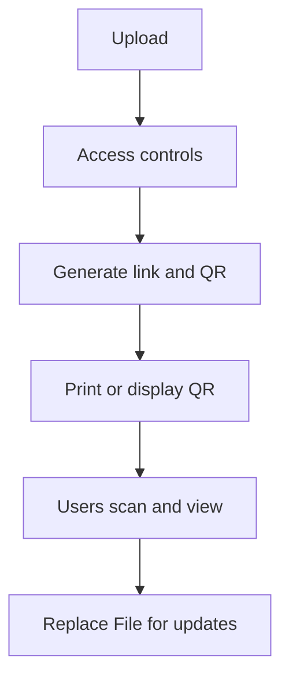

Un QR code est juste une façon rapide d’ouvrir un lien. En distribution (formation, événement, support client), ça évite les erreurs de copie et accélère l’accès.

## Flux recommandé

1. **Téléverser**
2. **Régler l’accès** (si nécessaire)
3. **Générer lien + QR**
4. **Afficher/imprimer le QR**
5. **Mettre à jour via Replace File** (le lien reste le même, le QR reste valable)

## Capture

Référence (Replace File) : `https://sendpdfonline.com/article/replace-pdf-without-changing-link-zh`

