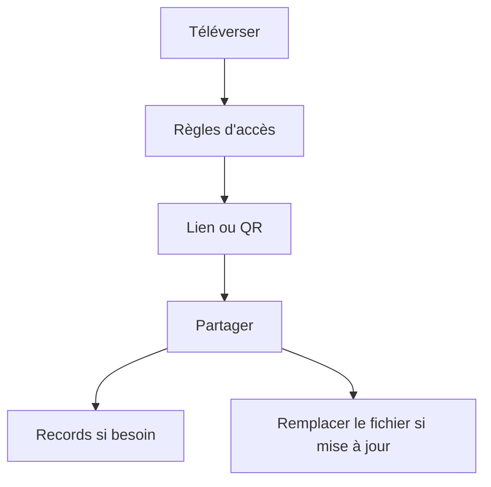

Partager un PDF “en ligne” revient souvent à une chose : **un lien unique** plutôt que des fichiers envoyés partout.

## Un flux simple

1. **Téléverser**
2. **Règles d’accès** (si besoin)
3. **Lien / QR**
4. **Partager**
5. **Vérifier les enregistrements** (si besoin)
6. **Remplacer le fichier** (mise à jour, lien inchangé)

> Note : on ne suppose pas une “date d’expiration” comme option.

Référence (remplacer le fichier sans changer le lien) : `https://sendpdfonline.com/article/replace-pdf-without-changing-link-zh`

