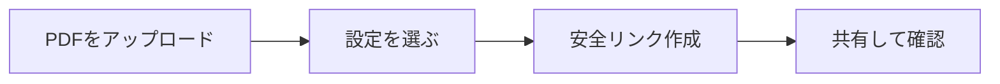

# PDF共有の設定

  
ここでは<strong>アップロード画面の設定項目</strong>だけをわかりやすく説明します。

## 5つの設定項目

1. **アクセス制限**  
   総開封回数を制限します。

2. **セッション時間**  
   1回の閲覧時間を制限します。

3. **保護タイプ**  
   - DynamoWatermark  
   - SecureView（閲覧のみ）  
   - FenceView（スクショ抑止）  
   - Unrestricted  

4. **メール認証**  
   閲覧前にメール確認を求めます。

5. **閲覧通知（任意）**  
   開封時にメールで通知します。

## 簡単フロー

