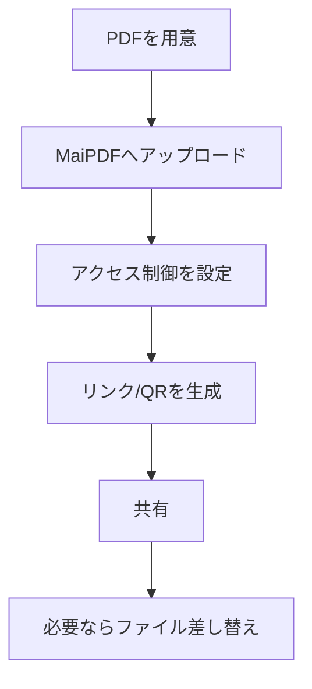

社内外にPDFを配布するとき、メール添付やチャット送信は「最新版が分からない」「転送されて管理できない」など運用が崩れがちです。  
MaiPDFは **PDFをオンラインでリンク共有** するためのツールです（※画像共有は **Maiimg** の領域）。

このページでは、企業で破綻しにくい **シンプルな運用フロー** をまとめます。

## おすすめフロー（4ステップ）

1. **PDFをアップロード**
2. **アクセス制御を設定**（必要な場合）
3. **リンク / QR を生成して共有**
4. **更新が必要なら「ファイル差し替え」**（リンクを変えずに内容を更新）

> 注意：MaiPDFオンライン版に「有効期限（expiration date）を設定して自動失効」する機能が無い前提で、ここでは書きません。

## ステップ1：アップロード

## ステップ2：アクセス制御（必要な時だけ）

社内ポリシーに合わせて、閲覧のルールを絞り込みます（例：閲覧回数、閲覧時間、メール認証など）。

## ステップ3：リンク／QRで共有

共有は「1つのリンク」にまとめると運用が安定します。

## ステップ4：更新は「ファイル差し替え」（リンクはそのまま）

配布後にPDFを更新したいときは、同じリンクのまま新しい版に入れ替える運用が簡単です。

参考（日本語ではありません）：`https://sendpdfonline.com/article/replace-pdf-without-changing-link-zh`

