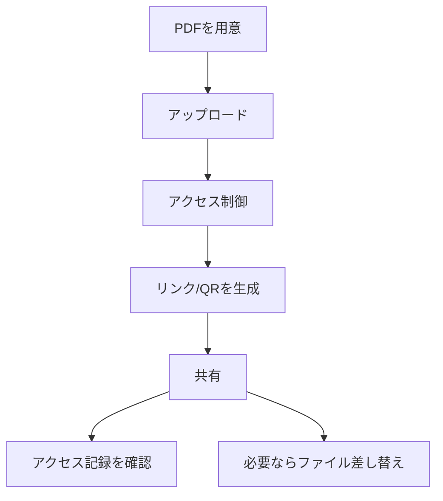

企業でPDFを扱うときに大事なのは、派手な機能より **運用が崩れないこと** です。

MaiPDFは、PDFをオンラインで共有し、必要に応じて **アクセス制御** と **アクセス記録** を確認できる形に整理します。

## 最小で効く運用フロー

1. **アップロード**
2. **アクセス制御を設定**（必要な場合）
3. **リンク/QRで共有**
4. **記録を確認**（必要な場合）
5. **更新は「ファイル差し替え」**（リンクを変えずに版を更新）

> 注意：MaiPDFオンライン版に「有効期限（expiration date）で自動失効」を設定する前提では書きません。

## アクセス制御と表示保護（必要な時だけ）

必要に応じて、閲覧ルールを絞り込みます（例：閲覧回数、閲覧時間、メール認証など）。

## 記録（トレース）を確認（必要な時だけ）

「誰が見たか」「いつ開かれたか」が必要な運用では、記録の確認を組み込みます。

## 更新は“リンクを変えずに差し替え”

配布後に内容を更新したい場合は「ファイル差し替え」で最新版に入れ替えます。

参考：`https://sendpdfonline.com/article/replace-pdf-without-changing-link-zh`

