# Maiimg完全紹介：プロフェッショナルな画像共有プラットフォーム、シンプルで安全

  
<strong>Maiimg</strong> は、登録不要で素早く共有リンクを生成し、いつでもアクセス権限を制御し、リアルタイムで画像の開封状況を追跡できるプロフェッショナルなオンライン画像共有プラットフォームです。イベント写真、製品画像、デザイン作品など、Maiimgは画像共有をシンプルで安全、制御可能にします。

## Maiimgとは？

### プラットフォームの位置づけ

Maiimgは、シンプルで安全、制御可能な画像共有ソリューションを提供することに焦点を当てた**オンライン画像共有・管理プラットフォーム**です。

**核心特徴：**
- ✅ **登録不要** - 即座に使用可能、ゼロ障壁
- ✅ **秒級生成** - アップロード後即座にリンク生成
- ✅ **完全無料** - 基本機能は完全無料
- ✅ **プロフェッショナルなセキュリティ** - アクセス制御、データ追跡、一括管理

### Maiimg vs 従来の方法

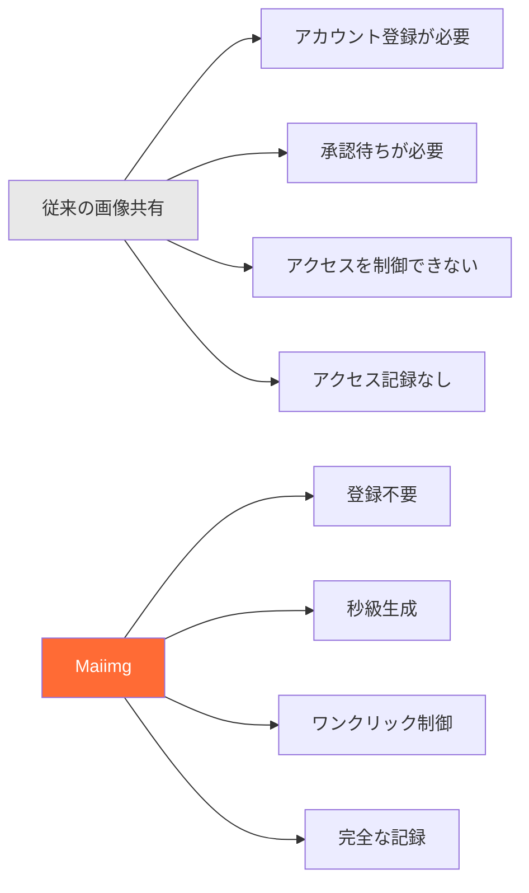

## 核心機能一覧

### 機能アーキテクチャ

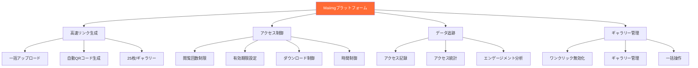

## 完全な使用フロー

### アップロードから共有までの完全フロー

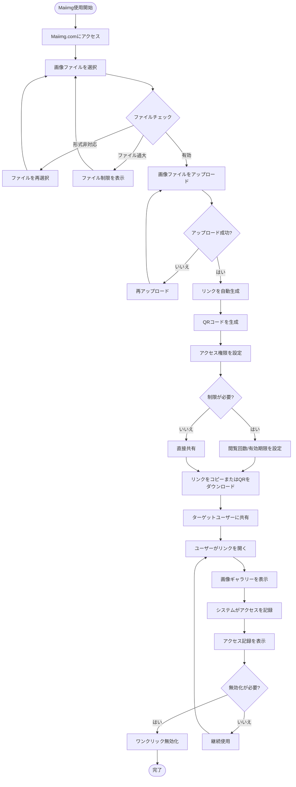

### 3ステップで開始

**ステップ1：画像をアップロード**
- Maiimg.comにアクセス
- 画像ファイルをドラッグ&ドロップまたは選択
- 一括アップロード対応（最大25枚/ギャラリー）

**ステップ2：リンクを生成**
- 共有リンクを自動生成
- QRコードを自動生成
- アクセス権限を設定

**ステップ3：共有して使用**
- リンクをコピーして共有
- またはQRコードをダウンロードして共有
- リアルタイムでアクセス記録を表示

## 核心機能の詳細説明

### 機能1：高速リンク生成

**特徴：**
- ⚡ 秒級生成（アップロード即生成）
- 🔗 一意のリンクを自動生成
- 📱 QRコードを自動生成
- 📦 一括アップロード対応（最大25枚/ギャラリー）

**フローチャート：**

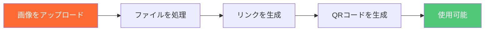

### 機能2：アクセス制御

**制御オプション：**

| 制御 | 説明 | 応用シーン |
|------|------|----------|
| 閲覧回数制限 | ギャラリーが開ける回数を制限 | イベント写真、限定共有 |
| 有効期限 | リンクの自動失効を設定 | 一時共有、イベント資料 |
| ダウンロード制御 | 画像ダウンロードを許可/禁止 | 著作権保護、拡散防止 |
| 時間制御 | アクセス可能な時間帯を設定 | 限時イベント、予定公開 |

**アクセス制御フローチャート：**

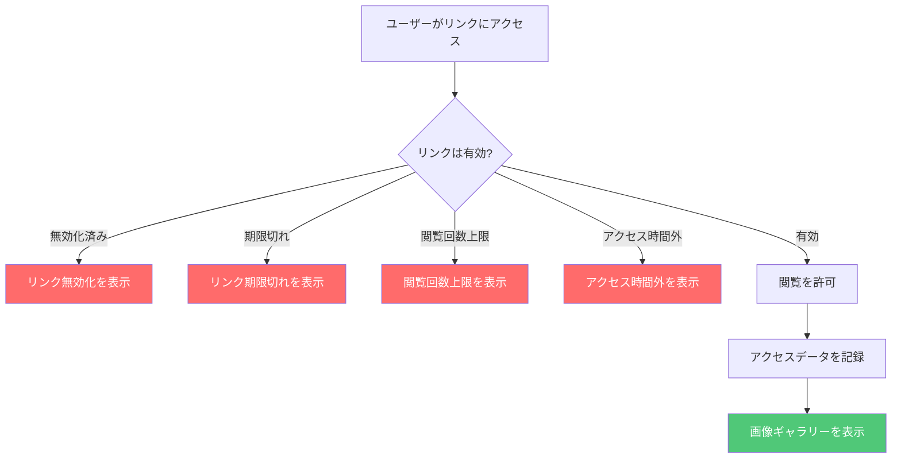

### 機能3：データ追跡

**追跡内容：**
- 📊 総開封回数
- ⏰ 各開封の時刻
- 📱 デバイス情報
- 📈 アクセストレンド分析
- 🎯 画像エンゲージメントデータ

**データ追跡フローチャート：**

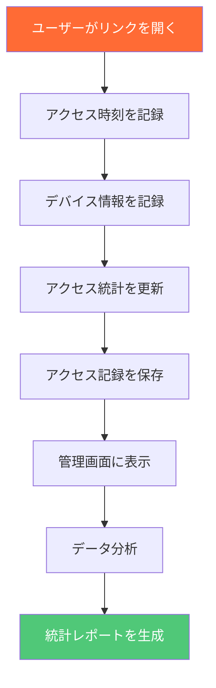

### 機能4：ギャラリー管理

**管理機能：**
- 🚫 ワンクリックリンク無効化
- 📝 アクセス設定の変更
- 📊 管理画面の表示
- 🗑️ ギャラリーの削除

**ギャラリー管理フローチャート：**

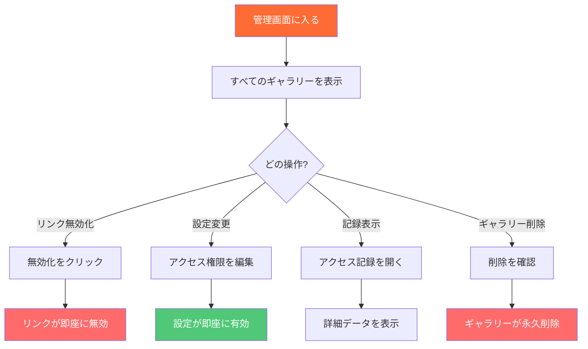

## 応用シーン

### シーン分類図

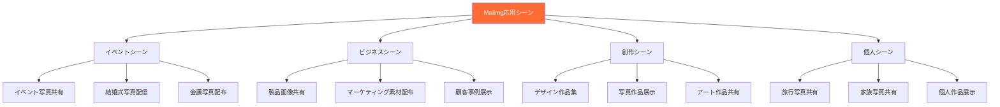

### 典型的な応用シーンフロー

**シーン：イベント写真共有**

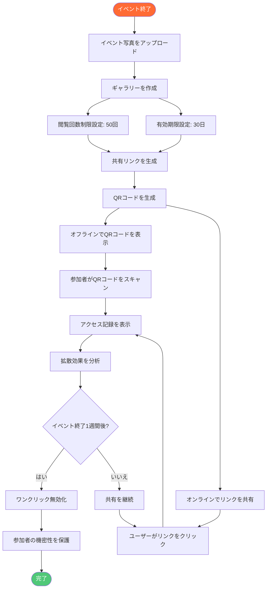

## 機能比較

### Maiimg vs 従来の方法

| 比較項目 | 従来の画像共有 | Maiimg |
|---------|--------------|--------|
| **登録要件** | ❌ アカウントが必要 | ✅ 登録不要 |
| **リンク生成** | ❌ 承認待ちが必要 | ✅ 秒級生成 |
| **アクセス制御** | ❌ 制御不可 | ✅ 完全制御（回数、時間、ダウンロード） |
| **アクセス追跡** | ❌ 記録なし | ✅ 完全な記録（時間、デバイス、統計） |
| **リンク管理** | ❌ 削除のみ可能 | ✅ ワンクリック無効化、設定変更 |
| **一括アップロード** | ❌ 単一アップロード | ✅ 一括アップロード（25枚/ギャラリー） |
| **使用コスト** | 💰 有料の可能性 | ✅ 完全無料 |
| **操作の複雑さ** | 📋 手順が複雑 | ✅ シンプルで直感的 |

### 機能優位性比較図

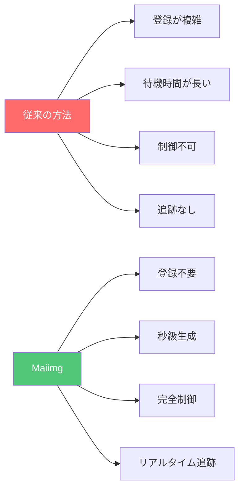

## 使用優位性のまとめ

### 核心優位性

**1. シンプルで使いやすい**
- 登録不要、即座に使用可能
- 3ステップ：アップロード → 生成 → 共有
- クリーンなインターフェース、直感的な操作

**2. 高速で効率的**
- 秒級リンク生成
- 自動QRコード生成
- 一括アップロード対応（最大25枚/ギャラリー）

**3. 安全で制御可能**
- 完全なアクセス制御
- リアルタイムアクセス追跡
- ワンクリックリンク無効化
- 柔軟な権限設定

**4. 完全無料**
- 基本機能は完全無料
- 隠れた費用なし
- 使用制限なし

### 優位性図

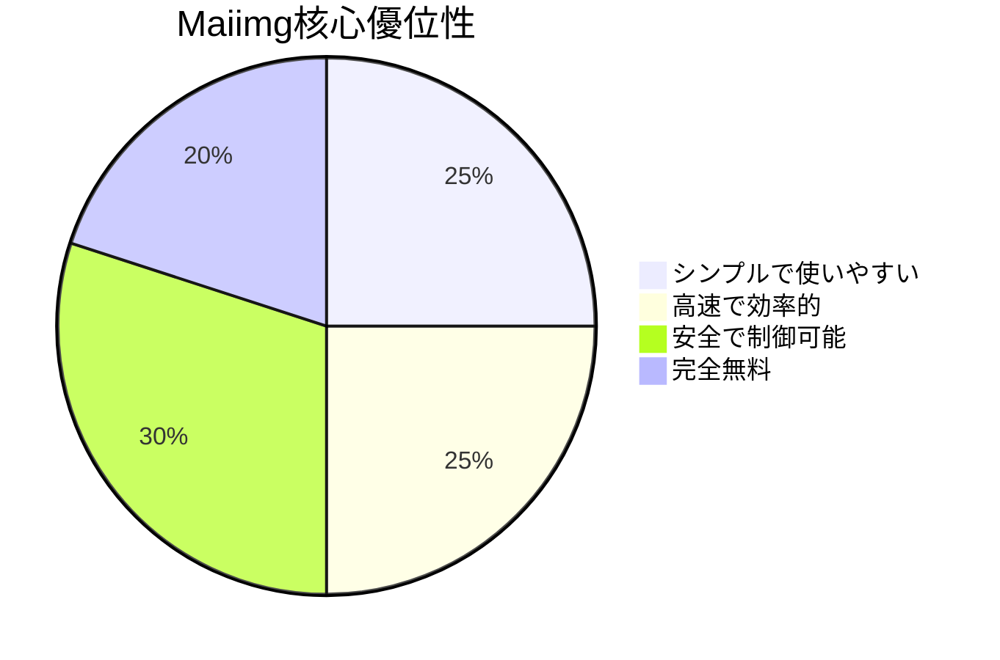

## クイックスタート

### 3ステップで開始

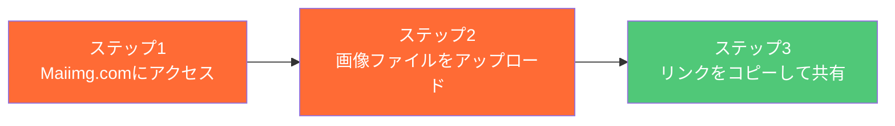

**今すぐ開始：**
1. [Maiimg.com](https://maiimg.com)にアクセス
2. 画像ファイルをアップロードエリアにドラッグ&ドロップ
3. 生成されたリンクをコピーまたはQRコードをダウンロード
4. ターゲットユーザーに共有

## まとめ

Maiimgは、以下の核心機能により画像共有を簡単にする**プロフェッショナルでシンプル、安全、無料**の画像共有プラットフォームです：

- ⚡ **高速生成** - 即座にリンク生成、待機不要
- 🔒 **安全制御** - 完全なアクセス制御と権限管理
- 📊 **データ追跡** - リアルタイムアクセス記録と分析
- 🎯 **使いやすい** - 登録不要、3ステップで共有
- 💰 **完全無料** - 基本機能は完全無料で使用可能

イベント主催者、写真家、デザイナー、個人ユーザーを問わず、Maiimgはプロフェッショナルな画像共有ソリューションを提供します。

**今すぐ使用開始：** [Maiimg.comにアクセス](https://maiimg.com)

