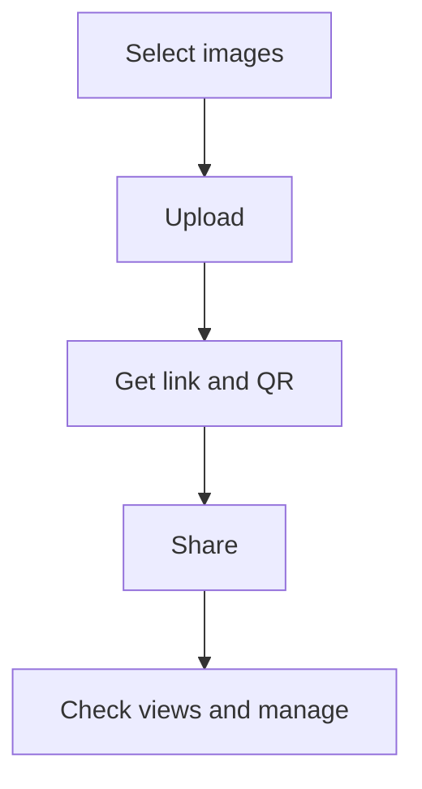

チャットに画像を何枚も貼るより、**リンクでまとめて共有**したほうがスムーズな場面があります。

Maiimg は **画像共有**向けのサービスです（PDF は MaiPDF）。

## 基本フロー

1. 画像を選択
2. アップロード
3. リンク / QR を取得
4. 共有
5. 必要に応じて確認・管理

```mermaid
flowchart TD
  A[Select images] --> B[Upload]
  B --> C[Get link and QR]
  C --> D[Share]
  D --> E[Check views and manage]
```

## 画面イメージ

