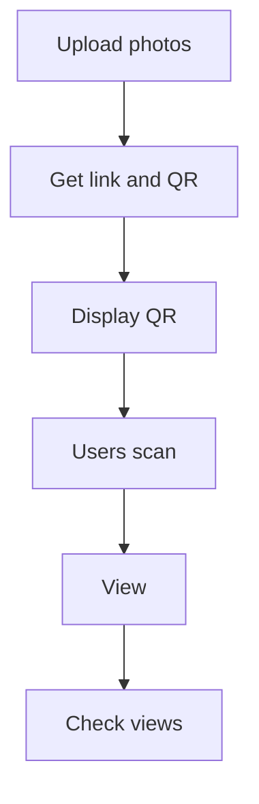

イベント後の写真配布は、URL を配るだけでも混乱しがちです。**QR を表示**しておくと、参加者がその場でアクセスできます。

## 推奨フロー

1. 写真をアップロード
2. リンク / QR を取得
3. 会場・案内ページに QR を掲載
4. 参加者がスキャンして閲覧
5. 必要なら閲覧状況を確認

```mermaid
flowchart TD
  A[Upload photos] --> B[Get link and QR]
  B --> C[Display QR]
  C --> D[Users scan]
  D --> E[View]
  E --> F[Check views]
```

## 画面イメージ

