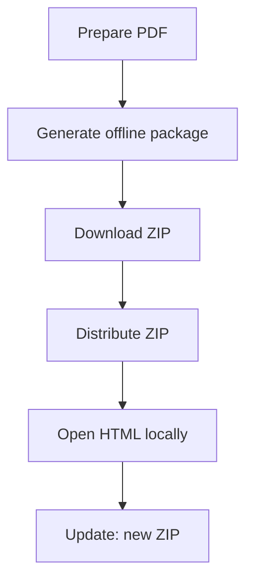

オンライン共有は便利ですが、現場によっては **オフラインで開ける形式**が必要なことがあります。ここでは ZIP/HTML パッケージの流れだけを短くまとめます。

## 基本フロー

1. オフラインパッケージを生成
2. ZIP をダウンロード
3. ZIP を配布
4. ZIP 内の HTML を開く
5. 内容更新時は新しい ZIP を配布

```mermaid
flowchart TD
  A[Prepare PDF] --> B[Generate offline package]
  B --> C[Download ZIP]
  C --> D[Distribute ZIP]
  D --> E[Open HTML locally]
  E --> F[Update: new ZIP]
```

## 画面イメージ

