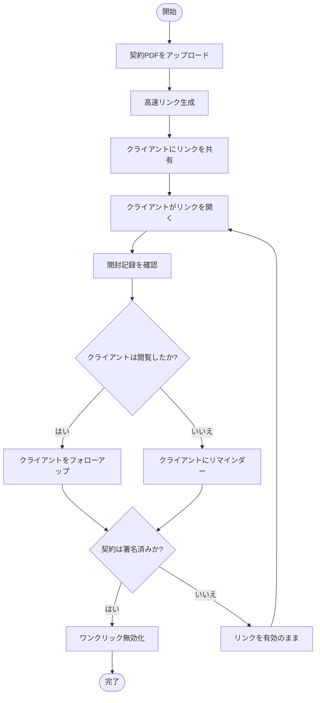

# MaiPDF 高速リンク生成、ワンクリック無効化、開封記録の確認：PDF共有の3つの核心機能

  
PDF共有に必要なものは？<strong>高速リンク生成</strong>、<strong>ワンクリック無効化</strong>、<strong>開封記録の確認</strong>。MaiPDFはこれら3つの核心機能を完璧に組み合わせ、PDF共有をシンプルで安全、制御可能にします。

## 核心機能1：高速リンク生成共有

### 即座に生成、数秒で完了

**待つ必要なし、即座に共有：**
- PDFアップロード後、リンクが即座に生成
- 登録不要、承認待ち不要
- 最大100MBファイル対応
- QRコード自動生成

**操作手順：**
1. MaiPDF.comにアクセス
2. PDFファイルをドラッグ&ドロップまたは選択
3. **リンクが自動生成**、すぐに利用可能
4. リンクをコピーまたはQRコードをダウンロードして共有

## 核心機能2：ワンクリック無効化

### いつでも制御、即座に有効

**ワンクリック操作、リンクが即座に無効：**
- 「無効化」ボタンをクリック、リンクが即座に利用不可
- PDFを削除する必要はなく、リンクを無効化するだけ
- 共有されたリンクが即座に無効
- いつでも再有効化可能（サポートされている場合）

## 核心機能3：開封記録の確認

### リアルタイム追跡、データ透明性

**完全なアクセス記録：**
- 総開封回数を確認
- 各開封の時刻を確認
- 開封者のIPアドレスを確認
- デバイス情報を確認
- 地理的位置を確認

## 3つの機能が完璧に組み合わさる

### 完全なワークフロー

**シナリオ：ビジネス契約共有**

**プロセス：**

1. **高速リンク生成**
   - 契約PDFをアップロード
   - リンクが数秒で生成
   - クライアントに共有

2. **開封記録の確認**
   - リアルタイムでクライアントがリンクを開いたか確認
   - 契約の閲覧状況を理解
   - クライアントの関心点を分析

3. **ワンクリック無効化**
   - 契約署名完了後
   - ワンクリックでリンクを無効化
   - 契約の機密性を保護

### 機能比較表

| 機能 | 従来のPDF共有 | MaiPDF |
|------|--------------|--------|
| リンク生成速度 | 登録が必要、承認待ち | 数秒で生成、登録不要 |
| リンク制御 | 無効化不可、削除のみ | ワンクリック無効化、いつでも制御 |
| 開封記録 | 記録なしまたは不完全 | 完全な記録、リアルタイム確認 |
| 利用コスト | 有料の可能性 | 完全無料 |
| 操作の複雑さ | 手順が煩雑 | シンプルで直感的 |
| ファイルサイズ制限 | 通常小さい | 最大100MB |

## 実用例

### ケース1：ビジネス契約共有

**ニーズ：** クライアントに契約を迅速に共有、閲覧状況を理解、署名後にアクセスを閉じる

**ソリューション：**
1. 契約PDFをアップロード、**高速リンク生成**
2. クライアントにリンクを共有
3. **開封記録を確認**、クライアントの閲覧状況を理解
4. 署名完了後、**ワンクリックでリンクを無効化**

### ケース2：製品マニュアル即時共有

**ニーズ：** 潜在顧客に製品マニュアルを迅速に共有、閲覧効果を追跡、キャンペーン後に機密性を保護

**ソリューション：**
1. 製品マニュアルPDFをアップロード、**高速リンクとQRコード生成**
2. クライアントがQRコードをスキャンして閲覧
3. **開封記録を確認**、マニュアルの拡散効果を理解
4. キャンペーン終了1週間後、**ワンクリックでリンクを無効化**

